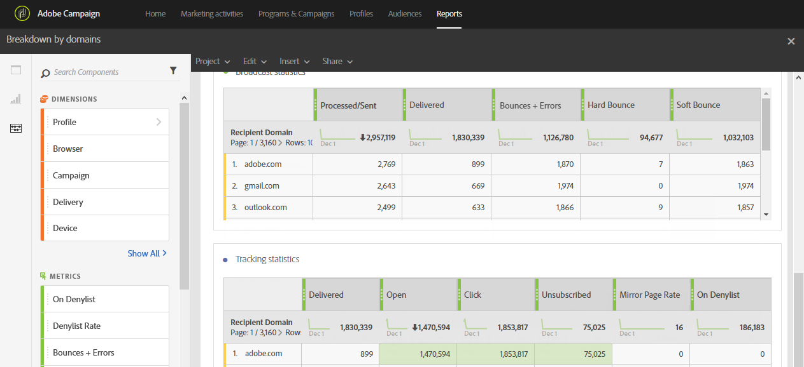

# 按域细分{#breakdown-by-domains}

此报表包含电子邮件受众中表示的每个域的性能数据。 如果是活动或项目报告，则性能数据可用于多个受众。 此数据允许您分析每个域的行为以响应特定事件。 例如，链接显示、阻止列表URL on等

表&#x200B;**广播统计数据**&#x200B;包含每个域可能遇到的错误的可用数据，例如：

* **已处理/已发送**:已发送的电子邮件数。
* **已交付**:已发送的电子邮件数。
* **跳出次数+错误**:无法传递的消息数。
* **硬弹起**:永久错误的总数，如错误的电子邮件地址。
* **软弹起**:临时错误（如完整收件箱）的总数。

第二个表&#x200B;**跟踪统计数据**&#x200B;包含收件人对投放反应性的可用数据，如：

* **已交付**:已发送的电子邮件数
* **打开**:在投放中打开消息的次数。
* **单击**:在投放中单击内容的次数。
* **取消订阅**:单击订阅链接的次数。
* **镜像页面**:单击镜像页面链接的次数。
* **阻止列表**:宣布电子邮件为垃圾邮件或垃圾邮件的收件人数。[了解详情](../../audiences/using/about-opt-in-and-opt-out-in-campaign.md)

