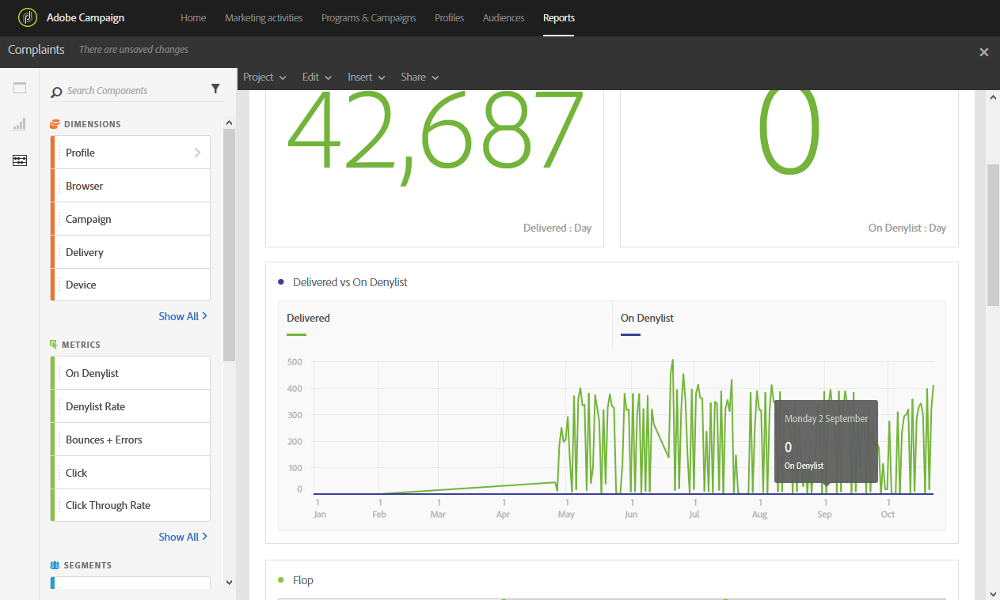

# 投诉{#complaints}

The **[!UICONTROL Complaints]** report identifies the deliveries that have received the most declarations as spam.

按收件人 **域排序** 的Flop表显示已声明电子邮件或垃圾邮件的收件人数。 图表和摘要编号中也提供表的结果。

“已 **交阻止列表付”和“按** ”表列表了已声明电子邮件为垃圾邮件或垃圾邮件的收件人数。 表按投放排序。
