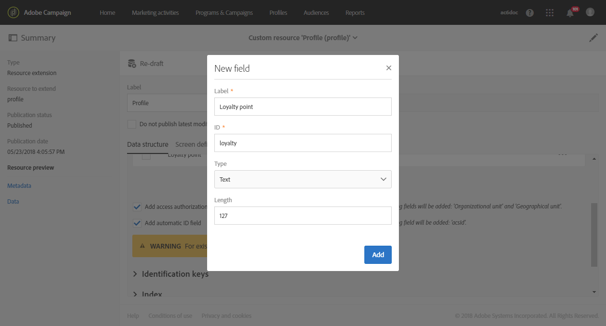
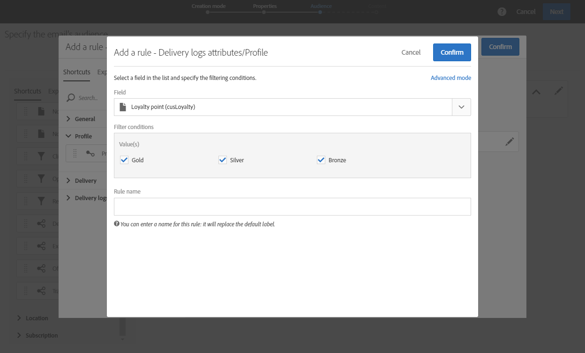
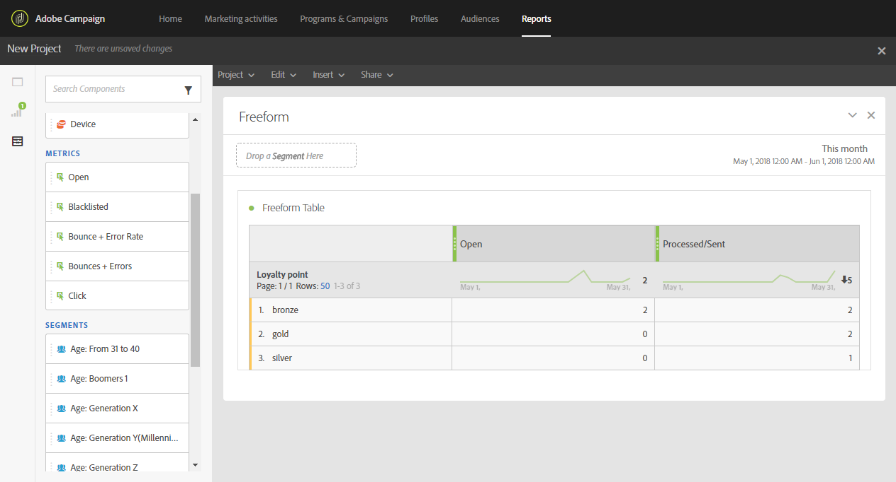

# 创建自定义用户档案维度{#creating-a-custom-profile-dimension}

还可以根据在用户档案自定义资源扩展期间创建的自定义用户档案数据来创建和管理报表。

在此示例中，我们要创建自定义用户档案字段&#x200B;**忠诚度计划**，该字段将分为三个级别：金、银、铜。 随后，此自定义用户档案将进行扩展，以便能够将其用作动态报告中的自定义用户档案维度。

* [步骤1:创建新用户档案字段](#step-1--create-a-new-profile-field)
* [步骤2:使用用户档案字段扩展发送日志](#step-2--extend-the-sending-logs-with-the-profile-field)
* [步骤3:创建投放定位已注册到忠诚度计划的收件人](#step-3--create-a-delivery-targeting-recipients-enrolled-in-the-loyalty-program)
* [步骤4:创建动态报告以使用自定义用户档案维度过滤收件人](#step-4--create-a-dynamic-report-to-filter-recipients-with-the-custom-profile-dimension)

## 步骤1:创建新用户档案字段 {#step-1--create-a-new-profile-field}

我们首先需要创建新的用户档案字段&#x200B;**忠诚度计划**，以便为收件人分配忠诚度级别：金、银或铜。

>[!NOTE]
>
>自定义资源只能由管理员管理。

为实现此操作，请执行以下步骤：

1. 从高级菜单中，选择&#x200B;**[!UICONTROL Administration]** > **[!UICONTROL Development]** > **[!UICONTROL Custom resources]** ，然后选择&#x200B;**[!UICONTROL Profile (profile)]**&#x200B;自定义资源。

   

1. 在&#x200B;**[!UICONTROL Data structure]**&#x200B;选项卡的&#x200B;**[!UICONTROL Fields]**&#x200B;类别中，单击&#x200B;**[!UICONTROL Add field]**&#x200B;按钮。

   

1. 输入&#x200B;**[!UICONTROL Label]**、**[!UICONTROL ID]**&#x200B;并选择自定义资源&#x200B;**[!UICONTROL Type]**。 在本例中，我们选择了&#x200B;**[!UICONTROL Text]**，因为收件人可以选择金、银和铜。

   

1. 单击图标以定义字段。

   

1. 在此，我们需要通过选中&#x200B;**[!UICONTROL Specify a list of authorized valued]**&#x200B;来指定授权值，并通过单击&#x200B;**[!UICONTROL Create element]**&#x200B;创建每个值。

   

1. 输入&#x200B;**[!UICONTROL Label]**&#x200B;和&#x200B;**[!UICONTROL Value]**，然后单击&#x200B;**[!UICONTROL Add]**。 在本例中，我们需要创建价值金、银和铜。 完成后单击 **[!UICONTROL Confirm]**。

   

1. 选择 **[!UICONTROL Screen definition]** 选项卡。在&#x200B;**[!UICONTROL Detail screen configuration]**&#x200B;下拉列表中，选中&#x200B;**[!UICONTROL Add personalized fields]**&#x200B;部分，以在用户档案中创建新部分。

   

1. 单击&#x200B;**[!UICONTROL Add an element]**&#x200B;按钮以创建新部分。 选择&#x200B;**[!UICONTROL Type]**:**[!UICONTROL Input field]**、**[!UICONTROL Value]**&#x200B;或&#x200B;**[!UICONTROL List]**，然后添加到此新部分中的字段。

   

1. 您还可以在字段&#x200B;**[!UICONTROL Customize the title of the section where the fields will be displayed]**&#x200B;中为部分添加标题。

   配置完成后，单击&#x200B;**[!UICONTROL Save]**。

   

1. 从高级菜单中，选择&#x200B;**[!UICONTROL Administration]** > **[!UICONTROL Development]** > **[!UICONTROL Publication]**&#x200B;以开始发布自定义资源。
1. 单击&#x200B;**[!UICONTROL Prepare publication]**，准备完成后，单击&#x200B;**[!UICONTROL Publish]**&#x200B;按钮。

   

您的新用户档案字段现已准备就绪，可供收件人使用和选择。

## 步骤2:使用用户档案字段扩展发送日志 {#step-2--extend-the-sending-logs-with-the-profile-field}

现在，您的用户档案字段已创建完毕，我们需要使用我们的用户档案字段扩展发送日志，以便在动态报告中创建关联的自定义用户档案维度。

在使用用户档案字段扩展日志之前，请确保已接受PII窗口，以访问&#x200B;**[!UICONTROL Sending logs extension]**&#x200B;选项卡。 有关详细信息，请参见此 [ 页面](../../reporting/using/about-dynamic-reports.md#dynamic-reporting-usage-agreement)。

>[!NOTE]
>
>只能由管理员通过用户档案字段扩展日志。

1. 从高级菜单中，选择&#x200B;**[!UICONTROL Administration]** > **[!UICONTROL Development]** > **[!UICONTROL Custom resources]** ，然后选择&#x200B;**[!UICONTROL Profile (profile)]**&#x200B;自定义资源。
1. 打开&#x200B;**[!UICONTROL Sending logs extension]**&#x200B;下拉列表。
1. 单击 **[!UICONTROL Create element]** 按钮。

   

1. 选择您之前创建的字段，然后单击&#x200B;**[!UICONTROL Confirm]**。
1. 选中&#x200B;**[!UICONTROL Add this field in Dynamic reporting as a new dimension]**&#x200B;以创建自定义用户档案维度。

   

   仅当PII窗口被接受时，此选项才可用。 有关详细信息，请参见此 [ 页面](../../reporting/using/about-dynamic-reports.md#dynamic-reporting-usage-agreement)。

1. 单击&#x200B;**[!UICONTROL Add]**，然后保存您的自定义资源。
1. 由于自定义资源已修改，因此我们需要发布它以实施新更改。

   从高级菜单中，选择&#x200B;**[!UICONTROL Administration]** > **[!UICONTROL Development]** > **[!UICONTROL Publication]**&#x200B;以开始发布自定义资源。

1. 单击&#x200B;**[!UICONTROL Prepare publication]**，准备完成后，单击&#x200B;**[!UICONTROL Publish]**&#x200B;按钮。

   

现在，您的自定义用户档案可用作报表中的自定义用户档案维度。

现在，您已创建字段并且使用此用户档案字段扩展了发送日志，接下来便可以开始定位投放中的收件人。

## 步骤3:创建投放定位已注册到忠诚度计划的收件人 {#step-3--create-a-delivery-targeting-recipients-enrolled-in-the-loyalty-program}

发布用户档案字段后，即可开始投放。 在此示例中，我们希望定位忠诚度计划中注册的每个收件人。

1. 在 **[!UICONTROL Marketing activities]** 选项卡中，单击 **[!UICONTROL Create]**，然后选择 **[!UICONTROL Email]**。
1. 选择&#x200B;**[!UICONTROL Email type]**，然后输入电子邮件的属性。
1. 要定位已注册加入忠诚度计划的收件人，请拖放&#x200B;**[!UICONTROL Profiles (attributes)]**&#x200B;活动。
1. 从&#x200B;**[!UICONTROL Field]**&#x200B;下拉列表中选择您之前创建的字段。

   

1. 选择&#x200B;**[!UICONTROL Filter conditions]**。 在此，我们要定位属于三个忠诚度计划级别之一的收件人。

   

1. 单击&#x200B;**[!UICONTROL Confirm]**，过滤完成后，单击&#x200B;**[!UICONTROL Next]**。
1. 定义和个性化消息内容、发件人姓名和主题。 有关创建电子邮件的更多信息，请参阅此[页面](../../designing/using/designing-content-in-adobe-campaign.md)。

   然后，单击&#x200B;**[!UICONTROL Create]**。

1. 准备就绪后，您可以预览并发送消息。 有关如何准备和发送消息的更多信息，请参阅此[page](../../sending/using/preparing-the-send.md)。

在将电子邮件正确发送到选定收件人后，您可以开始过滤数据并通过报表跟踪投放是否成功。

## 步骤4:创建动态报告以使用自定义用户档案维度过滤收件人 {#step-4--create-a-dynamic-report-to-filter-recipients-with-the-custom-profile-dimension}

发送投放后，您可以使用&#x200B;**[!UICONTROL Profile]**&#x200B;表中的自定义用户档案维度划分报表。

1. 从&#x200B;**[!UICONTROL Reports]**&#x200B;选项卡中，选择现成报表或单击&#x200B;**[!UICONTROL Create]**&#x200B;按钮以从头开始创建报表。

   

1. 在&#x200B;**[!UICONTROL Dimensions]**&#x200B;类别中，单击&#x200B;**[!UICONTROL Profile]**，然后将自定义&#x200B;**忠诚度计划**&#x200B;用户档案维度拖放到自由格式表中。

   

1. 拖放&#x200B;**[!UICONTROL Processed/Sent]**&#x200B;和&#x200B;**[!UICONTROL Open]**&#x200B;量度以开始过滤数据。

   

1. 根据需要，在工作区中拖放可视化图表。

   

**相关主题：**

* [使用自定义用户档案数据创建有洞察力的报表](https://helpx.adobe.com/campaign/kb/simplify-campaign-management.html#Reportandshareinsightswithallstakeholders)
