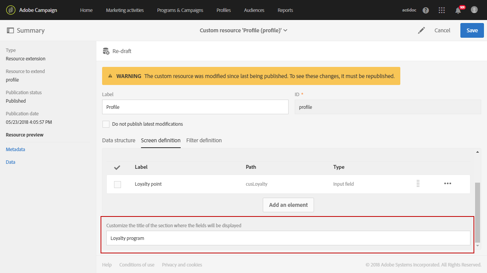

# 创建自定义配置文件维度{#creating-a-custom-profile-dimension}

还可以根据在配置文件自定义资源扩展期间创建的自定义配置文件数据创建和管理报告。

在此示例中，我们要创建自定义配置文件字段 **忠诚度计划** ，该字段将分为三个级别：金、银和铜。 此自定义配置文件随后将扩展为能够在动态报告中将其用作自定义配置文件维度。

* [第1步：创建新的配置文件字段](../../reporting/using/creating-a-custom-profile-dimension.md#step-1--create-a-new-profile-field)
* [第2步：使用配置文件字段扩展发送日志](../../reporting/using/creating-a-custom-profile-dimension.md#step-2--extend-the-sending-logs-with-the-profile-field)
* [第3步：创建已登记到忠诚度计划的分发目标收件人](../../reporting/using/creating-a-custom-profile-dimension.md#step-3--create-a-delivery-targeting-recipients-enrolled-in-the-loyalty-program)
* [第4步：创建动态报告以使用自定义配置文件维度筛选收件人](../../reporting/using/creating-a-custom-profile-dimension.md#step-4--create-a-dynamic-report-to-filter-recipients-with-the-custom-profile-dimension)

## 第1步：创建新的配置文件字段 {#step-1--create-a-new-profile-field}

我们首先需要创建新的档案字段忠诚度计 **划** ，以将忠诚度级别分配给我们的收件人：金、银或铜。

>[!NOTE]
>
>自定义资源只能由管理员管理。

为此，请执行以下操作：

1. 从高级菜单中，选择 **[!UICONTROL Administration]** &gt; **[!UICONTROL Development]** &gt; **[!UICONTROL Custom resources]** ，然后选择自 **[!UICONTROL Profile (profile)]** 定义资源。

   

1. 在选 **[!UICONTROL Data structure]** 项卡的类别中， **[!UICONTROL Fields]** 单击按 **[!UICONTROL Add field]** 钮。

   

1. 输入 **[!UICONTROL Label]**，然 **[!UICONTROL ID]** 后选择自定义资源 **[!UICONTROL Type]**。 在这里，我们选 **[!UICONTROL Text]** 择了，因为接受者可以选择金、银和铜。

   

1. 单击图  标以定义字段。

   

1. 在此，我们需要通过选中并单击创建每个值来 **[!UICONTROL Specify a list of authorized valued]** 指定授权值 **[!UICONTROL Create element]**。

   

1. 输入， **[!UICONTROL Label]** 然后 **[!UICONTROL Value]** 单击 **[!UICONTROL Add]**。 在本例中，我们需要创建金、银和铜的价值。 完成 **[!UICONTROL Confirm]** 后单击。

   

1. 选择选 **[!UICONTROL Screen definition]** 项卡。 在下拉 **[!UICONTROL Detail screen configuration]** 菜单中，选中部分 **[!UICONTROL Add personalized fields]** 以在我们的配置文件中创建新部分。

   

1. 单击该 **[!UICONTROL Add an element]** 按钮可创建新部分。 选择 **[!UICONTROL Type]**:或 **[!UICONTROL Input field]**&#x200B;者 **[!UICONTROL Value]****[!UICONTROL List]**，然后添加到此新部分中的字段。

   

1. 您还可以在字段中向章节添加标题 **[!UICONTROL Customize the title of the section where the fields will be displayed]**。

   完 **[!UICONTROL Save]** 成配置后单击。

   

1. 从高级菜单中，选择 **[!UICONTROL Administration]** &gt; **[!UICONTROL Development]** &gt; **[!UICONTROL Publication]** 开始发布自定义资源。
1. 单 **[!UICONTROL Prepare publication]** 击，准备完毕后，单击按 **[!UICONTROL Publish]** 钮。

   

您的新配置文件字段现在可供收件人使用和选择。

## 第2步：使用配置文件字段扩展发送日志 {#step-2--extend-the-sending-logs-with-the-profile-field}

现在，您的配置文件字段已创建完毕，我们需要使用配置文件字段扩展发送日志，以在动态报告中创建关联的自定义配置文件维度。

在使用我们的配置文件字段扩展日志之前，请确保PII窗口已被接受以有权访问该选 **[!UICONTROL Sending logs extension]** 项卡。 有关此方面的详细信息，请参阅本 [页](../../reporting/using/about-dynamic-reports.md#dynamic-reporting-usage-agreement)。

>[!NOTE]
>
>日志只能由管理员通过配置文件字段进行扩展。

1. 从高级菜单中，选择 **[!UICONTROL Administration]** &gt; **[!UICONTROL Development]** &gt; **[!UICONTROL Custom resources]** ，然后选择自 **[!UICONTROL Profile (profile)]** 定义资源。
1. 打开 **[!UICONTROL Sending logs extension]** 下拉列表。
1. 单击按 **[!UICONTROL Create element]** 钮。

   

1. 选择您之前创建的字段，然后单击 **[!UICONTROL Confirm]**。
1. 选中此 **[!UICONTROL Add this field in Dynamic reporting as a new dimension]** 项可创建您的自定义配置文件维度。

   

   此选项仅在PII窗口被接受时可用。 有关此方面的详细信息，请参阅本 [页](../../reporting/using/about-dynamic-reports.md#dynamic-reporting-usage-agreement)。

1. 单击 **[!UICONTROL Add]** 然后保存自定义资源。
1. 由于自定义资源已被修改，因此我们需要发布它以实施新的更改。

   从高级菜单中，选择 **[!UICONTROL Administration]** &gt; **[!UICONTROL Development]** &gt; **[!UICONTROL Publication]** 开始发布自定义资源。

1. 单 **[!UICONTROL Prepare publication]** 击，准备完毕后，单击按 **[!UICONTROL Publish]** 钮。

   

现在，您的自定义配置文件在您的报告中可作为自定义配置文件维度提供。

现在，您的字段已创建，并且发送日志已通过此配置文件字段扩展，您可以在分发中开始定位收件人。

## 第3步：创建已登记到忠诚度计划的分发目标收件人 {#step-3--create-a-delivery-targeting-recipients-enrolled-in-the-loyalty-program}

发布您的个人资料字段后，您便可以开始分发。 在此示例中，我们希望定位已登记到忠诚度计划的每个收件人。

1. 在选项卡 **[!UICONTROL Marketing activities]** 中，单击， **[!UICONTROL Create]** 然后选择 **[!UICONTROL Email]**。
1. 选择一个 **[!UICONTROL Email type]** 选项，然后输入电子邮件的属性。
1. 要定位在忠诚度计划中登记的收件人，请拖放活 **[!UICONTROL Profiles (attributes)]** 动。
1. 从下拉菜单中选择您之前 **[!UICONTROL Field]** 创建的字段。

   

1. 选择您的 **[!UICONTROL Filter conditions]**。 在此，我们希望定位属于三个忠诚度计划级别之一的收件人。

   

1. 单击 **[!UICONTROL Confirm]** 完毕后，单击 **[!UICONTROL Next]**。
1. 定义消息内容、发送者姓名和主题并实现个性化。 有关创建电子邮件的详细信息，请参阅 [此页](../../designing/using/overview.md)。

   然后，单击 **[!UICONTROL Create]**。

1. 准备就绪后，您可以预览并发送消息。 有关如何准备和发送消息的详细信息，请参阅本 [页](../../sending/using/preparing-the-send.md)。

在将电子邮件正确发送到选定收件人后，您可以开始过滤数据并通过报告跟踪交付的成功情况。

## 第4步：创建动态报告以使用自定义配置文件维度筛选收件人 {#step-4--create-a-dynamic-report-to-filter-recipients-with-the-custom-profile-dimension}

在发送交付后，您可以使用表格中的自定义配置文件维度细分 **[!UICONTROL Profile]** 报告。

1. 在选 **[!UICONTROL Reports]** 项卡中，选择现成报告或单击按钮从头开 **[!UICONTROL Create]** 始创建报告。

   

1. 在类别 **[!UICONTROL Dimensions]** 中，单击，然 **[!UICONTROL Profile]** 后将自定义Loyalty计划配置文件维度拖 **** 放到自由格式表中。

   

1. 拖放和度 **[!UICONTROL Processed/Sent]** 量 **[!UICONTROL Open]** 开始筛选数据。

   

1. 根据需要在工作区中拖放可视化。

   

**相关主题：**

* [使用自定义配置文件数据创建富有洞察力的报告](https://helpx.adobe.com/campaign/kb/simplify-campaign-management.html#Reportandshareinsightswithallstakeholders)
