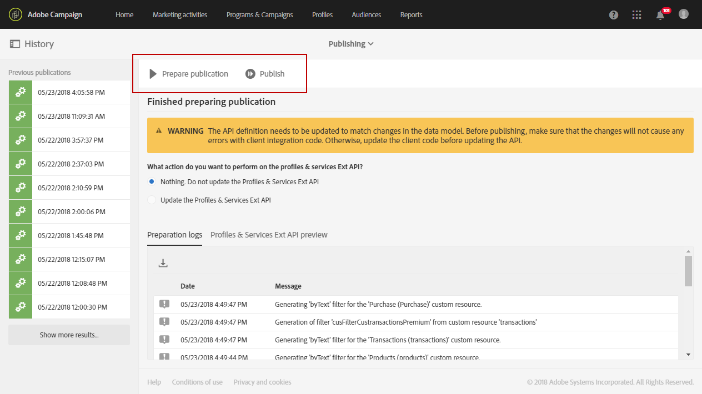
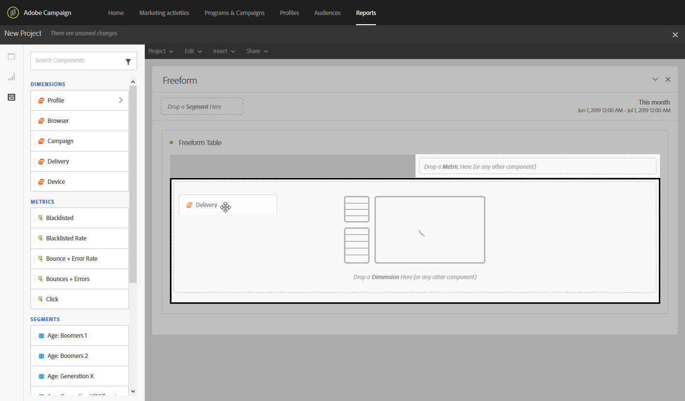

# 根据工作流区段创建报告{#creating-a-report-workflow-segment}

>[!CAUTION]
> **[!UICONTROL Segment code]**只能定位电子邮件和短信投放。

在创建工作流并将群体过滤到不同的目标受众后，您可以根据此定位工作流中定义的区段来衡量营销活动的效率。
要在报表中定位这些区段，请执行以下操作：

* [步骤1:使用区段更新用户档案自定义资源](#step-1--update-profiles-custom-resource-segments)
* [步骤2:使用区段创建工作流](#step-2--create-a-workflow-segments)
* [步骤3:创建动态报告以过滤区段](#step-3--create-a-dynamic-report-filter-segments)

>[!CAUTION]
>必须接受动态报告使用协议才能开始收集这些数据。
>
>如需有关本协议的详细信息，请参阅此 [页面](../../reporting/using/about-dynamic-reports.md#dynamic-reporting-usage-agreement).

## 步骤1:使用区段更新用户档案自定义资源{#step-1--update-profiles-custom-resource-segments}

在报告区段代码之前，您需要更新 **[!UICONTROL Profiles]** 存储区段代码的自定义资源。

1. 从高级菜单中，通过Adobe Campaign徽标，选择 **[!UICONTROL Administration]** > **[!UICONTROL Development]** > **[!UICONTROL Custom resources]**，然后选择 **[!UICONTROL Profile (profile)]** 资源。
1. 在 **[!UICONTROL Sending logs extension]** 菜单 **[!UICONTROL Data structure]** 选项卡，勾选 **[!UICONTROL Add segment code]** 以允许从定位工作流中存储区段代码，并将其发送到动态报告。

   的 **[!UICONTROL Segment code]** 将在 **[!UICONTROL Profile]** 维度部分。

   

1. 保存自定义资源。

1. 您现在需要发布自定义资源。
从高级菜单中，选择 **[!UICONTROL Administration]** > **[!UICONTROL Development]** > **[!UICONTROL Publishing]**.

   

1. 单击 **[!UICONTROL Prepare publication]** 然后，在准备完成后，单击 **[!UICONTROL Publish]** 按钮。 有关自定义资源的更多信息，请参阅此 [页面](../../developing/using/updating-the-database-structure.md).

您现在可以使用区段代码开始创建工作流。

请注意，一旦在 **[!UICONTROL Sending logs extension]**.

## 步骤2:使用区段创建工作流 {#step-2--create-a-workflow-segments}

>[!NOTE]
>如果电子邮件投放的输入过渡为空，则默认情况下会添加上一个过渡的段码。

您首先需要创建具有不同目标群体的工作流。 在此，我们希望发送一封根据受众年龄进行个性化的电子邮件：一次交付20至30岁用户档案，另一次交付30至40岁用户档案。

1. 创建工作流。 有关如何创建工作流的更多详细信息，请参阅此 [页面](../../automating/using/building-a-workflow.md).

1. 添加 **[!UICONTROL Query]** 活动，方法是将其从面板中拖放到工作区中。

1. 将20到40岁的用户档案定位到以后，将其细分为更有针对性的人群。

   

1. 添加 **[!UICONTROL Segmentation]** 活动，将查询结果拆分为两个目标群体。 有关分段的更多信息，请参阅此内容 [页面](../../automating/using/segmentation.md).

1. 双击 **[!UICONTROL Segmentation]** 活动进行配置。 通过单击 **[!UICONTROL Edit properties]**.

   

1. 在20到30岁之间查询用户档案并单击 **[!UICONTROL Confirm]** 完成时。

   

1. 单击 **[!UICONTROL Add an element]** 创建第二个区段，并按照上述步骤中所述对其进行配置，以定位30到40岁之间的用户档案。

1. 编辑 **[!UICONTROL Segment code]** 用于通过动态报告传递的每个群体。

   >[!NOTE]
   >此步骤是强制性的，否则您将无法了解要报告哪些区段。

   

1. 拖放 **[!UICONTROL Email delivery]** 活动。

   

1. 根据不同的定向群体，将投放个性化。 有关创建电子邮件的更多信息，请参阅此 [页面](../../designing/using/designing-content-in-adobe-campaign.md).

1. 保存工作流。

1. 单击 **[!UICONTROL Start]** 工作流准备就绪后。

您现在可以访问报表以跟踪区段代码。

## 步骤3:创建动态报告以过滤区段 {#step-3--create-a-dynamic-report-filter-segments}

使用工作流发送投放后，您可以使用工作流中的区段代码划分报表。

1. 从 **[!UICONTROL Reports]** 选项卡上，选择现成报表或单击 **[!UICONTROL Create new project]** 按钮从头开始。

   
1. 拖放 **[!UICONTROL Delivery]** 维度添加到自由格式表。

   

1. 将不同的量度拖放到您的表中，例如 **[!UICONTROL Open]** 和 **[!UICONTROL Click]** 量度来开始过滤数据。
1. 在 **[!UICONTROL Dimensions]** 类别，单击 **[!UICONTROL Profile]** 维度，然后拖放 **[!UICONTROL Segment code]** 维度，以根据目标群体衡量电子邮件投放是否成功。

   

1. 根据需要，在工作区中拖放可视化图表。

   
