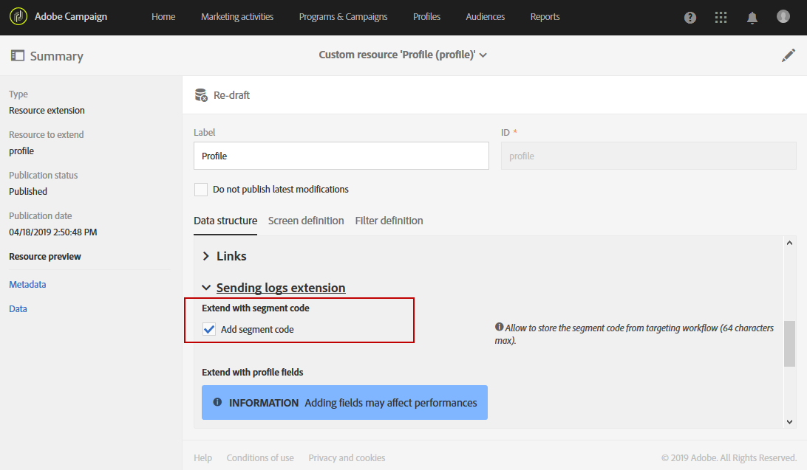

# Creating a report based on workflow segments{#creating-a-report-workflow-segment}

创建工作流并将用户过滤到不同目标受众中后，您可以根据在定位工作流中定义的细分，衡量营销活动的效率。
要将这些区段定位到报表中，请执行以下操作：

* [步骤1：使用区段更新配置文件自定义资源](#step-1--update-profiles-custom-resource-segments)
* [步骤2：使用区段创建工作流](#step-2--create-a-workflow-segments)
* [步骤3：创建动态报告以过滤区段](#step-3--create-a-dynamic-report-filter-segments)

>[!CAUTION]
>必须接受动态报告使用协议才能开始收集这些数据。
>For more on this agreement, refer to this [page](../../reporting/using/about-dynamic-reports.md#dynamic-reporting-usage-agreement).

## Step 1: Update Profiles custom resource with segments{#step-1--update-profiles-custom-resource-segments}

Before reporting on your segment code, you need to update your **[!UICONTROL Profiles]** custom resource for your segment codes to be stored.

1. From the advanced menu, via the Adobe Campaign logo, select **[!UICONTROL Administration]** &gt; **[!UICONTROL Development]** &gt; **[!UICONTROL Custom resources]**, then select the **[!UICONTROL Profile (profile)]** resource.
1. In the **[!UICONTROL Sending logs extension]** menu from the **[!UICONTROL Data structure]** tab, check **[!UICONTROL Add segment code]** to allow storage of your segment codes from targeting workflows and to send it to dynamic reporting.

   **[!UICONTROL Segment code]** 随后将在您的报表的 **[!UICONTROL Profile]** 维度部分提供。

   

1. 保存自定义资源。

1. 您现在需要发布自定义资源。
From the advanced menu, select **[!UICONTROL Administration]** &gt; **[!UICONTROL Development]** &gt; **[!UICONTROL Publishing]**.

   

1. Click **[!UICONTROL Prepare publication]** then when the preparation is done, click the **[!UICONTROL Publish]** button. For more information on custom resource, refer to this [page](../../developing/using/updating-the-database-structure.md).

现在，您可以开始使用细分代码创建工作流。

Note that segment codes will be collected as soon as you enable the segment code in the **[!UICONTROL Sending logs extension]**.

## Step 2: Create a workflow with segments {#step-2--create-a-workflow-segments}

[!NOTE]
>如果电子邮件发送的输入过渡为空，则默认情况下将添加先前过渡中的区段代码。

您首先需要创建具有不同目标人群的工作流。这里，我们希望发送一封根据受众年龄个性化的电子邮件：一次交付20到30年的档案，另一个交付档案可用于30到40年的档案。

1. 创建工作流程。For more details on how to create your workflow, refer to this [page](../../automating/using/building-a-workflow.md).

1. Add a **[!UICONTROL Query]** activity by dragging it from the palette and dropping it in the workspace.

1. 目标配置文件从20到40年，以后将其细分为更具针对性的人群。

   

1. Add a **[!UICONTROL Segmentation]** activity to split your query results into two targeted populations. For more on segmentation, refer to this [page](../../automating/using/targeting-data.md#segmenting-data).

1. Double click the **[!UICONTROL Segmentation]** activity to configure it. Edit the first segment by clicking **[!UICONTROL Edit properties]**.

   

1. Query profiles between the age of 20 to 30 and click **[!UICONTROL Confirm]** when done.

   

1. Click **[!UICONTROL Add an element]** to create your second segment and configure it as described in the steps above to target profiles between the age of 30 to 40.

1. Edit the **[!UICONTROL Segment code]** for each population to be passed on through dynamic reporting.

   >[!NOTE]
   >此步骤为必填，否则您将无法了解要报告的区段。

   

1. Drag and drop an **[!UICONTROL Email delivery]** activity after your segments.

   

1. 根据不同目标人群个性化交付内容。For more on email creation, refer to this [page](../../designing/using/about-email-content-design.md).

1. 保存工作流。

1. Click **[!UICONTROL Start]** when your workflow is ready.

您现在可以访问报表来跟踪区段代码。

## Step 3: Create a dynamic report to filter segments {#step-3--create-a-dynamic-report-filter-segments}

在向工作流发送分发后，您可以使用工作流中的区段代码划分报表。

1. From the **[!UICONTROL Reports]** tab, select an out-of-the-box report or click the **[!UICONTROL Create new project]** button to start one from scratch.

   
1. Drag and drop the **[!UICONTROL Delivery]** dimension to your freeform table.

   

1. Drag and drop different metrics to your table such as the **[!UICONTROL Open]** and **[!UICONTROL Click]** metrics to start filtering your data.
1. **[!UICONTROL Dimensions]** 在该类别中，单击 **[!UICONTROL Profile]** 维度，然后将 **[!UICONTROL Segment code]** 维度拖放到工作流的交付中，以根据目标人群测量电子邮件交付的成功与否。

   

1. 根据需要在工作区中拖放可视化。

   
