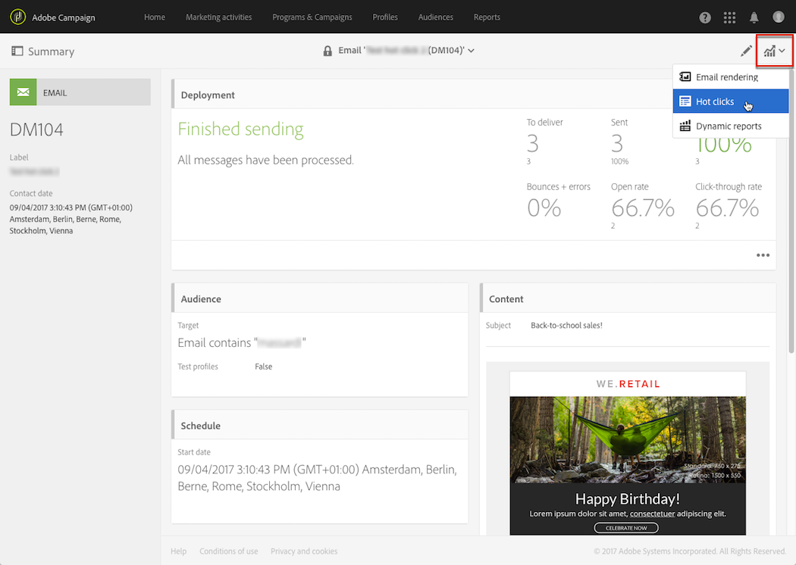
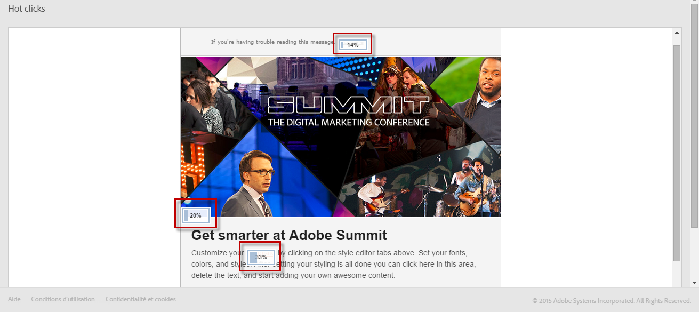
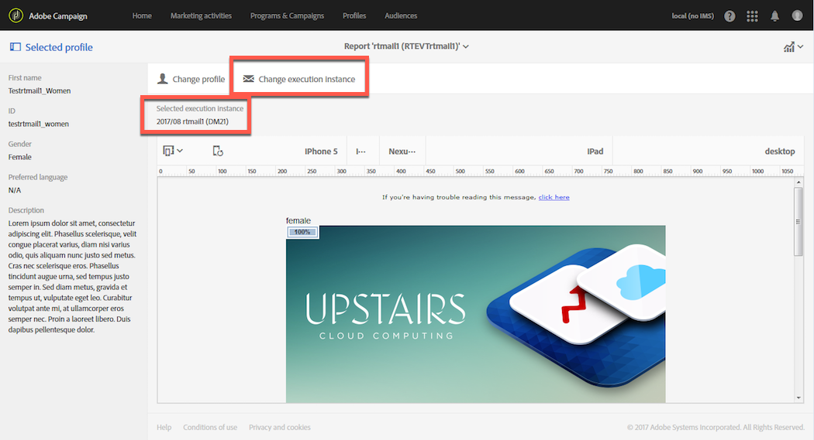

# 热门点击{#hot-clicks}

>[!IMPORTANT]
>
>热门点击报表专门显示电子邮件的HTML版本，不支持文本版本。

通过每个投放或事务型消息中的&#x200B;**[!UICONTROL Reports]**&#x200B;按钮，可访问此报表。

它会显示消息内容以及每个链接上的点击百分比。

如果为投放创建了动态内容，则可以查看所定义每个条件的百分比。 有关在投放中插入条件内容的更多信息，请参阅[定义动态内容](../../designing/using/personalization.md#defining-dynamic-content-in-an-email)。

例如，假设您创建了一个满足以下条件的投放：

* 如果接收者是男性或女性，则主图像上的链接会不同。
* 您还添加了一个指向特殊优惠的链接，该链接仅对25岁以上的收件人可见。

发送消息后，从投放仪表板中选择&#x200B;**[!UICONTROL Reports]** > **[!UICONTROL Hot clicks]**。

默认情况下，未选择配置文件。 仅显示性别未知的收件人以及25岁以下或年龄未知的收件人的点击量。

要显示女性的点击次数，请单击&#x200B;**[!UICONTROL Change profile]**&#x200B;按钮并选择女性测试配置文件。 要显示男性的点击次数，请以类似方式继续并选择男性测试用户档案。

要显示25岁以上收件人的点击次数，请单击&#x200B;**[!UICONTROL Change profile]**&#x200B;按钮，然后选择其出生日期与此条件匹配的测试用户档案。

有关测试配置文件的详细信息，请参阅[关于测试配置文件](../../audiences/using/managing-test-profiles.md)。

>[!NOTE]
>
>特定链接的点击次数是投放中所有条件内容的总点击次数的百分比。 因此，如果您定义了动态内容，则为特定测试用户档案显示的百分比总数可能不等于100。

同样，对于定期投放和事务型消息，您可以选择与要显示的动态内容对应的测试用户档案，也可以根据选定的执行投放查看点击百分比。

执行投放是在以下情况下创建的不可操作且无法正常使用的技术消息：

* 每次执行或更新定期投放时。

  例如，如果管理此投放的工作流每月执行一次，则每月将有一个执行投放。 此外，每次更新投放内容时，都会创建一个额外的执行投放。

  有关定期电子邮件投放的详细信息，请参阅[电子邮件投放](../../automating/using/email-delivery.md)。

* 默认情况下，事务型消息每月出现一次，每次都再次编辑和发布事务型消息。

  有关事务型消息的更多信息，请参阅[事务型消息传递入门](../../channels/using/getting-started-with-transactional-msg.md)。

>[!NOTE]
>
>由于每次执行的跟踪URL的ID不同，因此无法聚合给定消息的所有执行投放的热点点击数据。 一次只能显示一次一个执行投放。

发送消息后，从投放仪表板中选择&#x200B;**[!UICONTROL Reports]** > **[!UICONTROL Hot clicks]**。

默认情况下，选择上一个执行投放。 单击&#x200B;**[!UICONTROL Change execution delivery]**&#x200B;按钮选择其他按钮。

仅显示选定投放执行的点击百分比。
