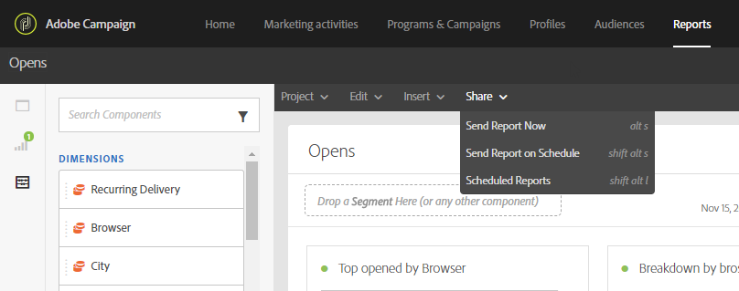

# 报告界面{#reporting-interface}

例如，顶部工具栏允许您修改、保存或打印报表。

使用“项 **目** ”选项卡可以：

* **打开……**:打开先前创建的报告或模板。
* **另存为……**:复制模板以便能够修改它们。
* **刷新项目**:根据新数据和对筛选器的更改更新您的报告。
* **下载CSV**:将报告导出为CSV文件。

编辑 **选项卡** 允许您：

* **撤消**:取消功能板上的上次操作。
* **全部清除**:删除功能板上的每个面板。

通过 **“插入** ”(Insert)表格，您可以通过向功能板中添加图形和表格来自定义报表：

* **新的空白面板**:将新的空白面板添加到功能板。
* **新的自由形式**:向功能板添加新的自由形式表。
* **新行**:将新的折线图添加到功能板。
* **新建栏**:将新条形图添加到功能板。

**相关主题：**

* [添加面板](../../reporting/using/adding-panels.md)
* [添加可视化](../../reporting/using/adding-visualizations.md)
* [添加组件](../../reporting/using/adding-components.md)
* [通过电子邮件自动与利益相关方共享报告](https://helpx.adobe.com/campaign/kb/simplify-campaign-management.html#Reportandshareinsightswithallstakeholders)

## 选项卡 {#tabs}

使用左侧选项卡，您可以根据需要构建报表和筛选数据。

这些选项卡允许您访问以下项目：

* **[!UICONTROL Panels]**:在报表中添加空白面板或自由格式，开始筛选数据。 有关详细信息，请参阅添加面板部分
* **[!UICONTROL Visualizations]**:拖放一系列可视化项目，为报表提供图形维度。 有关此内容的详细信息，请参阅添加可视化部分。
* **[!UICONTROL Components]**:使用不同的维度、指标、细分和时间段自定义您的报表。

## 工具栏 {#toolbar}

工具栏位于工作区上方。 它由不同的选项卡组成，例如，允许您修改、保存、共享或打印报表。

**相关主题：**

* [添加面板](../../reporting/using/adding-panels.md)
* [添加可视化](../../reporting/using/adding-visualizations.md)
* [添加组件](../../reporting/using/adding-components.md)

### “项目”选项卡 {#project-tab}

使用“项 **目** ”选项卡可以：

* **打开……**:打开先前创建的报告或模板。
* **另存为……**:复制模板以便能够修改它们。
* **刷新项目**:根据新数据和对筛选器的更改更新您的报告。
* **下载CSV**:将报告导出为CSV文件。
* **[!UICONTROL Print]**:打印报告。

### 编辑选项卡 {#edit-tab}

编辑 **选项卡** 允许您：

* **撤消**:取消功能板上的上次操作。
* **全部清除**:删除功能板上的每个面板。

### “插入”选项卡 {#insert-tab}

通过 **插入** (Insert)选项卡，您可以通过向功能板中添加图形和表格来自定义报表：

* **新的空白面板**:将新的空白面板添加到功能板。
* **新的自由形式**:向功能板添加新的自由形式表。
* **新行**:将新的折线图添加到功能板。
* **新建栏**:将新条形图添加到功能板。

### “共享”选项卡 {#share-tab}

该选 **[!UICONTROL Share]** 项卡允许您通过一次性或反复发送的电子邮件，向Adobe Campaign用户发送报告。 目标用户随后将收到一封附有您的报告的电子邮件。

* **[!UICONTROL Send report now]**:通过一次性电子邮件将报告发送给选定收件人的列表。

   1. 在窗口 **[!UICONTROL Send report]** 中，根据需要添加说明。

      

   1. 单击字段，在下拉列表中选择收件人，或键入其电子邮件地址，以选择电子邮件收件人。
   1. 检查 **[!UICONTROL Show scheduling options]** 是否要发送重复的电子邮件。 您也可以通过在选项卡中进行 **[!UICONTROL Send Report on schedule]** 选择来完 **[!UICONTROL Share]** 成此操作。
   1. Click **[!UICONTROL Send now]**. 收件人随后将收到一封电子邮件，并附上您的报告。

* **[!UICONTROL Send report on schedule]**:计划您的报告并向收件人发送重复的电子邮件。

   1. 在窗口 **[!UICONTROL Send report]** 中，根据需要添加说明。
   1. 单击字段，在下拉列表中选择收件人，或键入其电子邮件地址，以选择电子邮件收件人。

      

   1. 在和字段中选择开始和结束日期以配置电子邮件的有 **[!UICONTROL Starting on]** 效 **[!UICONTROL Ending on]** 性。
   1. 选择您的电子邮件的发送频率。

      

   1. 单击 **[!UICONTROL Send on schedule]**&#x200B;此按钮，您的收件人将收到您的重复电子邮件，具体取决于所选的频率。

* **[!UICONTROL Scheduled reports]**:查找并配置所有计划报告。

   1. 在窗口 **[!UICONTROL Scheduled reports]** 中，查找所有重复发送的报告。

      

   1. 如果需要删除其中一个计划报表，请选择要删除的计划报表，然后单击 **[!UICONTROL Delete the section]**。
   1. 要配置或检查计划报告，请直接单击要更改的报告。
   1. 此时 **[!UICONTROL Edit scheduled report]** 会显示窗口，您现在可以根据需要更改电子邮件的收件人或频率。

目标用户随后将收到一封电子邮件，您的报告直接附加在他们的收件箱中。 用户始终可以决定使用每个循环电子邮件中提供的取消订阅链接停止接收循环电子邮件。

**相关主题：**

* [通过电子邮件自动与利益相关方共享报告](https://helpx.adobe.com/campaign/kb/simplify-campaign-management.html#Reportandshareinsightswithallstakeholders)
