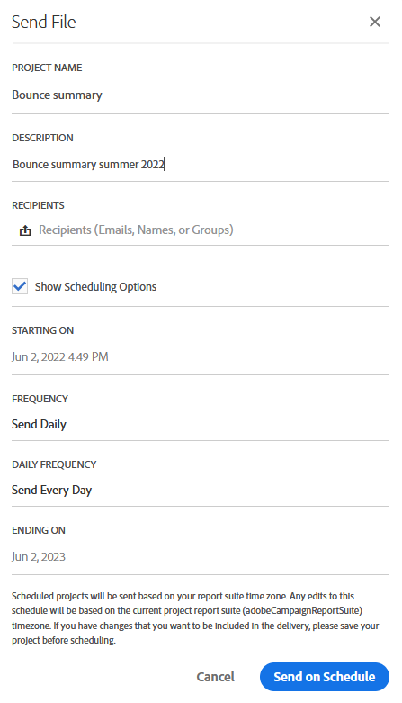

# 报告界面{#reporting-interface}

例如，顶部工具栏允许您修改、保存或打印报告。

使用 **项目** 按Tab键以：

* **打开……**：打开之前创建的报表或模板。
* **另存为……**：复制模板以修改它们。
* **刷新项目**：根据新数据和筛选器更改更新报表。
* **下载CSV**：将报表导出到CSV文件。

此 **编辑** 选项卡允许您：

* **撤消**：取消您在功能板上的上一个操作。
* **全部清除**：删除功能板上的每个面板。

此 **插入** 表格允许您通过向功能板添加图形和表格来自定义报表：

* **新建空白面板**：向功能板添加新的空白面板。
* **新建自由格式**：向功能板中添加新的自由格式表。
* **换行符**：向功能板中添加新的折线图。
* **新建栏**：向功能板中添加新的条形图。

**相关主题：**

* [添加面板](../../reporting/using/adding-panels.md)
* [添加可视化](../../reporting/using/adding-visualizations.md)
* [添加组件](../../reporting/using/adding-components.md)
* [通过电子邮件自动与利益相关者共享报告](https://helpx.adobe.com/campaign/kb/simplify-campaign-management.html#Reportandshareinsightswithallstakeholders)

## 选项卡 {#tabs}

通过左侧的选项卡，可构建报告并根据需要筛选数据。

通过这些选项卡，可访问以下项目：

* **[!UICONTROL Panels]**：在报表中添加空白面板或自由格式以开始筛选数据。 有关更多信息，请参阅添加面板一节
* **[!UICONTROL Visualizations]**：拖放所选的可视化图表项以为报表提供一个图形维度。 有关更多信息，请参阅添加可视化图表一节。
* **[!UICONTROL Components]**：使用不同的维度、量度、区段和时间段自定义您的报表。

## 工具栏 {#toolbar}

工具栏可在工作区上方找到。 它由不同的选项卡组成，允许您修改、保存、共享或打印报告。

**相关主题：**

* [添加面板](../../reporting/using/adding-panels.md)
* [添加可视化](../../reporting/using/adding-visualizations.md)
* [添加组件](../../reporting/using/adding-components.md)

### “项目”选项卡 {#project-tab}

使用 **项目** 按Tab键以：

* **打开……**：打开之前创建的报表或模板。
* **另存为……**：复制模板以修改它们。
* **刷新项目**：根据新数据和筛选器更改更新报表。
* **下载CSV**：将报表导出到CSV文件。
* **[!UICONTROL Print]**：打印报表。

### “编辑”选项卡 {#edit-tab}

此 **编辑** 选项卡允许您：

* **撤消**：取消您在功能板上的上一个操作。
* **全部清除**：删除功能板上的每个面板。

### 插入选项卡 {#insert-tab}

此 **插入** 选项卡允许您通过向功能板添加图形和表格来自定义报表：

* **新建空白面板**：向功能板添加新的空白面板。
* **新建自由格式**：向功能板中添加新的自由格式表。
* **换行符**：向功能板中添加新的折线图。
* **新建栏**：向功能板中添加新的条形图。

### “共享”选项卡 {#share-tab}

此 **[!UICONTROL Share]** 选项卡允许您通过一次性或定期电子邮件向Adobe Campaign用户发送报告。 随后，定向用户将收到一封电子邮件，其中包含您附加的报告。

* **[!UICONTROL Send report now]**：通过一次性电子邮件将您的报告发送给选定的收件人列表。

   1. 在 **[!UICONTROL Send report]** 窗口中，根据需要添加描述。

      

   1. 从下拉列表中选择收件人。 请注意，您不能选择组织外的用户。
   1. Check **[!UICONTROL Show scheduling options]** （如果要发送定期电子邮件）。 这也可以通过选择来完成 **[!UICONTROL Send Report on schedule]** 在 **[!UICONTROL Share]** 选项卡。
   1. 单击 **[!UICONTROL Send now]**。然后，收件人将收到一封电子邮件，其中包含您的附加报告。

* **[!UICONTROL Send report on schedule]**：计划报告并向收件人发送定期电子邮件。

   1. 在 **[!UICONTROL Send report]** 窗口中，根据需要添加描述。
   1. 从下拉列表中选择收件人。 请注意，您不能选择组织外的用户。

      

   1. 选择您的开始日期和结束日期，以配置电子邮件有效期 **[!UICONTROL Starting on]** 和 **[!UICONTROL Ending on]** 字段。
   1. 选择发送电子邮件的频率。

      

   1. 单击 **[!UICONTROL Send on schedule]**，收件人将根据所选的频率接收定期电子邮件。

* **[!UICONTROL Scheduled reports]**：查找并配置所有计划报表。

   1. 在 **[!UICONTROL Scheduled reports]** 窗口，查找所有定期发送的报告。

      

   1. 如果需要删除计划报表之一，请选择要删除的计划报表，然后单击 **[!UICONTROL Delete the section]**.
   1. 要配置或检查计划报表，请直接单击需要更改的报告。
   1. 此 **[!UICONTROL Edit scheduled report]** 窗口中，您现在可以根据需要更改电子邮件的收件人或频率。

然后，目标用户将收到一封电子邮件，其中包含您的报告，并直接附加在其收件箱中。 用户始终可以使用每封定期电子邮件中提供的退订链接决定停止接收定期电子邮件。

**相关主题：**

* [通过电子邮件自动与利益相关者共享报告](https://helpx.adobe.com/campaign/kb/simplify-campaign-management.html#Reportandshareinsightswithallstakeholders)
