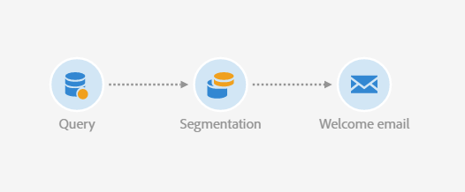

# 计算发送日期{#computing-the-sending-date}

您可以定义一个公式，在特定日期和时间将消息发送给每个收件人。

## 自定义日期公式 {#customizing-date-formula}

例如，您可以在加速过程中使用发送时间优化。

使用新平台发送电子邮件时，Internet服务提供商(ISP)会怀疑无法识别的IP地址。 如果突然发送了大量电子邮件，ISP通常会将其标记为垃圾邮件。

为避免被标记为垃圾邮件，您可以通过在不同时间分发大量电子邮件来逐渐增加发送量。 这应确保开始阶段的顺利开发，并使您能够降低无效地址的总体速率。

例如，您可以随机细分目标受众，以分五批发送投放。 您将在6月1日上午10:00发送第一批代表目标受众的10%,24小时后发送第二批代表受众的15%，依此类推。

您可以使用工作流来计划它。



1. 访问营销活动列表并创建新工作流。 See [Creating a workflow](../../automating/using/building-a-workflow.md#creating-a-workflow).
1. Drag and drop a **Query** activity into your workflow and open it. 请参阅 [查询](../../automating/using/query.md) 部分。
1. 选择受众，例如所有金牌客户，然后单 **[!UICONTROL Confirm]** 击以保存查询。
1. Drag and drop a **Segmentation** activity into your workflow and open it. 请参阅 [分段](../../automating/using/segmentation.md) 。
1. 定义五个细分。 对于每个区段：

   * 填写字 **[!UICONTROL Segment code]** 段：手动输入发送消息所需的日期和时间。

      例如，您希望在6月1日上午10:00 GMT+1发送第一批批。 使用以下格式： **YYYY-MM-DD hh:mm:ss+tz**。

      

      要在后天发送下一批，请 **输入2017-06-02 10:00:00** +01作为第二段。

      对于其余段，按如下方式定义下一批：

      * **2017-06-03 10:00:00+01**
      * **2017-06-04 10:00:00+01**
      * **2017-06-05 10:00:00+01**
   * 确保您选择了 **[!UICONTROL Limit the population of this segment]** 选项。

      在标签 **[!UICONTROL Limitation]** 中，选 **[!UICONTROL Random sampling]** 择并输入每个区段的所需百分比：第一批10，第二批15，依此类推。

      


1. 定义所有区段后，选择并 **[!UICONTROL Generate all segments in the same transition]** 单击 **[!UICONTROL Confirm]**。

   

1. Drag and drop an **Email delivery** activity into your workflow and open it. 请参阅电 [子邮件投放](../../automating/using/email-delivery.md) 部分。
1. 单击电 **[!UICONTROL Schedule]** 子邮件仪表板中的部分，然后选择 **[!UICONTROL Messages to be sent automatically on the date specified below]**。
1. 在字段 **[!UICONTROL Start sending from]** 中，定义联系人日期。
1. 从发送时间优化下拉菜单中，选择 **[!UICONTROL Send at a custom date defined by a formula]**。
1. 单击字 **[!UICONTROL Edit an expression]** 段的按 **[!UICONTROL Custom date formula]** 钮。

   

1. 使用函数和字段 **[!UICONTROL ToDateTime]** 创建以下 **[!UICONTROL Segment code]** 表达式。 您还可以直接键入表达式，但应确保使用正确的语法和拼写。

   ```
   ToDateTime([targetData/@segmentCode])
   ```

   该函 **[!UICONTROL ToDateTime]** 数将段代码从文本字符串转换为日期和时间值。

   确认表达式返回到上一个屏幕。

   

   在窗口 **[!UICONTROL Schedule]** 中，自定义日期公式显示如下：

   ```
   ToDateTime([targetData/@segmentCode])
   ```

   

1. 确认计划，保存投放并执行工作流。

投放将在五天内逐步发送到所有目标收件人。

>[!NOTE]
>
>确保确认发送时所有日期都在将来。 否则，消息将在确认发送后立即发送。

## 使用表达式 {#using-an-expression}

发送时间优化对于涉及呼叫中心的活动也很有用。 您可以确保不同时接收所有消息。 这样，您的组织可以根据其容量处理呼叫数。

例如，您希望发送一封电子邮件，邀请客户与呼叫中心联系以获得促销优惠。 为避免呼叫中心挤占用户，您决定随机分段目标受众，以四批发送电子邮件。

您可以使用工作流来计划它。


1. 访问营销活动列表并创建新工作流。 See [Creating a workflow](../../automating/using/building-a-workflow.md#creating-a-workflow).
1. Drag and drop a **Query** activity into your workflow and open it. 请参阅 [查询](../../automating/using/query.md) 部分。
1. 选择一个受众，例如超过35个用户档案，然后 **[!UICONTROL Confirm]** 单击以保存查询。
1. Drag and drop a **Segmentation** activity into your workflow and open it. 请参阅 [分段](../../automating/using/segmentation.md) 。
1. 定义四个区段。 对于每个区段：

   * 按如下方式定义段代码:

      * 上午8:00 —— 上午10:00: **0**. 消息将在上午8:00（联系日期）发送给目标口的第一季度。
      * 上午10:00 —— 下午12:00:00 **2**. 消息将在上午10:00（联系日期+ 2小时）发送给目标人口的第二季度。
      * 下午2:00 —下午4:00 : **6**. 呼叫中心在下午12:00至下午2:00之间关闭，消息将在下午2:00（联系日期+ 6小时）发送给目标群体的第三季度。
      * 下午4:00 —下午6:00 : **8**. 消息将在下午4:00（联系日期+ 8小时）发送到最后一个季度的目标群。

      >[!NOTE]
      >
      >联系日期将在工作流的稍后的电子邮件投放活动中定义。

   * 确保您选择了 **[!UICONTROL Limit the population of this segment]** 选项。
   * 在标签 **[!UICONTROL Limitation]** 中，选 **[!UICONTROL Random sampling]** 择并输入每个区段的所需百分比： **25**.


1. 定义所有区段后，选择并 **[!UICONTROL Generate all segments in the same transition]** 单击 **[!UICONTROL Confirm]**。

   

1. Drag and drop an **Email delivery** activity into your workflow and open it. 请参阅电 [子邮件投放](../../automating/using/email-delivery.md) 部分。
1. 单击电 **[!UICONTROL Schedule]** 子邮件仪表板中的部分。
1. 选择 **[!UICONTROL Messages to be sent automatically on the date specified below]**。
1. 在字段 **[!UICONTROL Start sending from]** 中，定义联系人日期。

   在此示例中，选择5月25日上午8:00。

1. 从发送时间优化下拉菜单中，选择 **[!UICONTROL Send at a custom date defined by a formula]** 并单击按 **[!UICONTROL Edit an expression]** 钮。

   

1. 在中 **[!UICONTROL Expression editor]**，设置日期和段代码以计算每个客户的数据。

   在函数列表中，选择 **[!UICONTROL AddHours]**。

   

   在可用字段中，选择 **[!UICONTROL Current delivery]** > **[!UICONTROL Delivery scheduling]** > **[!UICONTROL Contact date]**。

   

   这使您能够检索字段中指定的日期和 **[!UICONTROL Start sending from]** 时间。

   在函数列表中，选择 **[!UICONTROL ToInteger]**。 在可用字段中，选择 **[!UICONTROL Additional data]** > **[!UICONTROL Segment code]**。

   

   这使您能够检索您在段代码中指定的数字。

   您应该得到以下公式：

   ```
   AddHours([currentDelivery/scheduling/@contactDate], ToInteger([targetData/@segmentCode]))
   ```

1. 确认保存表达式。 确认计划，保存投放并执行工作流。

* 第一段将在联系日（5月25日上午8点）收到消息。
* 第二段将在两小时后（5月25日上午10点）收到消息。
* 第三部分将在六小时后（5月25日下午2点）收到消息。
* 第四部分将在8小时后（5月25日下午4点）收到消息。

