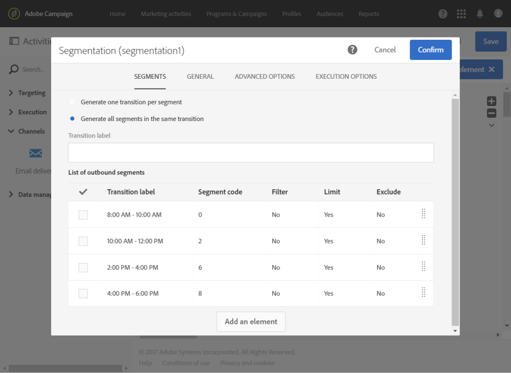

# 计算发送日期{#computing-the-sending-date}

您可以定义一个公式，以在特定日期和时间向每个收件人发送消息。

## 自定义日期公式{#customizing-date-formula}

例如，您可以在加速过程中使用发送时间优化。

使用新平台发送电子邮件时，Internet服务提供商(ISP)会怀疑无法识别的IP地址。 如果突然发送了大量电子邮件，ISP往往会将其标记为垃圾邮件。

为避免被标记为垃圾邮件，您可以通过在不同时间分发大量电子邮件来逐渐增加发送量。 这应确保开始阶段的顺利开发，并使您能够降低无效地址的总体速率。

例如，您可以随机细分目标受众，以分五批发送投放。 您将在6月1日上午10:00发送第一批代表目标受众的10%，在24小时后发送第二批代表受众的15%，依此类推。

您可以使用工作流来计划它。


1. 访问营销活动列表并创建新工作流。 请参阅[创建工作流](../../automating/using/building-a-workflow.md#creating-a-workflow)。
1. 将&#x200B;**查询**&#x200B;活动拖放到工作流中并打开它。 请参阅[查询](../../automating/using/query.md)部分。
1. 选择一个受众，例如您的所有Gold客户，然后单击&#x200B;**[!UICONTROL Confirm]**&#x200B;以保存该查询。
1. 将&#x200B;**分段**&#x200B;活动拖放到您的工作流中并打开它。 请参阅[分段](../../automating/using/segmentation.md)部分。
1. 定义五个细分。 对于每个区段：

   * 填写&#x200B;**[!UICONTROL Segment code]**&#x200B;字段：手动输入发送消息所需的日期和时间。

      例如，您希望在6月1日上午10:00 GMT+1发送第一批批。 使用以下格式：**YYYY-MM-DD hh:mm:ss+tz**。

      

      要在次日发送下一批，请输入&#x200B;**2017-06-02 10:00:00+01**&#x200B;作为第二段。

      对于其余段，按如下方式定义下一批：

      * **2017-06-03 10:00:00+01**
      * **2017-06-04 10:00:00+01**
      * **2017-06-05 10:00:00+01**
   * 确保选择&#x200B;**[!UICONTROL Limit the population of this segment]**&#x200B;选项。

      在&#x200B;**[!UICONTROL Limitation]**&#x200B;选项卡中，选择&#x200B;**[!UICONTROL Random sampling]**&#x200B;并为每个区段输入所需的百分比：第一批10，第二批15，依此类推。

      


1. 定义所有区段后，选择&#x200B;**[!UICONTROL Generate all segments in the same transition]**&#x200B;并单击&#x200B;**[!UICONTROL Confirm]**。

   

1. 将&#x200B;**电子邮件投放**&#x200B;活动拖放到您的工作流中并打开它。 请参阅[电子邮件投放](../../automating/using/email-delivery.md)部分。
1. 单击电子邮件仪表板中的&#x200B;**[!UICONTROL Schedule]**&#x200B;部分，然后选择&#x200B;**[!UICONTROL Messages to be sent automatically on the date specified below]**。
1. 在&#x200B;**[!UICONTROL Start sending from]**&#x200B;字段中，定义联系日期。
1. 从发送时间优化下拉菜单中，选择&#x200B;**[!UICONTROL Send at a custom date defined by a formula]**。
1. 单击&#x200B;**[!UICONTROL Custom date formula]**&#x200B;字段的&#x200B;**[!UICONTROL Edit an expression]**&#x200B;按钮。

   

1. 使用&#x200B;**[!UICONTROL ToDateTime]**&#x200B;函数和&#x200B;**[!UICONTROL Segment code]**&#x200B;字段创建以下表达式。 您还可以直接键入表达式，但应确保使用正确的语法和拼写。

   ```
   ToDateTime([targetData/@segmentCode])
   ```

   **[!UICONTROL ToDateTime]**&#x200B;函数将段代码从文本字符串转换为日期和时间值。

   确认表达式以返回到上一个屏幕。

   

   在&#x200B;**[!UICONTROL Schedule]**&#x200B;窗口中，自定义日期公式显示如下：

   ```
   ToDateTime([targetData/@segmentCode])
   ```

   

1. 确认计划，保存投放并执行工作流。

该投放将在五天内逐步发送给所有目标收件人。

>[!NOTE]
>
>确保确认发送时所有日期都在将来。 否则，消息将在确认发送后立即发送。

## 使用表达式{#using-an-expression}

发送时间优化对于涉及呼叫中心的活动也很有用。 您可以确保不会同时接收所有消息。 这使您的组织能够根据其容量处理呼叫数。

例如，您希望发送一封电子邮件，邀请您的客户与呼叫中心联系，以获得促销优惠。 为避免呼叫中心挤压您，您决定随机分段目标受众，以四批发送您的电子邮件。

您可以使用工作流来计划它。


1. 访问营销活动列表并创建新工作流。 请参阅[创建工作流](../../automating/using/building-a-workflow.md#creating-a-workflow)。
1. 将&#x200B;**查询**&#x200B;活动拖放到工作流中并打开它。 请参阅[查询](../../automating/using/query.md)部分。
1. 选择一个受众(例如35个以上的用户档案)，然后单击&#x200B;**[!UICONTROL Confirm]**&#x200B;以保存查询。
1. 将&#x200B;**分段**&#x200B;活动拖放到您的工作流中并打开它。 请参阅[分段](../../automating/using/segmentation.md)部分。
1. 定义四个区段。 对于每个区段：

   * 定义段代码如下：

      * 上午8:00 — 上午10:00 :**0**。 消息将在上午8:00（联系日期）发送到目标人口的第一季度。
      * 上午10:00 — 下午12:00 :**2**。 消息将在上午10:00（联系日+ 2小时）发送到目标人口的第二季度。
      * 下午2:00 — 下午4:00:**6**。 呼叫中心在中午12:00至下午2:00之间关闭，消息将在下午2:00（联系日+ 6小时）发送到目标人口的第三季度。
      * 下午4:00 — 下午6:00:**8**。 消息将在下午4:00（联系日+ 8小时）发送到最后四分之一的目标。

      >[!NOTE]
      >
      >联系日期将在工作流稍后的“电子邮件投放”活动中定义。

   * 确保选择&#x200B;**[!UICONTROL Limit the population of this segment]**&#x200B;选项。
   * 在&#x200B;**[!UICONTROL Limitation]**&#x200B;选项卡中，选择&#x200B;**[!UICONTROL Random sampling]**&#x200B;并为每个区段输入所需的百分比：**25**。


1. 定义所有区段后，选择&#x200B;**[!UICONTROL Generate all segments in the same transition]**&#x200B;并单击&#x200B;**[!UICONTROL Confirm]**。

   

1. 将&#x200B;**电子邮件投放**&#x200B;活动拖放到您的工作流中并打开它。 请参阅[电子邮件投放](../../automating/using/email-delivery.md)部分。
1. 单击电子邮件仪表板中的&#x200B;**[!UICONTROL Schedule]**&#x200B;部分。
1. 选择 **[!UICONTROL Messages to be sent automatically on the date specified below]**。
1. 在&#x200B;**[!UICONTROL Start sending from]**&#x200B;字段中，定义联系日期。

   在此示例中，选择5月25日上午8:00。

1. 从发送时间优化下拉菜单中，选择&#x200B;**[!UICONTROL Send at a custom date defined by a formula]**&#x200B;并单击&#x200B;**[!UICONTROL Edit an expression]**&#x200B;按钮。

   

1. 在&#x200B;**[!UICONTROL Expression editor]**&#x200B;中，设置日期和段代码以计算每个客户的数据。

   在函数列表中，选择&#x200B;**[!UICONTROL AddHours]**。

   

   在可用字段中，选择&#x200B;**[!UICONTROL Current delivery]** > **[!UICONTROL Delivery scheduling]** > **[!UICONTROL Contact date]**。

   

   这使您能够检索在&#x200B;**[!UICONTROL Start sending from]**&#x200B;字段中指定的日期和时间。

   在函数列表中，选择&#x200B;**[!UICONTROL ToInteger]**。 在可用字段中，选择&#x200B;**[!UICONTROL Additional data]** > **[!UICONTROL Segment code]**。

   

   这样，您就可以检索在段代码中指定的数字。

   您应该获得以下公式：

   ```
   AddHours([currentDelivery/scheduling/@contactDate], ToInteger([targetData/@segmentCode]))
   ```

1. 确认保存表达式。 确认计划，保存投放并执行工作流。

* 第一段将在联系日（5月25日上午8点）收到消息。
* 第二段将在两小时后（5月25日上午10点）收到消息。
* 第三部分将在六小时后（5月25日下午2点）收到消息。
* 第四部分将在八小时后（5月25日下午4点）收到消息。

