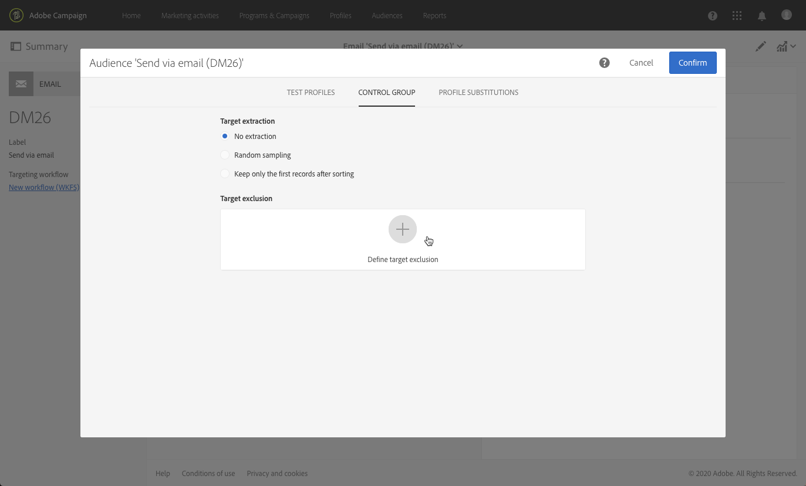
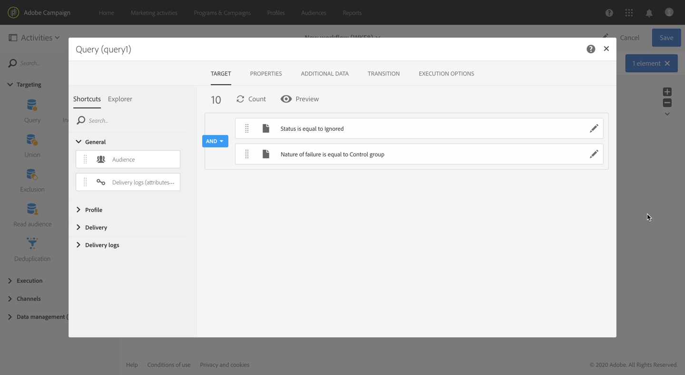
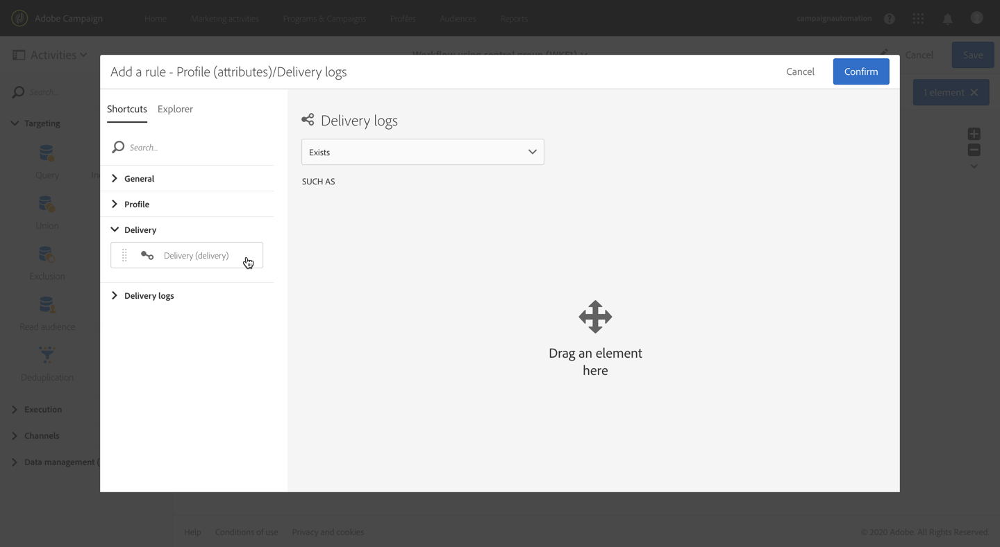
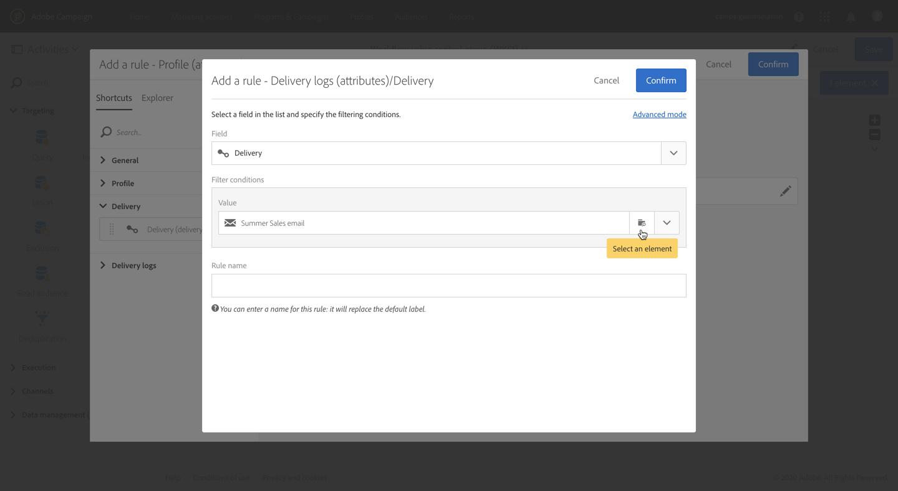

# 添加控制组 {#adding-control-group}

您可以使用控制组避免向部分受众发送消息，以便衡量活动的影响。

要在 Adobe Campaign 中执行此操作，请在定义投放目标时创建<b>控制组</b>。用户档案会随机、已筛选或未筛选或者根据条件添加到控制组中。

然后，便能够将收到消息的目标群体的行为与非目标联系人的行为进行比较。根据发送日志，还可以在将来活动中以控制组为目标。

<!--The control group is built when the delivery is prepared.-->

## 概述 {#overview}

可以从主目标随机提取和/或从特定群体中选择该控制组。因此，有两种主要方法可定义控制组：
* 从主目标&#x200B;**提取**&#x200B;大量用户档案。
* 根据查询中定义的条件&#x200B;**排除**&#x200B;某些用户档案。

在定义控制组时，可以同时使用这两种方法。

在投放准备步骤中属于控制组的所有用户档案都将从主目标中删除。一旦发送消息，这些用户档案就将不会收到该消息。

## 从目标群体提取 {#extraction-target-population}

要定义控制组，您可以选择随机或基于排序从目标群体提取某个百分比或固定数量的用户档案。

### 目标提取 {#target-extraction}

首先，定义将从目标提取用户档案的方式：**随机**&#x200B;或基于&#x200B;**排序**。

在 **[!UICONTROL Target extraction]** 部分下，选择下列选项之一：

* **[!UICONTROL Random sampling]**：在准备投放时，Adobe Campaign 将随机提取与百分比或与将设置为[大小限制](#size-limit)的最大数量对应的用户档案数。

   例如，如果您随后在 **[!UICONTROL Limits]** 部分中将阈值设置为 10，则控制组将由从目标群体中随机选择的 10% 组成。<!--Change screenshot to match example)-->

   

* **[!UICONTROL Keep only the first records after sorting]**：通过此选项可根据一个或多个排序顺序定义限制。

   例如：

   * 选择 **[!UICONTROL Age]** 字段作为排序条件。
   * 在 **[!UICONTROL Limits]** 部分中将 100 定义为阈值（请参阅[大小限制](#size-limit)）。
   * 保持选中 **[!UICONTROL Descending sort]** 选项。

   因此，控制组将由 100 个最早的收件人组成。<!--Change screenshot to match example)-->

   

   定义包含很少或频繁购买的用户档案的控制组，并将其行为与联系的收件人的行为进行比较可能很有趣。

>[!NOTE]
>
>选择 **[!UICONTROL No extraction]**（如果不想使用 **[!UICONTROL Target extraction]** 选项）。

<!---->

### 大小限制 {#size-limit}

无论您是选择 **[!UICONTROL Random sampling]** 还是 **[!UICONTROL Keep only the first records after sorting]**，都必须设置将如何限制从主目标提取的用户档案数。执行以下操作之一：

* 选择 **[!UICONTROL Size (as a % of the initial population)]** 并填充对应的框架。

   例如，如果设置 10，则根据以上选择的选项，Adobe Campaign 将执行以下任一操作：
   * 随机提取目标群体的 10%。
   * 如果选择 **[!UICONTROL Age]** 字段作为排序条件，则从目标群体中提取 10% 的最旧用户档案。

   >[!NOTE]
   >
   >如果取消选中 **[!UICONTROL Descending sort]** 选项，则将提取 10% 的最新用户档案。

* 选择 **[!UICONTROL Maximum size]** 并填充对应的框架。

   例如，如果设置 100，则 Adobe Campaign 将执行以下任一操作：
   * 从目标群体中随机提取 100 个用户档案。
   * 如果选择 **[!UICONTROL Age]** 字段作为排序条件，则从目标群体中提取 100 个最旧用户档案。

   >[!NOTE]
   >
   >如果取消选中 **[!UICONTROL Descending sort]** 选项，则将提取 100 个最新用户档案。

## 排除特定群体 {#excluding-specific-population}

定义控制组的另一种方法是使用查询从目标中排除特定群体。

操作步骤：

1. 从 **[!UICONTROL Target exclusion]** 部分中，单击 **[!UICONTROL Define target exclusion]**。

   

1. 使用[查询编辑器](../../automating/using/editing-queries.md)定义排除条件。您还可以选择先前创建的[受众](../../audiences/using/about-audiences.md)。

   

1. 单击 **[!UICONTROL Confirm]**.

将从目标中排除与查询结果匹配的用户档案。

<!--For more on using the query editor, see the [Editing queries](../../automating/using/editing-queries.md) section.-->

## 用例：设置控制组 {#control-group-example}

下面是一个示例，其中显示如何使用下列两种方法定义控制组：从主目标提取用户档案和使用查询排除特定群体。

1. 创建工作流.有关创建工作流的详细步骤，请参阅[构建工作流](../../automating/using/building-a-workflow.md)一节。
1. 在 **[!UICONTROL Activities]** > **[!UICONTROL Targeting]** 中，拖放[查询](../../automating/using/query.md)活动。双击活动并定义目标。<!--For example, in **[!UICONTROL Shortcuts]**, drag and drop **[!UICONTROL Profile]**, select **[!UICONTROL Age]** with the operator **[!UICONTROL Greater than]** and type 25 in the **[!UICONTROL Value]** field.-->

1. 在 **[!UICONTROL Activities]** > **[!UICONTROL Channels]** 中，将[电子邮件投放](../../automating/using/email-delivery.md)活动拖放到主目标段之后，然后进行编辑。
1. 单击投放仪表板中的 **[!UICONTROL Audience]** 块。

1. 选择 **[!UICONTROL Control group]** 选项卡。

   

1. 从 **[!UICONTROL Target extraction]** 部分中，选择 **[!UICONTROL Keep only the first records after sorting]**。
1. 对年龄进行排序，并保持选中 **[!UICONTROL Descending]** 排序选项。

   

1. 将 100 设置为最大大小。将提取目标中 100 个最旧用户档案。

1. 在 **[!UICONTROL Target exclusion]** 部分中，使用[查询编辑器](../../automating/using/editing-queries.md)根据选择的条件定义将从目标中排除的用户档案。例如，“年龄小于 20 岁”。

   

   将排除年龄在 20 岁以下的用户档案。

1. 启动[投放准备](../../sending/using/preparing-the-send.md)并[确认发送](../../sending/using/confirming-the-send.md)。

将从主目标中提取已提取的用户档案（100 个最旧用户档案）和已根据查询定义的用户档案（年龄在 20 岁以下的用户档案）。这些用户档案将不会收到消息。

## 比较结果 {#delivery-logs}

现在您已发送投放，可以如何处理控制组？

您可以提取&#x200B;**发送日志**，以将未收到通信的控制组的行为方式与有效目标进行比较。您还可以使用投放日志&#x200B;**构建其他目标**。

>[!IMPORTANT]
>
>您需要具有[管理员角色](../../administration/using/users-management.md#functional-administrators)并隶属 **[!UICONTROL All]** [组织单位](../../administration/using/organizational-units.md)才能连接到 Adobe Campaign。如果您希望限制特定用户或用户组的访问权，请勿将其链接到能够访问投放日志的 **[!UICONTROL All]** 单位。

### 检查投放日志 {#checking-logs}

要查看在发送消息后从目标中删除了哪些用户档案，请检查 **[!UICONTROL Delivery logs]**。有关投放日志以及如何对其进行访问的更多信息，请参阅[此部分](../../sending/using/monitoring-a-delivery.md#delivery-logs)。

* 在 **[!UICONTROL Sending logs]** 选项卡中，您可以查看已提取和已排除的用户档案。它们具有 **[!UICONTROL Ignored]** 状态，并且失败的原因为 **[!UICONTROL Control group]**。

   

* 您还可以检查 **[!UICONTROL Exclusion causes]** 选项卡，以查看未包含在投放中的用户档案数。

   

### 使用控制组日志 {#using-logs}

发送投放后，可以使用投放日志对未收到消息的用户档案进行筛选。按照下面的步骤进行操作：

1. 创建工作流.有关创建工作流的详细步骤，请参阅[构建工作流](../../automating/using/building-a-workflow.md)一节。
1. 在 **[!UICONTROL Activities]** > **[!UICONTROL Targeting]** 中，拖放[查询](../../automating/using/query.md)活动。
1. 在 **[!UICONTROL Properties]** 选项卡中， 将 **[!UICONTROL Delivery logs]** 设置为 **[!UICONTROL Resource]**，并将 **[!UICONTROL Profile]** 设置为 **[!UICONTROL Targeting dimension]**。

   

1. 在 **[!UICONTROL Target]** 选项卡中，单击 **[!UICONTROL Delivery logs]**。
1. 拖放 **[!UICONTROL Status]** 并选择 **[!UICONTROL Ignored]** 作为筛选条件。

   

1. 单击 **[!UICONTROL Confirm]**.

1. 仍然在 **[!UICONTROL Target]** 选项卡中，拖放 **[!UICONTROL Nature of failure]** 并选择 **[!UICONTROL Control group]** 作为筛选条件。

   

1. 单击 **[!UICONTROL Confirm]**.

   

然后，可以使用&#x200B;**提取文件**&#x200B;活动，跟以例如&#x200B;**传输文件**&#x200B;活动来导出日志数据。这样，您即可在自己的报告工具中与控制组相比较来分析有效目标上的活动的结果。有关导出日志的更多信息，请参阅[此部分](../../automating/using/exporting-logs.md)。

### 确定控制组目标 {#targeting-control-group}

要根据未收到消息的用户档案确定目标，您还可以使用投放日志。按照下面的步骤进行操作：

1. 创建工作流.有关创建工作流的详细步骤，请参阅[构建工作流](../../automating/using/building-a-workflow.md)一节。
1. 在 **[!UICONTROL Activities]** > **[!UICONTROL Targeting]** 中，拖放第一个[查询](../../automating/using/query.md)活动。
1. 在 **[!UICONTROL Properties]** 选项卡中，确保选择 **[!UICONTROL Profile]** 资源作为 **[!UICONTROL Resource]** 和 **[!UICONTROL Targeting dimension]**。

   

1. 在 **[!UICONTROL Target]** 选项卡中，展开 **[!UICONTROL Delivery]** 并拖放 **[!UICONTROL Delivery logs]**。

   

1. 在 **[!UICONTROL Add a rule]** 窗口中，拖放 **[!UICONTROL Delivery]**。

   

1. 选择已发送的电子邮件作为筛选条件。单击 **[!UICONTROL Confirm]**.

   

1. 返回 **[!UICONTROL Add a rule]** 窗口中，拖放 **[!UICONTROL Status]** 并选择 **[!UICONTROL Ignored]** 作为筛选条件。单击 **[!UICONTROL Confirm]**.

   

1. 拖放 **[!UICONTROL Nature of failure]** 并选择 **[!UICONTROL Control group]** 作为筛选条件。单击 **[!UICONTROL Confirm]**.

   

1. 确保条件全都与 **AND** 布尔运算符一致。

   

1. 单击 **[!UICONTROL Confirm]**.

现在，可以将未收到第一条消息的用户档案设为目标，因为它们属于控制组，并向其发送另一封电子邮件。

在同一工作流中，您还可以创建其他查询来将收到电子邮件的用户档案设为目标，并向其发送其他消息。

