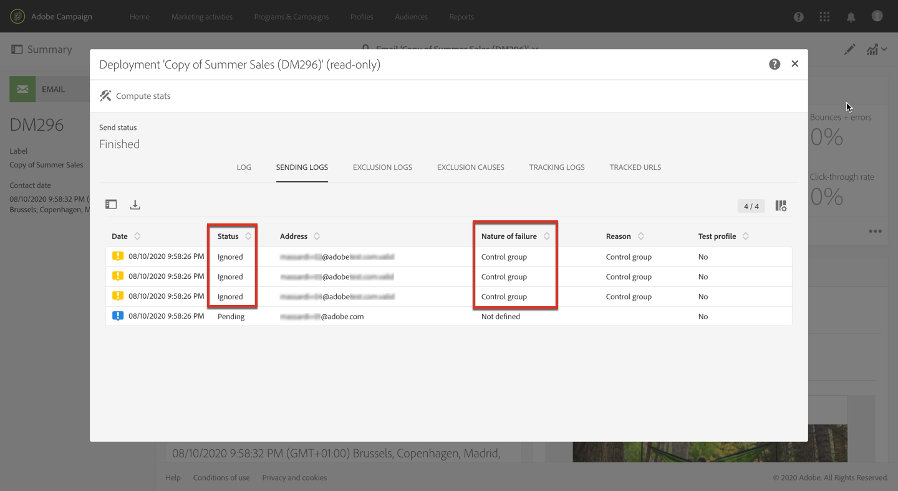

# 添加对照组 {#adding-control-group}

您可以使用对照组避免向受众的某一部分发送消息，以衡量活动的影响。

要在Adobe Campaign中执行此操作，请在定 <b>义对照组</b> 时创建一个目标。 用户档案会随机添加到对照组中，筛选或不筛选，或根据条件添加。

然后，您将能够将收到消息的目标群体的行为与未定位的联系人的行为进行比较。 根据发送日志，您还可以在将来目标对照组。

<!--The control group is built when the delivery is prepared.-->

## 概述 {#overview}

该对照组可以从主目标随机提取和／或从特定群体中选择。 因此，有两种主要方法可定义对照组:
* **从主** 用户档案中提取大量目标。
* **根据** 查询中定义的条件排除某些用户档案。

定义对照组时，可以同时使用这两种方法。

在投放准备步骤中作为对照组一部分的所有用户档案都将从主目标中删除。 邮件一经发送，他们就不会收到。

## 从目标群体中提取 {#extraction-target-population}

要定义对照组，您可以选择从目标群中随机或基于排序、百分比或固定数量的用户档案提取。

### 目标提取 {#target-extraction}

首先，定义从用户档案中提取目标的方式： **随机** 或基于排 **序**。

在部分 **[!UICONTROL Target extraction]** 下，选择下列选项之一：

* **[!UICONTROL Random sampling]**:在准备投放时，Adobe Campaign将随机提取与百分比或最大用户档案数相对应的，该数目将设置为大小 [限制](#size-limit)。

   例如，如果您随后在部分中将阈值设 **[!UICONTROL Limits]** 置为10，则对照组将由从目标人群中随机选择的10%组成。<!--Change screenshot to match example)-->

   

* **[!UICONTROL Keep only the first records after sorting]**:此选项允许您根据一个或多个排序顺序定义限制。

   例如：

   * 选择字 **[!UICONTROL Age]** 段作为排序标准。
   * 定义100作为部分中的阈 **[!UICONTROL Limits]** 值(请参 [阅大小限](#size-limit)制)。
   * 选中该 **[!UICONTROL Descending sort]** 选项。

   因此，对照组将由100名最古老的收件人组成。<!--Change screenshot to match example)-->

   

   定义包含很少或频繁购买的对照组的用户档案，并将其行为与联系的收件人进行比较，这可能很有趣。

>[!NOTE]
>
>如 **[!UICONTROL No extraction]** 果不想使用该选 **[!UICONTROL Target extraction]** 项。

<!---->

### 大小限制 {#size-limit}

无论您是 **[!UICONTROL Random sampling]** 选择 **[!UICONTROL Keep only the first records after sorting]**&#x200B;还是选择，您都必须设置如何限制从主目标提取的用户档案数。 执行以下操作之一：

* 选 **[!UICONTROL Size (as a % of the initial population)]** 择并填充相应的框架。

   例如，如果设置10，则Adobe Campaign将：
   * 随机抽取10%的目标群。
   * 如果选择该字 **[!UICONTROL Age]** 段作为排序标准，则从目标群中提取10%的最旧用户档案。

   >[!NOTE]
   >
   >如果取消选 **[!UICONTROL Descending sort]** 中此选项，则将提取10%最年轻的用户档案。

* 选 **[!UICONTROL Maximum size]** 择并填充相应的框架。

   例如，如果设置100,Adobe Campaign将：
   * 从目标群中随机提取100个用户档案。
   * 如果您选择了字 **[!UICONTROL Age]** 段作为排序标准，则从目标群中提取100个最旧用户档案。

   >[!NOTE]
   >
   >如果取消选 **[!UICONTROL Descending sort]** 中此选项，则会提取100个最年轻的用户档案。

## 排除特定人群 {#excluding-specific-population}

定义对照组的另一种方法是使用查询从目标中排除特定种群。

操作步骤：

1. From the **[!UICONTROL Target exclusion]** section, click **[!UICONTROL Define target exclusion]**.

   

1. 使用查询编辑器定义排 [除条件](../../automating/using/editing-queries.md)。 您还可以选择以 [前创](../../audiences/using/about-audiences.md) 建的受众。

   

1. 单击 **[!UICONTROL Confirm]**.

与用户档案结果匹配的查询将从目标中排除。

<!--For more on using the query editor, see the [Editing queries](../../automating/using/editing-queries.md) section.-->

## 用例：设置对照组 {#control-group-example}

下面是一个示例，其中显示了如何使用这两种方法定义对照组:从主目标提取用户档案并使用查询排除特定人群。

1. 创建工作流. 有关创建工作流的详细步骤，请参阅[构建工作流](../../automating/using/building-a-workflow.md)一节。
1. 在 **[!UICONTROL Activities]** > **[!UICONTROL Targeting]**&#x200B;中，拖放一个 [查询](../../automating/using/query.md) 活动。 多次-单击活动并定义目标。 <!--For example, in **[!UICONTROL Shortcuts]**, drag and drop **[!UICONTROL Profile]**, select **[!UICONTROL Age]** with the operator **[!UICONTROL Greater than]** and type 25 in the **[!UICONTROL Value]** field.-->

1. 在> **[!UICONTROL Activities]** 中 **[!UICONTROL Channels]**，将电子邮件投放 [活动拖放](../../automating/using/email-delivery.md) 到主目标段之后，然后进行编辑。
1. 单击投放 **[!UICONTROL Audience]** 仪表板中的块。

1. 选择 **[!UICONTROL Control group]** 选项卡。

   

1. 从部分 **[!UICONTROL Target extraction]** 中，选择 **[!UICONTROL Keep only the first records after sorting]**。
1. 按年龄排序，并保持选 **[!UICONTROL Descending]** 中排序选项。

   

1. 将100设置为最大大小。 您的用户档案中最早的100个目标将被提取。

1. 在部 **[!UICONTROL Target exclusion]** 分中，根据您选择的条件，使用用户档案编辑器定义将从目标中排 [除的查询](../../automating/using/editing-queries.md)。 例如，“年龄小于20”。

   

   年龄在20岁以下的用户档案将被排除。

1. 启动 [投放准备](../../sending/using/preparing-the-send.md) , [并确认发送](../../sending/using/confirming-the-send.md)。

提取的用户档案(100个最古老的用户档案)和根据查询定义的(20岁以下的用户档案)将从主目标中提取。 他们不会收到消息。

## 比较结果 {#delivery-logs}

既然你派了投放，那对照组怎么办？

您可以提取发 **送日志** ，将未收到通信的对照组与有效目标的操作方式进行比较。 您还可以使用投放日志构建 **其他定位**。

>[!IMPORTANT]
>
>您需要具有 [管理员](../../administration/using/users-management.md#functional-administrators) ，并且要成为组织单 **[!UICONTROL All]** 位的一 [部分](../../administration/using/organizational-units.md) ，才能连接到Adobe Campaign。 如果您希望限制特定用户或用户组的访问，请不要将其链接到 **[!UICONTROL All]** 能够访问投放日志的设备。

### 检查投放日志 {#checking-logs}

要查看在发送消息后哪些用户档案从目标中删除，请检查 **[!UICONTROL Delivery logs]**。 有关投放日志以及如何访问它们的更多信息，请参 [阅此部分](../../sending/using/monitoring-a-delivery.md#delivery-logs)。

* 在选项卡 **[!UICONTROL Sending logs]** 中，您可以看到提取的和排除的用户档案。 它们有地 **[!UICONTROL Ignored]** 位，也 **[!UICONTROL Control group]** 是失败的原因。

   

* 您还可以检查选 **[!UICONTROL Exclusion causes]** 项卡，查看未包含在投放中的用户档案数。

   

### 使用对照组日志 {#using-logs}

发送投放后，您可以使用投放日志过滤未收到消息的用户档案。 按照以下步骤操作：

1. 创建工作流. 有关创建工作流的详细步骤，请参阅[构建工作流](../../automating/using/building-a-workflow.md)一节。
1. 在 **[!UICONTROL Activities]** > **[!UICONTROL Targeting]**&#x200B;中，拖放一个 [查询](../../automating/using/query.md) 活动。
1. 在选 **[!UICONTROL Properties]** 项卡中， **[!UICONTROL Delivery logs]** 设置 **[!UICONTROL Resource]** 为和 **[!UICONTROL Profile]** 作为 **[!UICONTROL Targeting dimension]**。

   

1. 在 **[!UICONTROL Target]** 选项卡中，单击 **[!UICONTROL Delivery logs]**。
1. 拖放并 **[!UICONTROL Status]** 选择 **[!UICONTROL Ignored]** 作为筛选条件。

   

1. 单击 **[!UICONTROL Confirm]**.

1. 仍然在选 **[!UICONTROL Target]** 项卡中，拖放 **[!UICONTROL Nature of failure]** 并选择 **[!UICONTROL Control group]** 作为筛选条件。

   

1. 单击 **[!UICONTROL Confirm]**.

   

然后，您可以使用Extract文件活动 **导出日志** ，然后 **使用Transfer文件** 活动等。 这样，您就可以在自己的报告工具中分析与对照组相比，活动对有效目标的结果。 For more on exporting logs, see [this section](../../automating/using/exporting-logs.md).

### 定位对照组 {#targeting-control-group}

要根据未收到消息的用户档案进行定位，您还可以使用投放日志。 按照以下步骤操作：

1. 创建工作流. 有关创建工作流的详细步骤，请参阅[构建工作流](../../automating/using/building-a-workflow.md)一节。
1. 在 **[!UICONTROL Activities]** > **[!UICONTROL Targeting]**&#x200B;中，拖放第一个 [查询](../../automating/using/query.md) 活动。
1. 在选 **[!UICONTROL Properties]** 项卡中，确保选 **[!UICONTROL Profile]** 择资源作为和 **[!UICONTROL Resource]** 。 **[!UICONTROL Targeting dimension]**

   

1. 在选 **[!UICONTROL Target]** 项卡中，展 **[!UICONTROL Delivery]** 开并拖放 **[!UICONTROL Delivery logs]**。

   

1. 在窗 **[!UICONTROL Add a rule]** 口中拖放 **[!UICONTROL Delivery]**。

   

1. 选择您作为筛选条件发送的电子邮件。 单击 **[!UICONTROL Confirm]**.

   

1. 返回窗 **[!UICONTROL Add a rule]** 口，拖放并 **[!UICONTROL Status]** 选择 **[!UICONTROL Ignored]** 作为筛选条件。 单击 **[!UICONTROL Confirm]**.

   

1. 拖放并 **[!UICONTROL Nature of failure]** 选择 **[!UICONTROL Control group]** 作为筛选条件。 单击 **[!UICONTROL Confirm]**.

   

1. 确保条件都与AND布尔运 **算符** 对齐。

   

1. 单击 **[!UICONTROL Confirm]**.

您现在可以目标未收到您第一条消息的用户档案，因为他们是对照组的一部分，并向他们发送另一封电子邮件。

在同一工作流程中，您还可以创建其他查询来目标收到电子邮件的用户档案，并向其发送其他消息。

