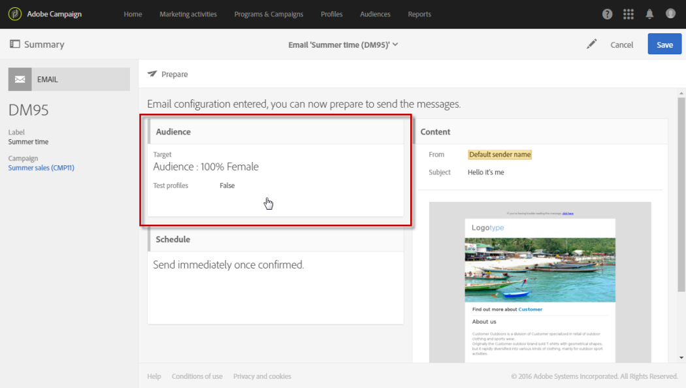
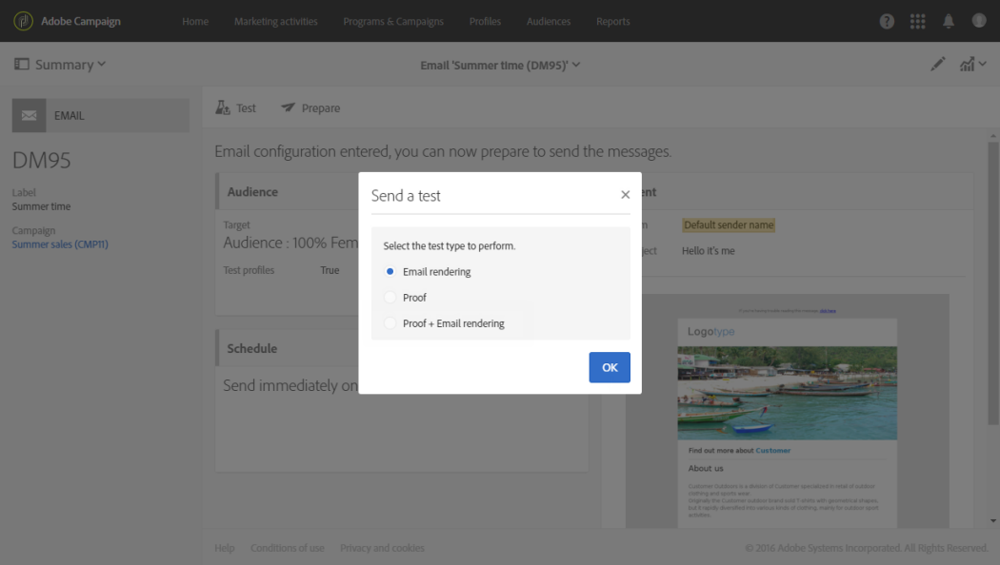
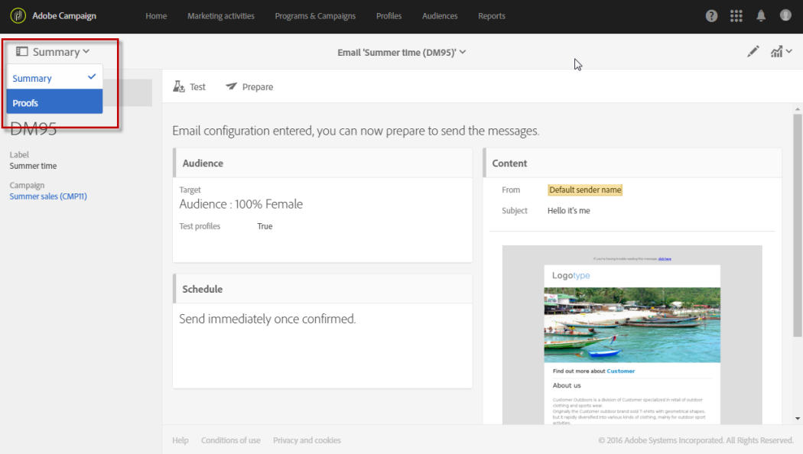
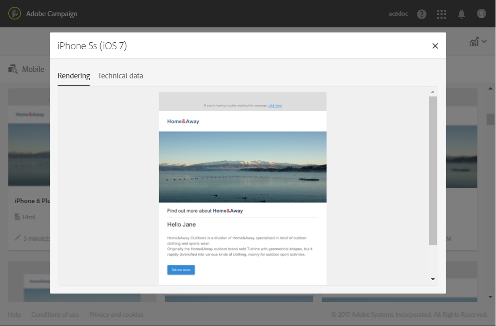

# 电子邮件渲染{#email-rendering}

在点击 **[!UICONTROL Send]** 按钮之前，确保以最佳方式在各种 Web 客户端、Web 邮件和设备上显示您的消息。

为了实现此功能，Adobe Campaign 会捕捉渲染状态并提供在专用报告中。这样，您就可以预览不同消息接收环境下所收到之消息的显示情况。

可用于 Adobe Campaign 中&#x200B;**电子邮件渲染**&#x200B;的移动设备、即时消息传递和网络邮件客户端列表，请参见 Litmus [网站](https://litmus.com/email-testing)（单击 **View all email clients**）。

## 生成电子邮件呈现{#checking-the-email-rendering-report}

创建电子邮件投放并定义其内容及定向群体后，请执行以下步骤。

1. 单击 **Audience**，以访问 **[!UICONTROL Test profiles]** 选项卡。

   

1. 使用查询编辑器以定义要使用的测试用户档案，包括用于&#x200B;**电子邮件渲染**&#x200B;的测试用户档案。请参阅[关于测试用户档案](../../audiences/using/managing-test-profiles.md)。

   

1. 检查并确认查询，然后保存更改。
1. 单击操作栏中的 **[!UICONTROL Test]** 按钮。

   

1. 选择 **[!UICONTROL Email rendering]** 选项，然后单击 **[!UICONTROL OK]**。

   

   >[!NOTE]
   >
   >利用 **[!UICONTROL Proof + Email rendering]** 选项，可发送校样并同时使用电子邮件渲染功能。根据定向的收件箱，您可以让校样收件人对消息进行审阅，并测试接收消息的方式。在这种情况下，您还需要选择校样测试用户档案。请参阅[关于测试用户档案](../../audiences/using/managing-test-profiles.md)。

   测试投放已发送。

1. 在发送消息后几分钟内，即可获得渲染缩览图。要访问这些缩览图，请在 **[!UICONTROL Summary]** 下拉菜单中选择 **[!UICONTROL Proofs]**。

   

1. 在 **[!UICONTROL Proofs]** 列表中，单击 **[!UICONTROL Access email rendering]** 图标。

   

随即会显示专用的电子邮件渲染报告。请参阅[电子邮件渲染报告说明](#email-rendering-report-description)。

**相关主题**：

* [创建电子邮件](../../channels/using/creating-an-email.md)
* [发送校样](../../sending/using/sending-proofs.md)
* [查询编辑器](../../automating/using/editing-queries.md#about-query-editor)

## 电子邮件呈现报告{#email-rendering-report-description}

此报告展示了显示在收件人面前的电子邮件渲染。根据收件人打开电子邮件投放的方式，电子邮件渲染可能会有所不同：在浏览器中打开、在移动设备上打开或通过电子邮件应用程序打开。

### 电子邮件呈现令牌

许可协议中列出了可用渲染的数量。启用了 **Email rendering** 的每个投放，都会让您的可用渲染（又叫令牌）数量减一。

令牌用于每个呈现，而非整个电子邮件呈现报表，这意味着：

* **每次** 生成“电子邮件”呈现报告时，都会扣除每个消息客户端的一个令牌：一个用于Outlook 2000渲染的令牌，一个用于Outlook渲染，一个用于Apple Mail渲染，等等。

* **对于同一投放**，如果您再次生成“电子邮件”呈现，则可用令牌的数量将再次减少为生成的呈现数。

### 报告摘要

报告摘要可显示已接收的消息数量、无用的（垃圾邮件）消息数量、未接收的消息数量或待接收的消息数量。

报告分为三部分：**[!UICONTROL Mobile]**、**[!UICONTROL Messaging clients]** 和 **[!UICONTROL Webmails]**。向下滚动报告，可显示分组到这三个类别中的所有渲染。

要获取各个报告的详细信息，请单击相应的卡。将针对所选的接收方式显示对应的渲染。

利用 **[!UICONTROL Technical data]** 选项卡，可获取更多信息，如接收日期和捕获日期以及电子邮件的完整标题。
