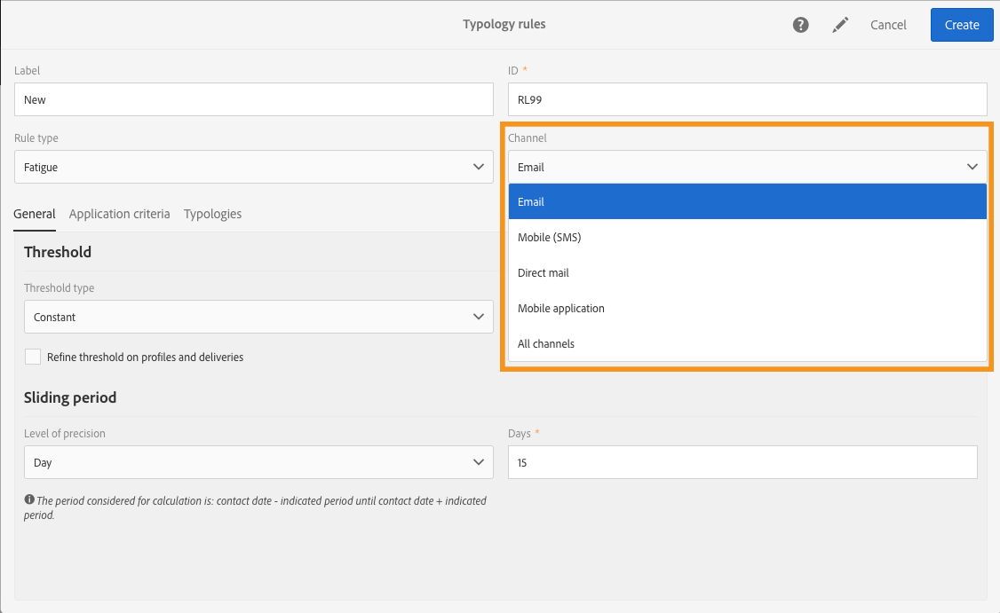
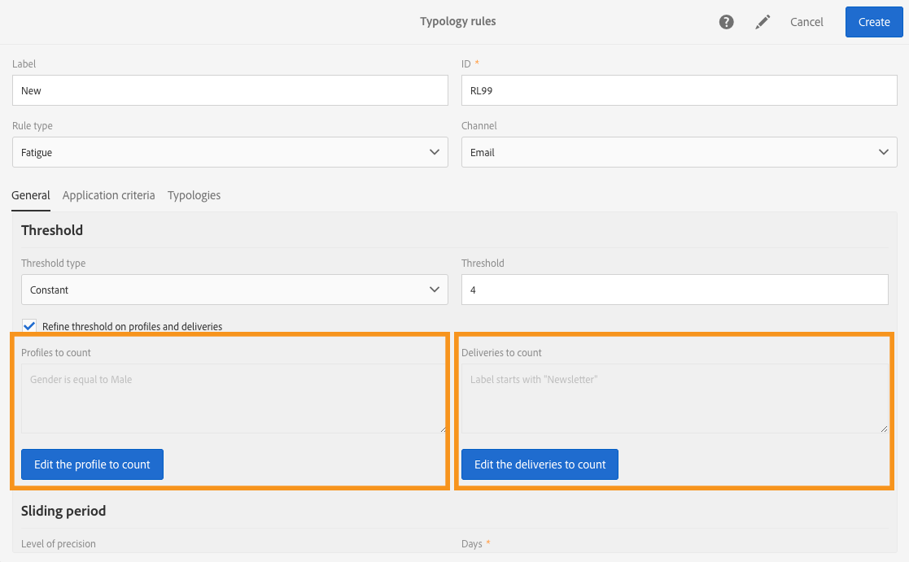

# 疲劳规则{#fatigue-rules}

## 关于疲劳规则 {#about-fatigue-rules}

疲劳规则允许营销人员设置全局交叉渠道业务规则，该规则将自动从活动中排除过度请求的用户档案。

要实施疲劳规则，您需要为每个用户档案定义最大消息数，并选择将应用该规则的期间。 在投放准备过程中，用户档案会根据已发送给投放的消息数量从中排除（如果适用）。

>[!NOTE]
>
>要应用疲劳规则，您需要为投放定义联系日期。 如果选择立即发送消息，则不应用疲劳规则。

相关主题：

* [准备](../../administration/using/configuring-email-channel.md#preparation)
* [管理类型](../../sending/using/managing-typologies.md)
* [类型规则](../../sending/using/managing-typology-rules.md)
* [优化通信频率以防止接触疲劳](https://helpx.adobe.com/campaign/kb/simplify-campaign-management.html#Engageyourcustomersateverystep)

## 创建疲劳规则 {#creating-a-fatigue-rule}

要创建和配置 **[!UICONTROL Fatigue]** 类型规则，请应用以下步骤：

1. 单击界面左上角的Adobe Campaign标志，然后选择 **[!UICONTROL Administration]** > **[!UICONTROL Channels]** > **[!UICONTROL Typologies]** > **[!UICONTROL Typology rules]**。

   

1. 在列表中，单击 **[!UICONTROL Create]**。

   

1. 在字段 **[!UICONTROL Rule type]** 中，选择 **[!UICONTROL Fatigue]**。

   

1. 在字 **[!UICONTROL Channel]** 段中，选择您的规则将应用到的渠道。 您可以选择单个渠道（电子邮件、短信、直邮、移动应用程序）或选择 **[!UICONTROL All channels]**。 请参 [阅选择渠道](#choosing-the-channel)。

   

1. 在选 **[!UICONTROL General]** 项卡中，定义计算每个用户档案消息最大数的方法。 您可以选择常量阈值或变量。 您还可以调整用户档案和投放的阈值。 有关此问题的详细信息，请 [参阅定义阈值](#defining-the-threshold)。

   

1. 选择 **[!UICONTROL Sliding period]** 类型规则将应用到的。 有关详细信息，请参 [阅设置滑动周期](#setting-the-sliding-period)。

   

   在此示例（请参阅以前的屏幕截图）中，我们选择在15天的滑动时间内最多发送4条消息。

1. 在选 **[!UICONTROL Application criteria]** 项卡中，您可以选择将此规则应用于所有投放，或根据要发送的消息限制规则的适用性。 只有满足应用程序条件，规则才会执行。 例如，只能对标签以给定单词开头或ID包含某些字母的邮件应用规则。 请参 [阅限制筛选规则的适用性](../../sending/using/filtering-rules.md#restricting-the-applicability-of-a-filtering-rule)。

   

1. 选择选 **[!UICONTROL Typologies]** 项卡，将类型规则链接到用于投放的排版。 请参 [阅管理排](../../sending/using/managing-typologies.md) 版和 [类型规则](../../sending/using/managing-typology-rules.md)。

   

   >[!NOTE]
   >
   >可以在投放模板中定义类型，并自动应用于使用此模板创建的所有投放。

在投放准备过程中，用户档案会根据已发送给投放的投放数量从中排除（如果适用）。 您可以视图疲劳规则执行结果中的投放日志。 请参 [阅查看疲劳结果](#viewing-the-fatigue-results)。

>[!IMPORTANT]
>
>要使疲劳规则有效，您需要为投放定义联系日期。 如果选择立即发送消息，则不应用疲劳规则。

## 选择渠道 {#choosing-the-channel}

疲劳规则适用于各种渠道。 渠道在类型规则设置 **[!UICONTROL Channel]** 的字段中定义。 您可以选择单个渠道或选择 **[!UICONTROL All channels]**。

**可用渠道**

提供以下渠道:

* 电子邮件
* 移动(SMS)
* 直邮
* 移动应用程序： 此渠道允许您向用户档案或应用程序订阅者发送推送通知。 如果选择向用户档案发送通知，则通知将与多渠道疲劳规则兼容。

   >[!IMPORTANT]
   >
   >疲劳规则与发送给应用程序订阅者的推送通知不兼容。 如果向应用程序订阅者发送消息，则疲劳规则不适用。

* 所有渠道: 此选项允许您将规则应用于所有渠道。 例如，您可决定在任何渠道上每月最多发送3条消息。 如果您上周向用户档案发送了2封电子邮件，并且今天尝试发送推送通知，则将排除同一用户档案。

**投放类型**

疲劳规则与所有投放类型兼容： 一次性投放、重复投放、工作流投放和事务性消息。

**交易消息** ，可用于发送针对事件(rtEvent)的服务消息以及营销消息(针对用户档案)，例如再营销消息。 疲劳规则仅与营销消息兼容(定位用户档案)。 事件事务性消息不包含用户档案信息，因此它们与疲劳规则不兼容(即使是与用户档案扩充的)。 借助交易消息中的营销消息支持，您可以对 **包括营销事务性消息在内的所有渠道应用疲劳规则**。

## 定义阈值 {#defining-the-threshold}

每个疲劳规则定义一个阈值，即在给定的时间段内可以发送给一个用户档案的消息的最大数量。 达到此阈值后，在所考虑的期间结束之前，再无投放发生。 此过程允许您在消息超过设置的阈值时自动从投放中排除用户档案，从而避免过度请求。

阈值可以是常量或变量。 这意味着在给定的时间段内，阈值可能因用户档案而异，甚至对于同一用户档案也可能不同。

**使用修复阈值**

阈值表示在相关期间可发送到用户档案的最大消息数。

默认情况下，阈值为常量，您需要指示规则授权的最大消息数。

**使用可变阈值**

要定义变量阈值，请在字 **[!UICONTROL Depends on the recipient]** 段中选择 **[!UICONTROL Threshold type]** 值。

然后您有两个选项：

* 选择用户档案字段： 每个用户档案的阈值将根据所选字段而有所不同。 例如，如果已使用“通信频率”字段扩展用户档案资源，请单击该字段右侧的按钮，然 **[!UICONTROL Threshold computation formula]** 后选择您的字段。 对于每个用户档案，阈值将取“通信频率”字段的值。

   

* 定义公式： 单击字段右侧的第二个按 **[!UICONTROL Threshold computation formula]** 钮以定义高级阈值计算公式。 例如，您可以根据用户档案所属的段索引授权消息的数量。 这意味着属于“Web”区段的用户档案可能会收到比其他用户档案更多的消息。 类 **[!UICONTROL Iif (@origin='Web', 5, 3)]** 型公式授权将5条消息投放到Web区段的用户档案，将3条消息到其他区段。

   

**优化用户档案和投放的阈值**

默认情况下，所有消息都会考虑到阈值计算。 选中该 **[!UICONTROL Refine Threshold on profiles and deliveries]** 框可过滤准备用户档案时要计数的投放和投放。

在以下示例中，仅计数男性用户档案，并且只计数标签以Newsletter开头 **的投放** 。

优化投放上的阈值与限制整个规则（选项卡）的适用性 **[!UICONTROL Application criteria]** 不同：

* **[!UICONTROL Application criteria]**: 您选择是否根据特定条件执行规则。 例如，如果应用程序条件为“用Newsletter标记开始”，则规则将仅适用于遵守此条件的投放。 如果投放的标签开始为“升级”，则该规则将不执行。
* **[!UICONTROL Refine threshold on profiles and deliveries > Deliveries to count]**: 使用此类型规则的所有投放都将执行规则，但您决定在过去和计划的投放中，要计算哪些。 例如，如果限制为“用Newsletter标签开始”，则即使投放标签开始为“Promo”，也会执行规则。 在所选的滑动期内，它将计数其标签开始为“Newsletter”的投放数。

## 设置滑动周期 {#setting-the-sliding-period}

疲劳规则在n天滚动期间定义。 该期间在部分中 **[!UICONTROL Sliding period]** 进行配置，例如2周、7天或5小时。

执行规则时，将考虑过去的投放和计划的投放。 这保证在给定的滑动周期中，阈值从不超过。

例如，如果您定义48小时的时间段，则系统将在联系日 **期前48小时查看** ，在联 **系日期后48小时查看**。 因此，所选择的期间被加倍，以便能够将未来投放与以前的数据相融合。

要将投放限制为2周期，请在“滑动 **期** ” **部分输** 入Day和7 **或** 1周。 在计算中将考虑在投放日期前7天以及在应用规则的投放日期后7天以前计划的投放。

## 查看疲劳结果 {#viewing-the-fatigue-results}

在投放准备过程中，用户档案会根据已发送给投放的投放数量从中排除（如果适用）。 要视图疲劳规则执行结果，请单击块右下角的按 **[!UICONTROL Deployment]** 钮。

有三个选项卡，显示疲劳执行结果的详细信息，包括所应用规则的名称：

* 投放日志:

   

* 排除日志：

   

* 排除原因：

   

## 查看疲劳规则摘要报告 {#viewing-the-fatigue-rule-summary-report}

Adobe Campaign专门提供疲劳规则报告，帮助您了解疲劳规则如何应用于活动。 这使您能够了解活动如何相互影响并做出正确调整。

报 **[!UICONTROL Fatigue rules summary]** 告可以从每个项目 **[!UICONTROL Reports]** 、活动和消息右上角的按钮进行访问。

在屏幕的左侧部分，您可以过滤投放联系日期上的报告数据。 默认情况下，所选期间从当前日期前15天开始，到当前日期后15天结束。 您还可以根据特定疲劳规则进行筛选。

饼图显示选定期间的以下信息：

* **[!UICONTROL Total targeted]**: 消息准备前的目标总数
* **[!UICONTROL Excluded]**: 应用疲劳规则导致的排除总数
* **[!UICONTROL Other exclusions]**: 其他类型规则的排除总数
* **[!UICONTROL To deliver]**: 准备邮件后要传送的邮件总数( **[!UICONTROL To deliver]** = **[!UICONTROL Total targeted]** - **[!UICONTROL Excluded]** - **[!UICONTROL Other exclusions]** )

在图表右侧，您将找到按疲劳规则划分的排除数。

底部表格显示选定期间内的所有投放。 对于每个投放，您可以看到已应用的疲劳规则和相应的排除。 没有联系日期的投放也会显示在表中。

* **[!UICONTROL 0]** 表示已应用疲劳规则但没有排除。
* **[!UICONTROL -N]** 表示发生了N个排除。
* 空字段表示疲劳规则不适用。

>[!NOTE]
>
>显示的数据与您从中访问报告的项目、消息或活动无关。 此报表显示所有组织单位的所有疲劳规则和投放。 这样，您就可以获得所有投放的全球视图，从而了解活动如何受他人影响。

## 示例 {#examples}

疲劳管理的实施有许多可能。 以下是您可以执行的操作的一些示例：

* 使用适用于所有渠道 **的常数阈** 值创建疲 **劳规则**:

   假设您创建了多渠道规则，在7天的滑动期内，阈值不变为3。

   上周，您的高级用户档案收到了促销电子邮件和交易再营销电子邮件。 您还安排了下周发送的短信。 现在，您决定发送针对所有用户档案的推送通知。 高级用户档案将被排除在今天的推送之外，因为已达到他们在2周内的最大消息数。

   

* 使用基于用户档案字段 **的可变阈值** ，创建疲 **劳规则**:

   您已使用“通信限制”字段扩展用户档案资源，以为每个用户档案定义不同的阈值。 在疲劳规则中，根据此字段定义一个可变阈值，并选择2天的滑动周期。 让我们举两个用户档案的例子： John的通信限制为1,David的通信限制为2。 两者昨天都已收到新闻稿电子邮件。 您决定立即再给他们发送一封电子邮件。 只有大卫会收到，因为约翰被排除在目标之外。

   

* 使用阈值计算公式创 **建疲劳规则**:

   您希望根据用户档案的年龄来更改阈值。 如果用户档案低于40，则您要定义限制为4，对于较旧用户档案，限制为2。 您可以直接在疲劳规则中创建一个公式，根据用户档案的年龄来计算该阈值，而不是为每个带扩展字段的用户档案定义此阈值。 在我们的例子中，公式是 **[!UICONTROL Iif (@age<40, 4, 2)]**。

   

   >[!NOTE]
   >
   >本节还包括使用阈值计算公式的疲劳规则的逐步示例。

* 创建疲劳规则， **细化用户档案** 和投放的阈值：

   您已使用“分数”字段扩展了用户档案资源，还使用“类型”字段扩展了投放资源。 您要定义一个常量阈值3，但要从计数中排除“警报”或“黑色星期五”类型的所有投放以及得分大于10的所有用户档案。 当规则执行时，它将在过去和计划的投放中计算所有不属于“警报”或“黑色星期五”类型的投放，这些发送给得分小于10的用户档案。

   

这里是一个使用阈值计算公式的疲劳规则的分步示例。

在此用例中，我们希望创建一个类型规则来防止每周将2条以上消息投放为高级用户档案，将每周2条消息为标准用户档案。

为了识别客户和潜在客户，我们扩展了用户档案资源，该字 **[!UICONTROL Status]** 段包含0表示高级用户档案,1表示标准用户档案。

要创建规则，请应用以下步骤：

1. 创建新的 **疲劳** 类型类型规则。
1. 在部 **[!UICONTROL Threshold]** 分中，我们要创建一个公式来根据每个用户档案计算阈值。 在字 **[!UICONTROL Depends on the recipient]** 段中选 **[!UICONTROL Threshold type]** 择值，然后单击字段右侧的第二个按钮 **[!UICONTROL Threshold computation formula]** 。

   

1. 在部 **[!UICONTROL List of functions]** 分中，多次并单击 **节点中** 的Iif **[!UICONTROL Others]** 函数。

   

1. 然后，在部分中 **选择用户档案** 的“ **[!UICONTROL Available fields]** 状态”。

   

1. 输入所需的值以创建以下公式： **Iif(@status=0,2,4)**

   

   如果状态等于0，则通过此公式可分配值2；对于所有其他状态，可分配值4。

1. 单击 **[!UICONTROL Confirm]** 以批准公式。
1. 指示 **[!UICONTROL Sliding period]** 将应用规则的位置： 在这种情况下，将投放限制为2周。

   

1. 现在，将您刚刚创建的规则链接到类型学，以便将其应用于投放。 为此，请选择选 **[!UICONTROL Typologies]** 项卡，单 **[!UICONTROL Create element]** 击并选择用于投放的类型。

   

1. 保存规则以批准创建。

该规则将应用于所有基于类型学的投放。
