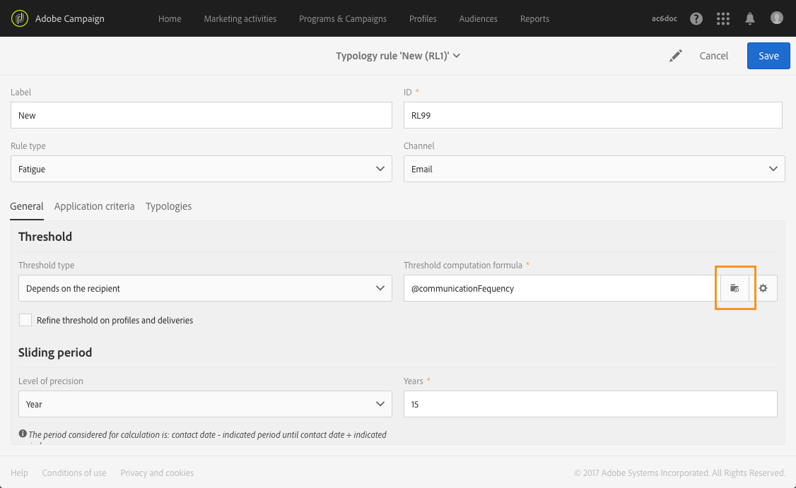
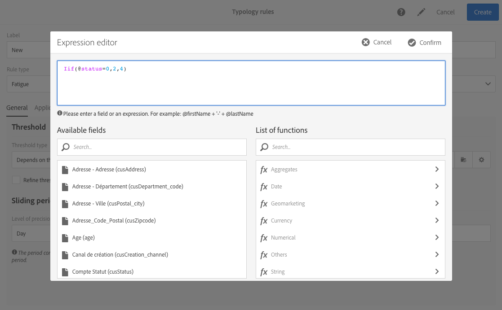

# 疲劳规则{#fatigue-rules}

## 关于疲劳规则 {#about-fatigue-rules}

疲劳规则允许营销人员设置全局交叉渠道业务规则，该规则将自动从活动中排除过度请求的用户档案。

要实施疲劳规则，您需要为每个用户档案定义最大消息数，并选择将应用该规则的期间。 在投放准备过程中，用户档案会根据已发送给投放的消息数量从协议中排除（如果适用）。

>[!NOTE]
>
>要应用疲劳规则，您需要为投放定义联系日期。 如果选择立即发送消息，则不会应用疲劳规则。

相关主题：

* [准备](../../administration/using/configuring-email-channel.md#preparation)
* [管理类型](../../sending/using/about-typology-rules.md#managing-typologies)
* [类型规则](../../sending/using/about-typology-rules.md#typology-rules)
* [优化通信频率以防止接触疲劳](https://helpx.adobe.com/campaign/kb/simplify-campaign-management.html#Engageyourcustomersateverystep)

## 创建疲劳规则 {#creating-a-fatigue-rule}

要创建和配置 **[!UICONTROL Fatigue]** 类型规则，请应用以下步骤：

1. 单击界面左上角的Adobe Campaign标志，然后选择 **[!UICONTROL Administration]** > **[!UICONTROL Channels]** > **[!UICONTROL Typologies]** > **[!UICONTROL Typology rules]**。

   

1. 在类型规则的列表中，单击 **[!UICONTROL Create]**。

   

1. 在字段 **[!UICONTROL Rule type]** 中，选择 **[!UICONTROL Fatigue]**。

   

1. 在字段 **[!UICONTROL Channel]** 中，选择您的规则将应用到的渠道。 您可以选择单个渠道（电子邮件、SMS、直邮、移动应用程序）或选择 **[!UICONTROL All channels]**。 请参 [阅选择渠道](#choosing-the-channel)。

   

1. 在选项 **[!UICONTROL General]** 卡中，定义计算每个用户档案消息最大数的方法。 您可以选择常数阈值或变量。 您还可以调整用户档案和投放的阈值。 有关此问题的详细信息，请参 [阅定义阈值](#defining-the-threshold)。

   

1. 选择 **[!UICONTROL Sliding period]** 将应用类型规则的对象。 有关详细信息，请参阅 [设置滑动周期](#setting-the-sliding-period)。

   

   在此示例（请参阅以前的屏幕截图）中，我们选择在15天的滑动时间内最多发送4条消息。

1. 在该选 **[!UICONTROL Application criteria]** 项卡中，您可以选择将此规则应用于所有投放，或根据要发送的消息限制该规则的适用性。 规则仅在满足应用程序条件时才执行。 例如，您只能对标签以给定单词开头或ID包含某些字母的消息应用该规则。 请参 [阅限制筛选规则的适用性](../../sending/using/filtering-rules.md#restricting-the-applicability-of-a-filtering-rule)。

   

1. 选择选 **[!UICONTROL Typologies]** 项卡，将类型规则链接到用于投放的类型学。 请参 [阅管理排版](../../sending/using/about-typology-rules.md#managing-typologies) 和 [类型规则](../../sending/using/about-typology-rules.md#typology-rules)。

   

   >[!NOTE]
   >
   >可以在投放模板中定义类型学，该类型学将自动应用于使用此模板创建的所有投放。

在投放准备过程中，用户档案将根据已发送给投放的投放数量从中排除（如果适用）。 您可以视图疲劳规则执行结果在投放日志中。 请参 [阅查看疲劳结果](#viewing-the-fatigue-results)。

>[!IMPORTANT]
>
>要使疲劳规则有效，您需要为投放定义联系日期。 如果选择立即发送消息，则不会应用疲劳规则。

## 选择渠道 {#choosing-the-channel}

疲劳规则适用于各种渠道。 渠道在类型规则设置 **[!UICONTROL Channel]** 的字段中定义。 您可以选择单个渠道或选择 **[!UICONTROL All channels]**。

**可用渠道**

有以下渠道:

* 电子邮件
* 移动(SMS)
* 直邮
* 移动应用程序：此渠道允许您向用户档案或应用程序订阅者发送推送通知。 如果选择向用户档案发送通知，则通知将与多渠道疲劳规则兼容。

   >[!IMPORTANT]
   >
   >疲劳规则与发送给应用程序订阅者的推送通知不兼容。 如果向应用程序订阅者发送消息，则疲劳规则不适用。

* 所有渠道:此选项允许您将规则应用于所有渠道。 例如，您可以决定在任何渠道上每月最多发送3条消息。 如果您上周向用户档案发送了2封电子邮件，并且今天尝试发送推送通知，则将排除同一用户档案。

**投放类型**

疲劳规则与所有投放类型兼容：一次性投放、重复投放、工作流投放和事务性消息。

**交易消息** ，可用于发送以事件(rtEvent)为目标的服务消息以及营销消息(定位用户档案)，例如再营销消息。 疲劳规则仅与营销消息兼容(定位用户档案)。 事件事务性消息不包含用户档案信息，因此它们与疲劳规则不兼容(即使与用户档案扩充时)。 借助交易消息中的营销消息支持，您可以将疲劳 **规则应用于所有渠道，包括营销事务性消息**。

## 定义阈值 {#defining-the-threshold}

每个疲劳规则定义一个阈值，即在给定周期内可发送到一个用户档案的最大消息数。 一旦达到这一阈值，在所考虑的期间结束之前，就不能再发生投放。 此过程允许您在消息超过设置的阈值时自动从用户档案中排除投放，从而避免过度请求。

阈值可以是常数或变量。 这意味着在给定的时间段内，阈值可能因一个用户档案而异，甚至对于同一用户档案也可能不同。

**使用修复阈值**

阈值表示在相关期间可发送到用户档案的最大消息数。

默认情况下，阈值为常数，您需要指示规则授权的最大消息数。

**使用可变阈值**

要定义变量阈值，请在字 **[!UICONTROL Depends on the recipient]** 段中选择 **[!UICONTROL Threshold type]** 值。

然后您有两个选项：

* 选择用户档案字段：每个用户档案的阈值将根据所选字段而不同。 例如，如果您已使用“通信频率”字段扩展用户档案资源，请单击该字段右侧的按钮并 **[!UICONTROL Threshold computation formula]** 选择您的字段。 对于每个用户档案，阈值将取“通信频率”字段的值。

   

* 定义公式：单击字段右侧的第二个按钮 **[!UICONTROL Threshold computation formula]** 可定义高级阈值计算公式。 例如，您可以根据用户档案所属的区段索引授权消息的数量。 这意味着属于“Web”区段的用户档案可能会收到比其他用户档案更多的消息。 类 **[!UICONTROL Iif (@origin='Web', 5, 3)]** 型公式授权将5条消息投放给Web区段的用户档案，将3条消息分别给其他区段。

   

**细化用户档案和投放的阈值**

默认情况下，所有消息都会考虑到阈值计算。 选中该 **[!UICONTROL Refine Threshold on profiles and deliveries]** 框可过滤用户档案和投放，以在准备投放时进行计数。

在以下示例中，仅计数男性用户档案，并且只计数标签以 **Newsletters开头的投放** 。

优化投放上的阈值与限制整个规则（选项卡）的适用性 **[!UICONTROL Application criteria]** 不同：

* **[!UICONTROL Application criteria]**:您可以根据特定条件选择是否执行该规则。 例如，如果应用程序条件为“用Newsletter标记开始”，则规则将仅适用于符合此条件的投放。 如果投放的标签开始为“升级”，则该规则根本不执行。
* **[!UICONTROL Refine threshold on profiles and deliveries > Deliveries to count]**:使用此类型规则的所有投放将执行该规则，但您决定在过去和计划的投放中要计算哪些。 例如，如果限制为“用Newsletter标签开始”，则即使投放标签开始为“Promo”，也将执行该规则。 在选定的滑动期内，它将计数其标签开始有“Newsletter”的投放数。

## 设置滑动周期 {#setting-the-sliding-period}

在n-d轧制周期中定义疲劳规则。 该期间在部分中 **[!UICONTROL Sliding period]** 进行配置，例如2周、7天或5小时。

执行规则时，将考虑过去的投放和计划的投放。 这保证在给定的滑动周期中，阈值不会超过。

例如，如果您定义48小时的时间段，则系统将在联系日期前48 **小时查看** ，在联系日 **期后48小时查看**。 因此，选定的期间翻倍，以便使未来投放和以前的期间能够整合。

要将投放限制在2周的期间内，请在“滑动期间” **部分输入** Day和7 **或1周****** 。 投放在计算中将考虑到在投放日期前7天以及计划在投放日期后7天（应用规则的日期后）发送。

## 查看疲劳结果 {#viewing-the-fatigue-results}

在投放准备过程中，用户档案将根据已发送给投放的投放数量从中排除（如果适用）。 要视图疲劳规则执行结果，请单击块右下角的按 **[!UICONTROL Deployment]** 钮。

有三个选项卡，显示疲劳执行结果的详细信息，包括所应用规则的名称：

* 投放日志:

   

* 排除日志：

   

* 排除原因：

   

## 查看疲劳规则摘要报告 {#viewing-the-fatigue-rule-summary-report}

Adobe Campaign专门提供疲劳规则报告，帮助您了解疲劳规则如何应用于活动。 这使您能够了解您的活动如何相互影响并做出正确的调整。

可 **[!UICONTROL Fatigue rules summary]** 以从每个项目、活动和消息 **[!UICONTROL Reports]** 右上角的按钮访问报告。

在屏幕的左侧，您可以过滤投放联系日期的报告数据。 默认情况下，选定期间开始当前日期前15天，后15天结束。 您还可以根据特定疲劳规则进行筛选。

饼图显示选定时段的以下信息：

* **[!UICONTROL Total targeted]**:消息准备前的总目标
* **[!UICONTROL Excluded]**:由于应用疲劳规则而导致的排除总数
* **[!UICONTROL Other exclusions]**:其他类型规则的排除总数
* **[!UICONTROL To deliver]**:准备消息后要传送的消息总数( **[!UICONTROL To deliver]** = **[!UICONTROL Total targeted]** - **[!UICONTROL Excluded]** - **[!UICONTROL Other exclusions]** )

在图表右侧，您将找到按疲劳规则划分的排除数。

底部表格显示选定时段内的所有投放。 对于每个投放，您可以看到已应用的疲劳规则和相应的排除。 没有联系日期的投放也显示在表中。

* **[!UICONTROL 0]** 表示已应用疲劳规则但没有排除。
* **[!UICONTROL -N]** 表示出现了N个排除。
* 空字段表示疲劳规则不适用。

>[!NOTE]
>
>显示的数据与您访问报表的项目、消息或活动不相关。 此报告显示所有组织单位的所有疲劳规则和投放。 这样，您就可以获得所有投放的全球视图，以便了解您的活动如何受他人影响。

## 示例 {#examples}

在疲劳管理实施方面，有许多可能。 以下是您可以执行的操作的一些示例：

* 使用适用于所有渠道的 **常数阈值** ，创建疲劳 **规则**:

   假设您创建了一个多渠道规则，在7天的滑动期内，该规则的阈值不变为3。

   上周，您的高级用户档案收到了一封促销电子邮件和一封交易再营销电子邮件。 您还安排了下周发送的短信， 现在，您决定发送针对所有用户档案的推送通知。 高级用户档案将被排除在今天的推广之外，因为已经达到其两周内的最大消息数。

   

* 使用基于用户档案字段 **的可变阈值** ，创建疲劳 **规则**:

   您已使用“通信限制”字段扩展了用户档案资源，以为每个用户档案定义不同的阈值。 在疲劳规则中，根据此字段定义一个可变阈值，并选择2天的滑动周期。 让我们举两个用户档案的例子：John的通信限制为1，而David的通信限制为2。 昨天，这两家公司都已收到新闻稿电子邮件。 您决定立即再给他们发送一封电子邮件。 只有大卫会收到，因为约翰被排除在目标之外。

   

* 使用阈值计算公式创 **建疲劳规则**:

   您希望根据用户档案的年龄来更改阈值。 如果用户档案低于40，则您要定义4的限制，对于较旧的用户档案，定义2的限制。 您可以在疲劳规则中直接创建一个公式，以根据用户档案的年龄计算阈值，而不是为每个带扩展字段的用户档案定义此阈值。 在我们的例子中，公式是 **[!UICONTROL Iif (@age<40, 4, 2)]**。

   

   >[!NOTE]
   >
   >本节还包括使用阈值计算公式的疲劳规则的分步示例。

* 创建疲劳规则， **细化用户档案** 和投放的阈值：

   您已使用“分数”字段扩展了用户档案资源，并且您还使用“类型”字段扩展了投放资源。 您要定义一个常数阈值3，但是要从计数中排除“警报”或“黑色星期五”类型的所有投放以及得分大于10的所有用户档案。 当该规则执行时，它将在过去和计划的投放中计算所有不属于“警报”或“黑色星期五”类型的投放发送到得分小于10的用户档案。

   

这里是一个使用阈值计算公式的疲劳规则的分步示例。

在此用例中，我们希望创建一个类型规则，以防止每周将超过2条消息投放为高级用户档案，将每周2条消息为标准用户档案。

为了识别客户和潜在客户，我们扩展了用户档案资源，该字段 **[!UICONTROL Status]** 包含0表示高级用户档案,1表示标准用户档案。

要创建规则，请应用以下步骤：

1. 创建新的 **疲劳** 类型类型规则。
1. 在部 **[!UICONTROL Threshold]** 分中，我们要创建一个公式来根据每个用户档案计算阈值。 在字 **[!UICONTROL Depends on the recipient]** 段中选 **[!UICONTROL Threshold type]** 择值，然后单击字段右侧的第二个按钮的图 **[!UICONTROL Threshold computation formula]** 标。

   

1. 在部 **[!UICONTROL List of functions]** 分中，多次并单击节 **点中的** Iif函 **[!UICONTROL Others]** 数。

   

1. 然后在部分中选 **择用户档案** 的状态 **[!UICONTROL Available fields]** 。

   

1. 输入所需的值以创建以下公式： **Iif(@status=0,2,4)**

   

   如果状态等于0，则通过此公式可分配值2，对于所有其他状态，则可分配值4。

1. 单击 **[!UICONTROL Confirm]** 以批准公式。
1. 指示 **[!UICONTROL Sliding period]** 将应用该规则的位置：在此情况下，将投放限制为2周。

   

1. 现在，将您刚刚创建的规则链接到一个类型学，以将其应用于您的投放。 为此，请选择选 **[!UICONTROL Typologies]** 项卡，单 **[!UICONTROL Create element]** 击并选择用于投放的排版。

   

1. 保存规则以批准创建。

该规则将应用于所有基于类型学的投放。
