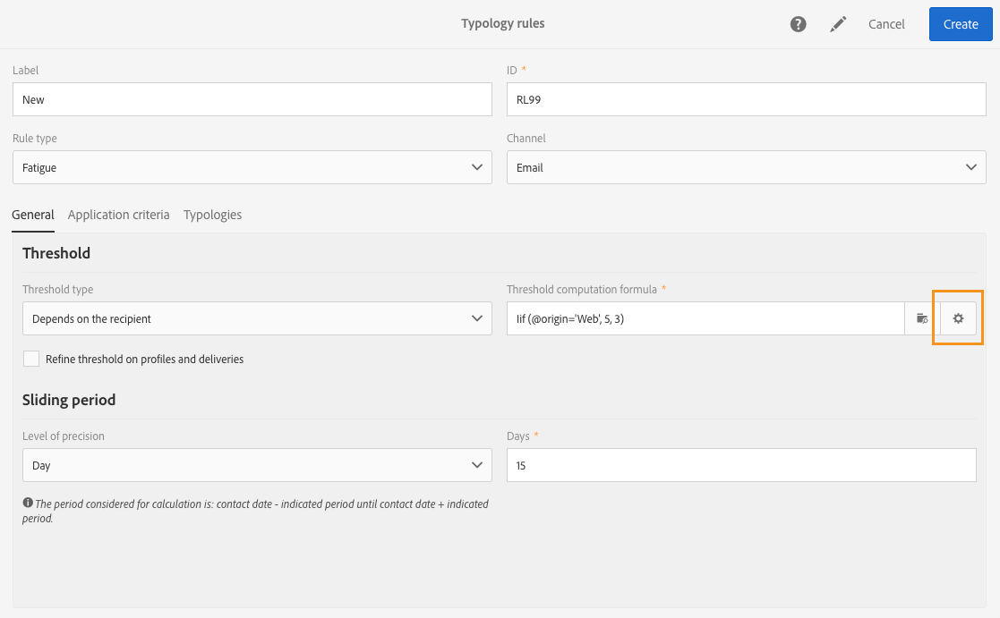

# 疲劳规则{#fatigue-rules}

## 关于疲劳规则 {#about-fatigue-rules}

利用疲劳规则，营销人员可设置全局跨渠道业务规则，以自动从营销策划中排除发送营销信息过于频繁的用户档案。

要实施疲劳规则，您需要定义每个用户档案的最大消息数，并选择应用该规则的时段。在投放准备期间，会根据已发送给用户档案的消息数量，将符合条件的用户档案从投放中排除。

>[!NOTE]
>
>要应用疲劳规则，您需要为投放定义联系日期。如果选择立即发送消息，则不会应用疲劳规则。

相关主题：

* [准备](../../administration/using/configuring-email-channel.md#preparation)
* [管理类型](../../sending/using/managing-typologies.md)
* [类型规则](../../sending/using/managing-typology-rules.md)
* [优化通信频次以防止沟通疲劳](https://helpx.adobe.com/cn/campaign/kb/simplify-campaign-management.html#Engageyourcustomersateverystep)

## 创建疲劳规则 {#creating-a-fatigue-rule}

要创建和配置 **[!UICONTROL Fatigue]** 分类规则，请应用以下步骤：

1. 单击界面左上角的Adobe Campaign徽标，然后选择 **[!UICONTROL Administration]** > **[!UICONTROL Channels]** > **[!UICONTROL Typologies]** > **[!UICONTROL Typology rules]**.

   

1. 在分类规则列表中，单击 **[!UICONTROL Create]**。

   

1. 在 **[!UICONTROL Rule type]** 字段中，选择 **[!UICONTROL Fatigue]**。

   

1. 在 **[!UICONTROL Channel]** 字段中，选择要应用规则的渠道。您可以选择单个渠道（电子邮件、短信、直邮、移动应用程序），也可以选择 **[!UICONTROL All channels]**。请参阅[选择渠道](#choosing-the-channel)。

   

1. 在 **[!UICONTROL General]** 选项卡中，定义每个用户档案最大消息数的计算方法。您可以选择常量阈值或变量。您还可以针对用户档案和投放对阈值进行优化。有关更多信息，请参见[定义阈值](#defining-the-threshold)。

   

1. 选择要应用分类规则的 **[!UICONTROL Sliding period]**。有关更多信息，请参见[设置滑动周期](#setting-the-sliding-period)。

   

   在本例（请参阅之前的屏幕截图）中，我们选择在 15 天的滑动周期内最多发送 4 条消息。

1. 在 **[!UICONTROL Application criteria]** 选项卡中，您可以选择将此规则应用于所有投放，或根据要发送的消息限制规则的适用性。只有满足应用的条件，才会执行规则。例如，只能对标签以指定单词开头或 ID 包含特定字母的消息应用规则。请参阅[限制筛选规则的适用性](../../sending/using/filtering-rules.md#restricting-the-applicability-of-a-filtering-rule)。

   

1. 选择 **[!UICONTROL Typologies]** 选项卡，将分类规则链接到用于投放的分类。请参阅[管理分类](../../sending/using/managing-typologies.md)和 [分类规则](../../sending/using/managing-typology-rules.md)。

   

   >[!NOTE]
   >
   >可以在投放模板中定义分类，以自动应用至使用此模板创建的所有投放。

在投放准备期间，会根据已发送给用户档案的投放数量，将符合条件的用户档案从投放中排除。您可以在投放日志中查看疲劳规则的执行结果。请参阅[查看疲劳结果](#viewing-the-fatigue-results)。

>[!IMPORTANT]
>
>要使疲劳规则生效，您需要为投放定义联系日期。如果选择立即发送消息，则不会应用疲劳规则。

## 选择渠道 {#choosing-the-channel}

疲劳规则适用于各种渠道。可在分类规则设置的 **[!UICONTROL Channel]** 字段中定义渠道。您可以选择单个渠道，也可以选择 **[!UICONTROL All channels]**。

**可用的渠道**

可以使用以下渠道：

* 电子邮件
* 手机（短信）
* 直邮
* 移动应用程序：利用此渠道，可向用户档案或应用程序订阅者发送推送通知。如果选择向用户档案发送通知，则通知将与多渠道疲劳规则兼容。

  >[!IMPORTANT]
  >
  >疲劳规则与发送给应用程序订阅者的推送通知不兼容。如果向应用程序订阅者发送消息，则不会应用疲劳规则。

* 所有渠道：利用此选项可将规则应用于所有渠道。例如，您可决定在所有渠道上每月最多发送 3 条消息。如果您上周向某个用户档案发送了 2 封电子邮件，而今天尝试发送推送通知时则会排除该用户档案。

**投放类型**

疲劳规则兼容所有投放类型：一次性投放、定期投放、工作流投放和事务型消息。

**事务型消息**&#x200B;可用于发送定向事件 (rtEvent) 的服务消息以及营销消息（定向用户档案），例如再营销消息。疲劳规则仅与营销消息（定向用户档案）兼容。由于事件事务型消息不包含用户档案信息，所以就算使用用户档案扩充了内容，也不兼容疲劳规则。借助事务型消息中的营销消息支持，您可以&#x200B;**对包括营销事务型消息在内的所有渠道应用疲劳规则**。

## 定义阈值 {#defining-the-threshold}

每个疲劳规则可定义一个阈值，即在指定时间段内可以向一个用户档案发送的消息数量上限。达到此阈值后，只有在所考虑的时段结束后，才会再进行投放。通过此流程，可在消息数量超过设置的阈值时，自动从投放中排除配置文件，从而避免过度通信。

阈值可以是常量，也可以是变量。这意味着在指定的时间段内，阈值可能因用户档案而异，甚至对于同一用户档案也可能有所不同。

**使用固定阈值**

阈值表示在相关时段内可发送给用户档案的消息数量上限。

默认情况下，阈值为常量，您需要指定规则授权的消息数量上限。

**使用变量阈值**

要定义变量阈值，请在 **[!UICONTROL Threshold type]** 字段中选择 **[!UICONTROL Depends on the recipient]** 值。

然后可使用两个选项：

* 选择用户档案字段：每个用户档案的阈值将根据所选字段而有所不同。例如，如果已使用“Communication frequency”字段扩展了用户档案资源，请单击 **[!UICONTROL Threshold computation formula]** 字段右侧的按钮，然后选择您的字段。对于每个用户档案，阈值都将采用“Communication frequency”字段的值。

  

* 定义公式：单击 **[!UICONTROL Threshold computation formula]** 字段右侧的第二个按钮可定义高级阈值计算公式。例如，您可以根据用户档案所属的区段，索引授权消息的数量。这意味着属于“Web”区段的用户档案，可接受的消息数量可能会超过其他用户档案。使用 **[!UICONTROL Iif (@origin='Web', 5, 3)]** 类型的公式，可为 Web 区段的用户档案授权投放 5 条消息，为其他区段授权投放 3 条消息。

  

**优化用户档案和投放的阈值**

默认情况下，所有消息都会考虑阈值计算式。选中 **[!UICONTROL Refine Threshold on profiles and deliveries]** 方框，可在准备投放时筛选要计数的用户档案和投放。

在下方的示例中，仅计数男性用户档案，并且只计数标签以 **Newsletter** 开头的投放。

优化投放阈值与限制整个规则（**[!UICONTROL Application criteria]** 选项卡）的适用性不同：

* **[!UICONTROL Application criteria]**：您可以选择是否根据特定条件执行规则。例如，如果应用条件为“Label starts with Newsletter”，则规则将仅适用于符合此条件的投放。如果投放标签的开头为“Promotion”，则不会执行规则。
* **[!UICONTROL Refine threshold on profiles and deliveries > Deliveries to count]**：使用此分类规则的所有投放都将执行规则，但您可以决定是对过去的投放进行计数、还是对计划的投放进行计数。例如，如果限制为“Label starts with Newsletter”，那么即使投放标签开头为“Promo”，也会执行规则。这样，在所选的滑动周期内，标签以“Newsletter”开头的投放都将被计数。

## 设置滑动周期 {#setting-the-sliding-period}

疲劳规则被定义为 n 天的滚动周期。在 **[!UICONTROL Sliding period]** 部分中可以对该周期进行配置，例如 2 周、7 天或 5 小时。

执行规则时，过去的投放和计划的投放都将被考虑在内。这样可保证在指定滑动周期内不会超过阈值。

例如，如果您定义 48 小时的周期，则系统会检查&#x200B;**联系日期之前**&#x200B;的 48 小时和&#x200B;**联系日期之后**&#x200B;的 48 小时。这样，所选择的周期时长会被加倍，以便纳入未来的投放和过去的投放数量。

要将考虑的投放限制为 2 周的周期，请在 **Sliding period** 部分输入 **Day** 和 **7** 或“1 week”。计算时，将考虑在应用规则的投放日期之前 7 天内发送的投放数量和之后 7 天内计划发送的投放数量。

## 查看疲劳结果 {#viewing-the-fatigue-results}

在投放准备期间，会根据已发送给用户档案的投放数量，将符合条件的用户档案从投放中排除。要查看疲劳规则执行结果，请单击 **[!UICONTROL Deployment]** 块右下角的按钮。

提供了三个选项卡用于显示疲劳执行结果的详细信息，包括所应用规则的名称：

* 投放日志：

  

* 排除日志：

  

* 排除原因：

  

## 查看疲劳规则摘要报告 {#viewing-the-fatigue-rule-summary-report}

Adobe Campaign 可提供专门的疲劳规则报告，以帮助您了解疲劳规则如何应用于营销策划。这样您即可了解营销策划如何相互影响并做出正确的调整。

可以从每个项目、营销策划和消息右上角的 **[!UICONTROL Reports]** 按钮访问 **[!UICONTROL Fatigue rules summary]** 报告。

在屏幕的左部，您可以根据投放的联系日期筛选报告数据。默认情况下，所选时段始于当前日期之前的第 15 天，止于当前日期之后的第 15 天。您还可以根据特定疲劳规则进行筛选。

饼图可显示选定时段的以下信息：

* **[!UICONTROL Total targeted]**：消息准备前的目标总数
* **[!UICONTROL Excluded]**：应用疲劳规则导致的排除总数
* **[!UICONTROL Other exclusions]**：其他分类规则导致的排除总数
* **[!UICONTROL To deliver]**：准备消息后要投放的消息总数 ( **[!UICONTROL To deliver]** = **[!UICONTROL Total targeted]** - **[!UICONTROL Excluded]** - **[!UICONTROL Other exclusions]** )

图表右侧将显示按疲劳规则划分的排除数量。

底部表格显示选定时段内的所有投放。对于每个投放，都可以查看已应用的疲劳规则和相应的排除情况。没有联系日期的投放也会显示在表格中。

* **[!UICONTROL 0]** 表示已应用疲劳规则但没有排除任何项。
* **[!UICONTROL -N]** 表示发生了 N 项排除。
* 空字段表示疲劳规则不适用。

>[!NOTE]
>
>显示的数据与您报告的来源项目、消息或营销策划无关。此报告显示所有组织单位的所有疲劳规则和投放。利用此报告，您可以查看所有投放的全局信息，从而了解营销活动之间的相互影响。

## 示例 {#examples}

疲劳管理的实施有许多可能性。下方提供了一些操作示例：

* 使用适用于&#x200B;**所有渠道**&#x200B;的&#x200B;**常量阈值**&#x200B;创建疲劳规则：

  假设您创建了一个多渠道规则，规定 7 天滑动周期的常量阈值为 3。

  在上周，您的高级用户档案收到了一封促销电子邮件和一封事务型再营销电子邮件。您还安排了在下周发送一条短信。今天，您决定发送一条定向所有用户档案的推送通知。则高级用户档案将被排除在今天的推送之外，因为已达到他们在 2 周内的消息数量上限。

  

* 使用基于&#x200B;**用户档案字段**&#x200B;的&#x200B;**变量阈值**&#x200B;创建疲劳规则：

  您已使用“Communication limit”字段扩展了用户档案资源，从而为每个用户档案定义不同的阈值。在疲劳规则中，根据该字段定义一个变量阈值，并选择 2 天的滑动周期。让我们看看这两个用户档案示例：John 的“Communication limit”为 1，David 的“Communication limit”为 2。两者昨天都已收到了一封新闻通讯电子邮件。您决定今天再给他们发送一封电子邮件。只有 David 会收到今天这封电子邮件，因为 John 会被排除在目标之外。

  

* 使用&#x200B;**阈值计算公式**&#x200B;创建疲劳规则：

  您希望根据用户档案的年龄来更改阈值。对于年龄低于 40 岁的用户档案，将限制数量规定为 4；对于年龄大于 40 岁的用户档案，将限制数量规定为 2。您可以直接在疲劳规则中创建一个公式，以根据用户档案的年龄来计算该阈值，而不是为使用扩展字段为每个用户档案定义此阈值。在本例中，该公式为 **[!UICONTROL Iif (@age<40, 4, 2)]**。

  

  >[!NOTE]
  >
  >本节还包含一个关于使用阈值计算公式之疲劳规则的分步示例。

* 创建一个可&#x200B;**优化**&#x200B;用户档案和投放阈值的疲劳规则：

  您已使用“Score”字段扩展了用户档案资源，还使用“Type”字段扩展了投放资源。您要定义一个常量阈值“3”，但要从计数中排除所有投放类型为“Alert”或“Black Friday”的投放以及得分大于 10 的所有用户档案。执行该规则时，它将对发送给得分小于 10 分的用户档案的、所有不属于“Alert”或“Black Friday”类型的过去和计划投放进行计数。

  

以下是关于使用阈值计算公式之疲劳规则的分步示例。

在此使用案例中，我们希望创建一个分类规则，防止向高级用户档案每周投放 2 条以上的消息，以及向标准用户档案每周投放 2 条消息。

为了识别客户和潜在客户，我们使用 **[!UICONTROL Status]** 字段扩展了用户档案，其中的 0 表示高级用户档案，1 表示标准用户档案。

要创建规则，请应用以下步骤：

1. 创建新的 **Fatigue** 类型分类规则。
1. 在 **[!UICONTROL Threshold]** 部分中，创建一个公式以根据各个用户档案计算阈值。在 **[!UICONTROL Depends on the recipient]** 字段中选择 **[!UICONTROL Threshold type]** 值，然后单击 **[!UICONTROL Threshold computation formula]** 字段右侧的第二个按钮。

   

1. 在 **[!UICONTROL List of functions]** 部分中，双击 **[!UICONTROL Others]** 节点中的 **Iif** 函数。

   

1. 然后，在 **[!UICONTROL Available fields]** 部分中选择用户档案的 **Status**。

   

1. 输入所需的值以创建以下公式：**Iif(@status=0,2,4)**

   

   使用此公式后，如果 Status 等于 0，则分配值“2”；对于所有其他 Status，则分配值“4”。

1. 单击 **[!UICONTROL Confirm]** 以批准公式。
1. 指示应用规则的 **[!UICONTROL Sliding period]**：在本例中为 7 天，从而考虑 2 周内的投放。

   

1. 现在，可将之前创建的规则链接到分类，以将其应用于投放。为此，请选择 **[!UICONTROL Typologies]** 选项卡，单击 **[!UICONTROL Create element]** 并选择用于投放的分类。

   

1. 保存规则以批准创建。

该规则将根据分类应用于所有投放。
