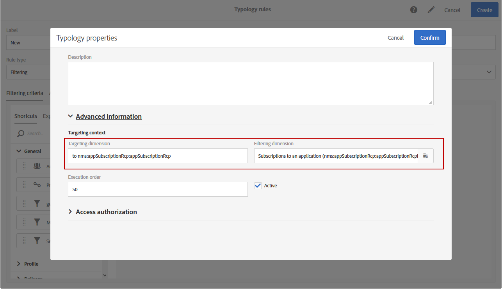

# 筛选规则 {#filtering-rules}

过滤规则允许您根据查询中定义的条件排除邮件目标的一部分，例如已发送一定数量电子邮件的隔离用户档案或用户档案。

## 默认筛选类型规则{#default-filtering-typology-rules}

下表提供了有关现成过滤规则及其相关渠道的信息。

| 标签 | 渠道 | 说明 |
---------|----------|---------
| **[!UICONTROL Address not specified]** | 所有 | 排除没有指定地址（电子邮件、邮政地址等）的目标人口。 )。 |
| **[!UICONTROL Address on denylist]** | 所有 | 排除中的地阻止列表址。 |
| **[!UICONTROL Duplicate]** | 所有 | 排除基于重复填充&#x200B;**[!UICONTROL Address]**&#x200B;字段的目标。 |
| **[!UICONTROL Exclude mobile applications]** | 移动应用程序 | 不包括与消息中定义的移动应用程序不匹配的应用程序订阅。 |
| **[!UICONTROL Exclude mobile applications for In-App]** | 应用程序内 | 不包括与消息（应用程序内模板）中定义的移动应用程序不匹配的应用程序订阅。 |
| **[!UICONTROL Exclude mobile applications for In-App broadcast]** | 应用程序内 | 排除与消息（应用程序内广播模板）中定义的移动应用程序不匹配的应用程序订阅 |
| **[!UICONTROL Exclude mobile applications for Push]** | 移动应用程序 | 不包括与消息中定义的移动应用程序不匹配的应用程序订阅（对于推送） |
| **[!UICONTROL Quarantined address]** | 所有 | 排除隔离地址。 |
| **[!UICONTROL Target limited in size]** | 所有 | 检查是否达到投放的最大目标大小。 适用于激活了“投放期限”选项的直接邮件投放。 |

除了这些默认过滤规则之外，还有两个排除规则：

* **[!UICONTROL Exclusion of addresses]** ( **[!UICONTROL addressExclusions]** )
* **[!UICONTROL Exclusion of domains]** ( **[!UICONTROL domainExclusions]** ).

在电子邮件分析期间，这些规则将收件人电子邮件地址与包含在可交付性实例中管理的加密全局抑制列表中的禁止地址或域名进行比较。 如果存在匹配项，则消息不会发送到该收件人。

这是为了避免由于恶意活动(阻止列表尤其是使用Spamtrap)而被添加到。 例如，如果使用Spamtrap通过您的某个Web表单进行订阅，则会自动向该Spamtrap发送确认电子邮件，这会导致您的地址被自动添加到该阻止列表订阅。

>[!NOTE]
>
>全局抑制列表中包含的地址和域名被隐藏。 在投放收件人日志中只指示被排除的分析数。

## 创建筛选规则{#creating-a-filtering-rule}

您可以根据自己的需要创建自己的过滤规则。 例如，您可以过滤新闻稿的目标群，以便年满18周岁的订阅者永远不会收到通信。

要创建筛选类型规则，请执行以下步骤：

1. 创建新类型规则。 创建类型规则的主要步骤详见[本节](../../sending/using/managing-typology-rules.md)。

1. 选择&#x200B;**[!UICONTROL Filtering]**&#x200B;规则类型，然后指定所需的渠道。

1. 在&#x200B;**[!UICONTROL Filtering criteria]**&#x200B;选项卡中，选择&#x200B;**[!UICONTROL Subscription]**&#x200B;类别中的订阅。

   

1. 在查询编辑器的&#x200B;**[!UICONTROL Explorer]**&#x200B;选项卡中，将&#x200B;**[!UICONTROL Subscriber]**&#x200B;节点拖放到屏幕的主部分。

   

1. 选择&#x200B;**[!UICONTROL Age]**&#x200B;字段并定义过滤条件，使订阅者的年龄达到或超过18岁。

   

1. 在&#x200B;**[!UICONTROL Typologies]**&#x200B;选项卡中，将此规则链接到类型学。

   

1. 确保在要使用的投放或投放模板中选择了字体。 如需详细信息，请参阅[此部分](../../sending/using/managing-typologies.md#applying-typologies-to-messages)。

   

每当在消息中使用此规则时，被视为未成年人的订阅者将自动被排除。

## 配置筛选规则的定位上下文{#configuring-filtering-rules-targeting-context}

Campaign Standard允许您根据要目标的数据配置要使用的&#x200B;**定位**&#x200B;和&#x200B;**筛选**&#x200B;维。

为此，请打开类型规则的属性，然后访问&#x200B;**[!UICONTROL Advanced information]**&#x200B;部分。

默认情况下，对&#x200B;**[!UICONTROL Profiles]**&#x200B;执行筛选。 例如，如果规则针对移动应用程序，则&#x200B;**[!UICONTROL Filtering dimension]**&#x200B;可更改为&#x200B;**[!UICONTROL Subscriptions to an application]**。

## 限制筛选规则{#restricting-the-applicability-of-a-filtering-rule}的适用性

可以根据要发送的消息限制过滤规则的适用性。

1. 在类型规则的&#x200B;**[!UICONTROL Application criteria]**&#x200B;选项卡中，取消选中&#x200B;**[!UICONTROL Apply the rule on all deliveries]**&#x200B;选项，该选项默认为启用状态。

   

1. 使用查询编辑器定义筛选器。 例如，您只能对标签开始带有给定字词或ID包含某些字母的消息应用此规则。

   

在这种情况下，规则仅应用于与定义的条件对应的消息。
