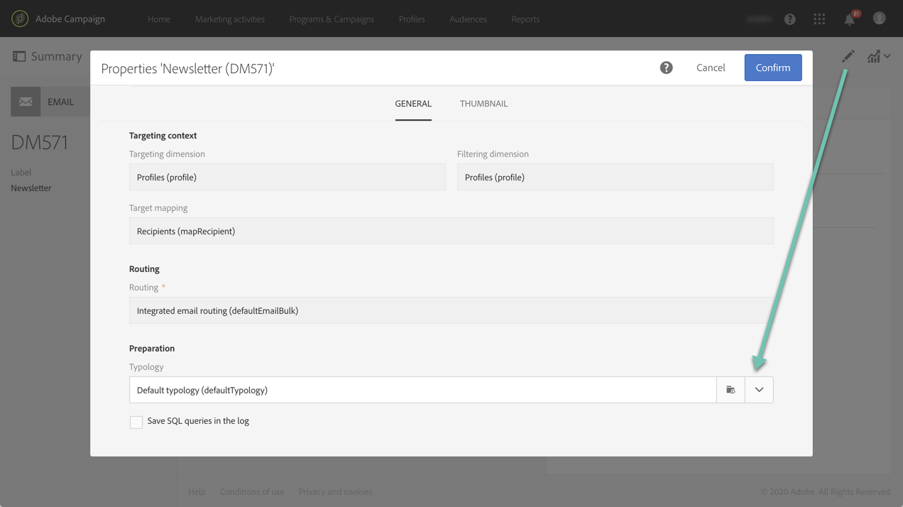

# 管理分类{#managing-typologies}

## 关于分类{#about-typologies}

分类是一组规则，可用于在发送消息之前检查消息的有效性。例如：消息内容不为空、存在退订、排除重复等。

可通过 **[!UICONTROL Administration]** > **[!UICONTROL Channels]** > **[!UICONTROL Typologies]** 菜单访问分类。默认情况下，应用程序中提供了默认的分类。您也可以根据自己的需要，创建自己的分类或修改现有分类。

对于每种分类，**[!UICONTROL Typology rules]** 部分都列出了在消息中使用该分类时执行的规则集。

>[!NOTE]
>
>要了解其中某一个分类规则的更多详细信息，请双击该分类。规则将以只读模式显示。

## 创建分类{#creating-a-typology}

要创建新的分类，请执行以下步骤：

1. 访问 **[!UICONTROL Administration]** > **[!UICONTROL Channels]** > **[!UICONTROL Typologies]** 菜单。

1. 随即会显示分类列表。单击 **[!UICONTROL Create]** 按钮。

   

1. 定义分类 **[!UICONTROL Label]**，然后单击 **[!UICONTROL Add an element]** 按钮以选择要包含在其中的分类规则。有关分类规则的更多信息，请参阅[此章节](../../sending/using/managing-typology-rules.md)。

   

   >[!NOTE]
   >
   >利用 **[!UICONTROL IP affinity]** 字段，可根据配置管理任务共用性。任务共用性通过实例的配置文件进行定义。如果要使用任务共用性，请与管理员联系。

1. 单击 **[!UICONTROL Create]** 以确认您的选择。您的分类现已准备就绪，可用于消息。

## 对消息应用分类{#applying-typologies-to-messages}

将分类与消息或消息模板关联时，将执行在分类中包含的分类规则以检查消息的有效性。

>[!NOTE]
>
>每个消息或消息模板只能分配一个分类。

要将分类链接到消息，请执行以下步骤：

1. 访问消息的属性。请注意，可通过 **[!UICONTROL Resources]** > **[!UICONTROL Templates]** 导航菜单访问消息模板。

1. 在 **[!UICONTROL Advanced parameters]** > **[!UICONTROL Prearation]** 部分，选择要链接到消息的分类。

   

1. 单击 **[!UICONTROL Confirm]**。

   现在，选定的分类已链接到消息。随即将执行其所有关联分类规则，以检查消息的有效性。
