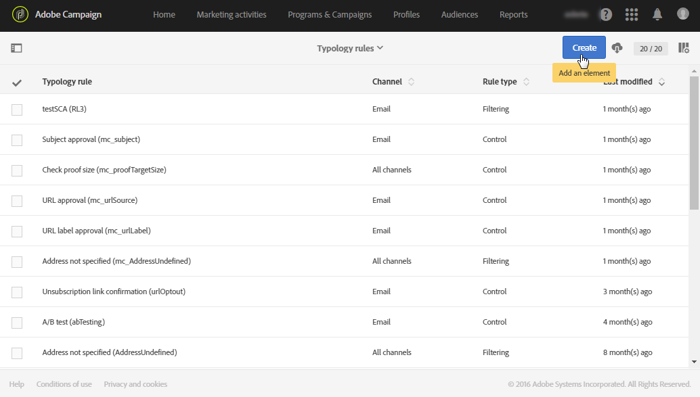
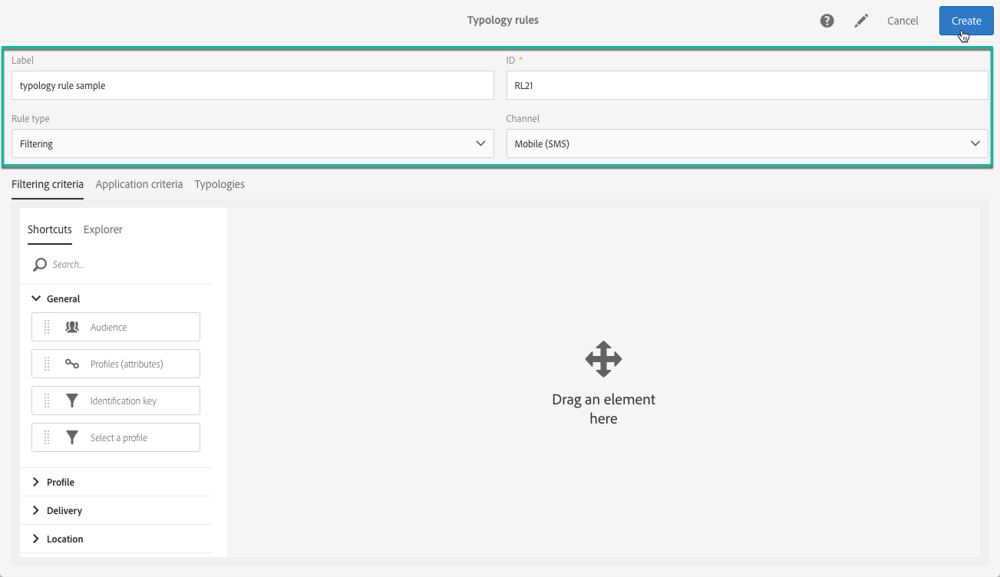
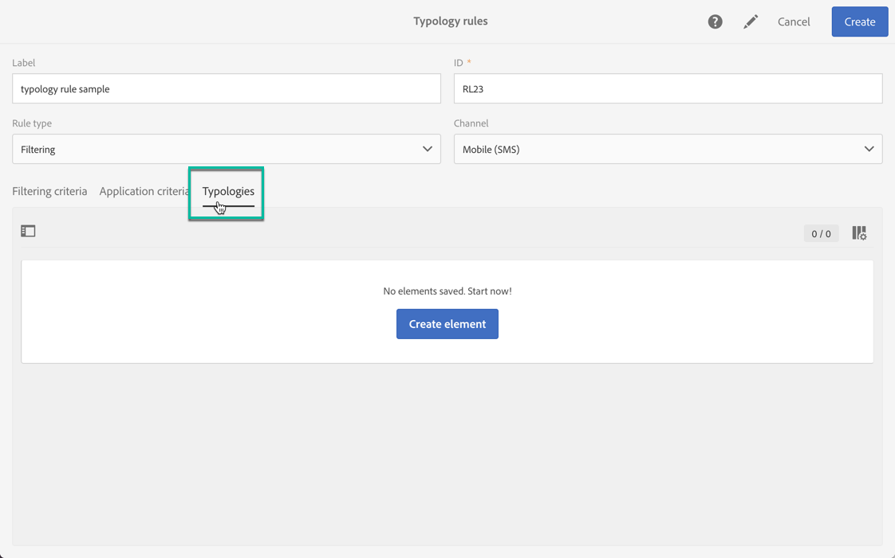
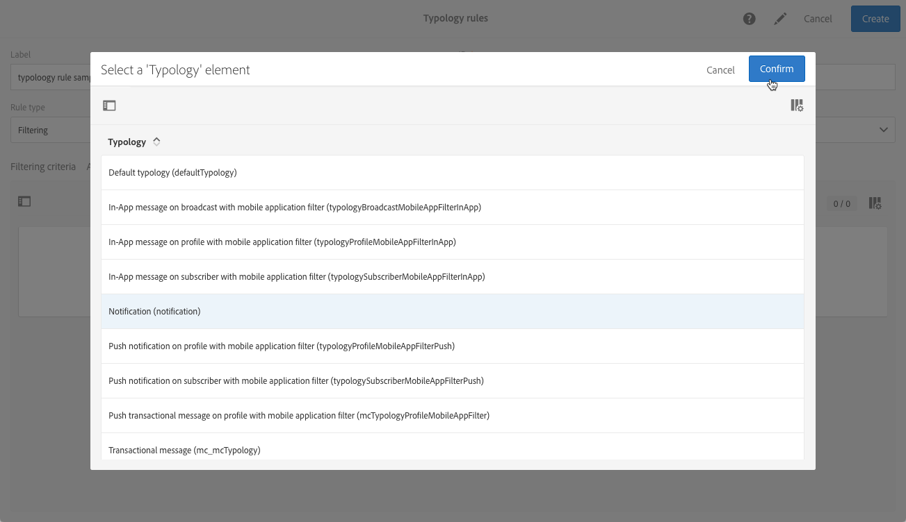
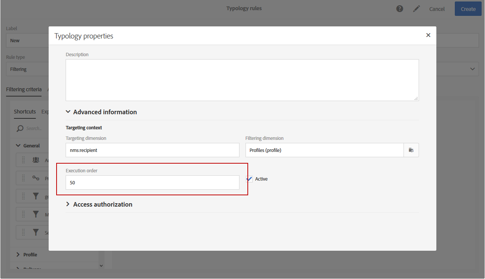
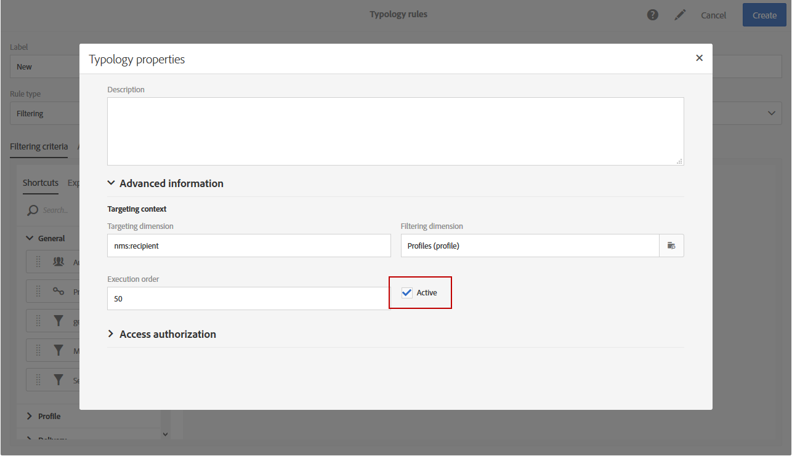

# 管理类型规则 {#managing-typology-rules}

## 关于类型学规则 {#about-typology-rules}

分类规则是一种业务规则，用于在发送之前对消息进行检查和筛选。 可使用以下类型的分类规则：

* **筛选**&#x200B;规则：利用此类型的规则，可根据查询中定义的条件排除部分消息目标，例如已隔离的轮廓和已向其发送了一定数量电子邮件的轮廓。 如需详细信息，请参阅[此小节](../../sending/using/filtering-rules.md)。

* **疲劳规则**：利用此类规则，可定义每个轮廓的最大邮件数，以避免对接收方造成过度骚扰。 如需详细信息，请参阅[此小节](../../sending/using/fatigue-rules.md)。

* **控制**&#x200B;规则：此类型的规则允许用户在发送消息之前检查消息的有效性和质量，如字符显示、短信消息大小、地址格式等。有关详细信息，请参阅[此部分](../../sending/using/control-rules.md)。

可通过 **[!UICONTROL Administration]** > **[!UICONTROL Channels]** > **[!UICONTROL Typologies]** > **[!UICONTROL Typology rules]** 菜单访问分类规则。

默认情况下，可以使用多个现成的&#x200B;**筛选**&#x200B;和&#x200B;**控制**&#x200B;分类规则。 有关详情，请参阅[筛选规则](../../sending/using/filtering-rules.md)和[控制规则](../../sending/using/control-rules.md)章节。

根据需要，您可以修改现有分类规则或创建新分类规则，但 **[!UICONTROL Control]** 规则除外，此类规则为只读类型，不能修改。

## 创建分类规则 {#creating-a-typology-rule}

创建分类规则的主要步骤如下：

1. 访问 **[!UICONTROL Administration]** / **[!UICONTROL Channels]** / **[!UICONTROL Typologies]** / **[!UICONTROL Typology rules]** 菜单，然后单击 **[!UICONTROL Create]**。

   

1. 输入分类 **[!UICONTROL Label]**，然后指定应用规则的 **[!UICONTROL Channel]**。

   

1. 指定分类规则的 **[!UICONTROL Type]**，然后根据需要进行配置。 请注意，分类规则的配置因分类而异。 有关更多信息，请参阅&#x200B;**[筛选规则](../../sending/using/filtering-rules.md)**&#x200B;和&#x200B;**[疲劳规则](../../sending/using/fatigue-rules.md)**&#x200B;章节。

1. 选择要包含新规则的分类。 要执行此操作，请选择 **[!UICONTROL Typologies]** 选项卡，然后单击 **[!UICONTROL Create element]** 按钮。

   

1. 选择所需的分类，然后单击 **[!UICONTROL Confirm]**。

   

1. 选择所有分类后，单击 **[!UICONTROL Create]** 以确认创建分类规则。

## 分类规则执行顺序 {#typology-rules-execution-order}

按照在定向、分析和消息个性化阶段期间指定的顺序，执行分类规则。

在标准操作模式下，按以下顺序应用规则：

1. 控制规则（如果在开始定向时应用）。
1. 筛选规则：

   * 地址限定的本机应用程序规则：定义的地址/未验证的地址/阻止列表上的地址/隔离的地址/地址质量。
   * 筛选用户定义的规则。

1. 控制规则（如果在定向结束时应用）。
1. 控制规则（如果在开始个性化时应用）。
1. 控制规则（如果在个性化结束时应用）。

但是，您可以调整每个分类中同类规则的执行顺序。 事实上，在同一消息处理阶段执行多个规则时，您可以选择应用规则的顺序。

例如，执行顺序位于第 20 位的筛选规则将在执行顺序位于第 30 位的筛选规则之前执行。

在分类规则的 **[!UICONTROL Properties]** 中，您可以设置其执行顺序 必须应用多个规则时，每个规则的执行顺序决定了规则处理的先后顺序。 有关更多信息，请参阅[分类规则执行顺序](#typology-rules-execution-order)一节。

如果经过分析，发现相关消息可能会被某个分类规则所影响，不想应用该规则，则可通过其 **[!UICONTROL Properties]** 取消激活该分类规则。

