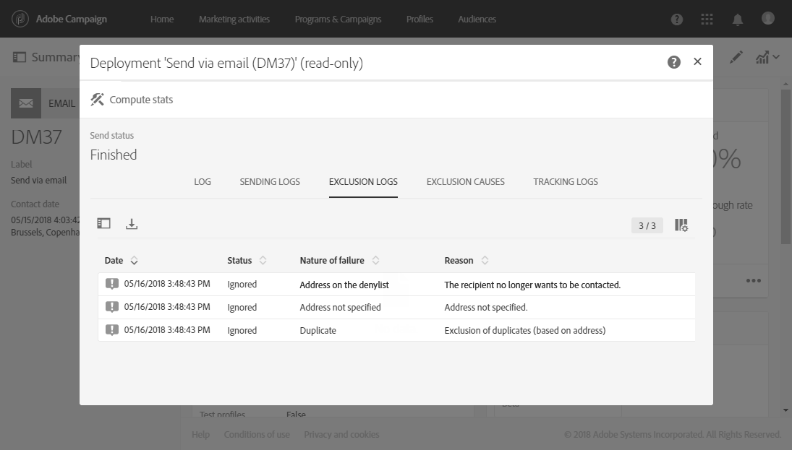

# 监控投放{#monitoring-a-delivery}

有几种方法可监控交付情况并衡量其影响：

* **消息日志**:这些日志可以直接从消息功能板中访问。 它们显示发送的详细信息、已排除的目标以及原因，以及打开和单击等跟踪信息。

   要查看消息日志，请单击块右下角的图 **[!UICONTROL Deployment]** 标。

   几个选项卡包含有关、、、和的信 **[!UICONTROL Sending logs]**&#x200B;息(如 **[!UICONTROL Exclusion logs]**&#x200B;果存在) **[!UICONTROL Exclusion causes]**(如 **[!UICONTROL Tracking logs]** 果有) **[!UICONTROL Tracked URLs]**。 请参阅 [交付日志](#delivery-logs)。

   

   日志包含与传送和校样相关的所有消息。 特定图标允许您识别错误或警告。 有关此问题的详细信息，请参阅 [批准消息](../../sending/using/previewing-messages.md)。

   您可以通过单击按钮导出日 **[!UICONTROL Export list]** 志。

   

* **交付通知**:为了跟踪交付成功或失败，Adobe Campaign提供了电子邮件警报系统，用于发送通知以告知用户重要的系统活动。
* **报告**:从消息功能板中，您可以访问此特定消息的多个报告。 您还可以使用 **[!UICONTROL Reports]** 一个菜单来访问内置或自定义报告的完整列表，您可以使用该列表勾勒与消息或营销活动相关的特定指标。
* 管理员还可以导出单独的文件中的日志，该文件可以在您自己的报告或BI工具中处理。 有关此内容的详细信息，请参 [阅导出日志](../../automating/using/exporting-logs.md)。

**相关主题：**

* [在失败时接收提醒](../../sending/using/receiving-alerts-when-failures-happen.md)
* [报告](../../reporting/using/about-dynamic-reports.md)

## 交付日志 {#delivery-logs}

### 发送日志 {#sending-logs}

该选 **[!UICONTROL Sending logs]** 项卡提供了此分发的每个实例的历史记录。 此处存储已发送消息及其状态的列表。 它允许您查看每个收件人的传送状态。

对于每个具有状态 **[!UICONTROL Sent]** 的配置文件， **[!UICONTROL Date]** 列会显示消息的发送时间。

### 排除日志 {#exclusion-logs}

该选 **[!UICONTROL Exclusion logs]** 项卡列出已从发送的目标中排除的所有消息，并指定发送失败的原因。

### 排除原因 {#exclusion-causes}

该选 **[!UICONTROL Exclusion causes]** 项卡显示从目标发送中排除的消息的卷（以消息数为单位）。

