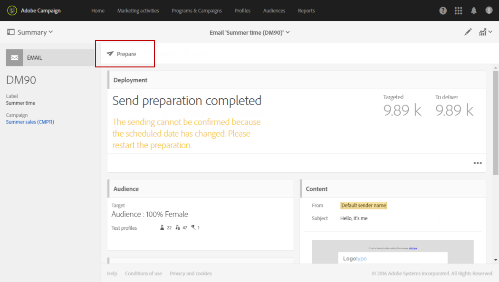

# 准备发送{#preparing-the-send}

准备对应于计算目标群体并为目标中包含的每个用户档案生成消息内容的步骤。 准备完成后，消息即可发送，可以立即发送，也可以在 [计划的日期和时间](../../sending/using/about-scheduling-messages.md).

1. 要开始准备发送，请单击 **准备** 按钮的操作栏。

   

1. 此 **[!UICONTROL Deployment]** 块显示准备进度，然后显示准备统计信息：目标消息数、要发送的消息数等。

   根据目标人群的规模，此操作可能需要花费一些时间。

   

1. 随时使用停止准备 **停止** 按钮，位于操作栏中。

   在准备阶段，不发送任何邮件。因此，您可以开始或停止准备而不影响任何内容。

   

1. 在准备投放阶段期间，将自动保存您的消息。 如果在准备步骤后需要对消息计划进行任何更改，则需要确保单击 **[!UICONTROL Prepare]** 再次按钮，以便将这些更改考虑在内。 有关如何计划消息的详细信息，请参阅此 [页面](../../sending/using/about-scheduling-messages.md).

   

1. 要查看准备日志，请单击块右下方的按钮。

   

1. 此 **[!UICONTROL Deployment]** 窗口打开，更正所有错误，然后重新启动准备工作。

   最后一条日志消息显示了所有错误消息和错误数。特定图标显示遇到的错误类型：黄色图标表示非关键处理错误，红色图标表示阻止启动投放的严重错误。

   

1. 在确认发送消息之前，请检查准备统计信息。 如果要发送的消息数与您的配置不对应，请编辑定向群体(请参阅 [选择消息的受众](../../audiences/using/selecting-an-audience-in-a-message.md))并重新启动准备工作。

完成准备工作后，即可发送消息。 有关此内容的更多信息，请参阅 [确认发送](../../sending/using/confirming-the-send.md).

**类型规则**

Adobe Campaign提供了一组内置分类规则，这些规则在消息准备期间应用。 它们用于检查消息是否有效且符合您的质量标准。 请参阅 [类型](../../sending/using/about-typology-rules.md). 例如，您可以定义自己的分类规则，并设置全局跨渠道疲劳规则，以自动从营销策划中排除过度投放的用户档案。 请参阅[疲劳规则](../../sending/using/fatigue-rules.md)。

**短信消息检查**

如果您在短信消息内容中插入了个性化字段或条件文本，则这些因素可能会引入GSM编码无法识别的字符。 运行准备时，将监控消息长度，如果超过限制，将显示警告消息。

有关详细信息，请参见 [短信编码、长度和音译](../../administration/using/configuring-sms-channel.md#sms-encoding--length-and-transliteration) 和 [个性化短信消息](../../channels/using/personalizing-sms-messages.md) 部分。
