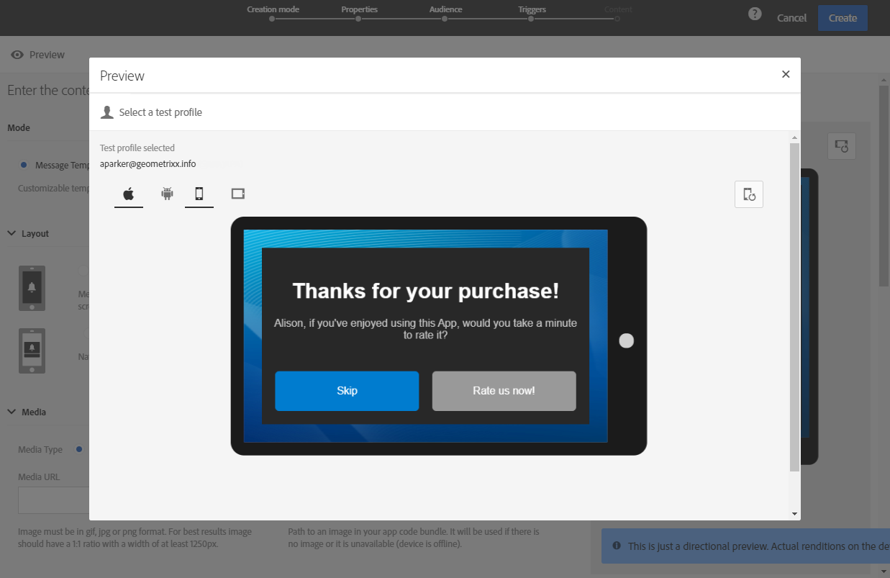

# 预览投放 {#previewing-messages}

## 预览电子邮件 {#previewing-emails}

Campaign Standard允许您在发送之前预览消息，以检查消息的个性化以及收件人将如何看到消息。

使用以下方式执行消息预览 **测试用户档案** 添加到消息目标的。

对象 **电子邮件** 消息，Campaign Standard允许您使用定向的用户档案预览消息，而不是测试用户档案。 这允许您获取特定用户档案将收到的消息的精确表示形式。 有关更多信息，请参阅[使用定向用户档案测试电子邮件消息](../../sending/using/testing-messages-using-target.md)。

要使用测试用户档案预览消息，请执行以下步骤：

1. 在 [电子邮件设计工具](../../designing/using/designing-content-in-adobe-campaign.md)，单击 **[!UICONTROL Preview]** 按钮。

   

   您的电子邮件的桌面视图和响应式移动设备视图并排显示。

1. 在每次预览期间执行自动反垃圾邮件检查。 单击 **[!UICONTROL Anti-spam analysis]** 按钮以了解有关警告的更多信息。

   

1. 选择 **[!UICONTROL Change profile]** 按钮以选择要在其上测试个性化元素的测试配置文件。

   

1. 退出 **[!UICONTROL Preview]** 模式，单击 **[!UICONTROL Edit]** 按钮进行标记。

   

**相关主题**

* [管理测试用户档案](../../audiences/using/managing-test-profiles.md)
* [使用目标用户档案测试电子邮件](../../sending/using/testing-messages-using-target.md)
* [发送校样](../../sending/using/sending-proofs.md)

## 预览短信消息 {#previewing-sms}

对象 **短信** 消息，Campaign Standard允许您使用测试用户档案预览消息。 这允许您获取特定用户档案将收到的消息的精确表示形式。 有关更多信息，请参阅[管理测试用户档案](../../audiences/using/managing-test-profiles.md)。

要使用测试用户档案预览短信消息，请执行以下步骤：

1. 一旦您填写了 **[!UICONTROL Properties]** 和选定受众的短信发送，您可以对投放进行个性化。 有关更多信息，请参阅 [部分](../../channels/using/personalizing-sms-messages.md).

   

1. 对内容进行个性化后，单击 **[!UICONTROL Create]** 以访问 **[!UICONTROL Summary]** 窗口。

1. 从 **[!UICONTROL Summary]** 窗口，单击 **[!UICONTROL Content]** 以开始预览您的投放。

   

1. 单击 **[!UICONTROL Preview]** 工具栏中。

   

1. 单击 **[!UICONTROL Change profile]** 以选择您的测试配置文件，然后 **[!UICONTROL Confirm]**.

   

您现在可以看到消息的精确表示形式，具体取决于所选的测试用户档案。

**相关主题**

* [关于短信消息](../../channels/using/about-sms-messages.md)
* [创建短信消息](../../channels/using/creating-an-sms-message.md)
* [个性化短信消息](../../channels/using/personalizing-sms-messages.md)

## 预览推送通知 {#previewing-push}

对象 **推送通知**，Campaign Standard允许您使用测试用户档案预览消息。 这允许您获取特定用户档案将收到的消息的精确表示形式。 有关更多信息，请参阅[管理测试用户档案](../../audiences/using/managing-test-profiles.md)。

要使用测试用户档案预览推送通知，请执行以下步骤：

1. 一旦您填写了 **[!UICONTROL Properties]** 和选定受众的推送通知，您可以个性化投放。 有关更多信息，请参阅 [自定义推送通知](../../channels/using/customizing-a-push-notification.md).

1. 对内容进行个性化后，您可以根据预览窗口中的设备和操作系统，直接检查推送通知的呈现。

   

1. 要使用测试用户档案预览推送通知，请单击 **[!UICONTROL Preview with test profile]**.

   

1. 选择您的测试配置文件，然后 **[!UICONTROL Confirm]**.

您现在可以看到消息的精确表示形式，具体取决于所选的测试用户档案。

**相关主题**

* [关于推送通知](../../channels/using/about-push-notifications.md)
* [准备和发送推送通知](../../channels/using/preparing-and-sending-a-push-notification.md)
* [自定义推送通知](../../channels/using/customizing-a-push-notification.md)

## 预览应用程序内消息 {#previewing-in-app}

对象 **应用程序内**，Campaign Standard允许您使用测试用户档案预览消息。 这允许您获取特定用户档案将收到的消息的精确表示形式。 有关更多信息，请参阅[管理测试用户档案](../../audiences/using/managing-test-profiles.md)。

要使用测试用户档案预览应用程序内消息，请执行以下步骤：

1. 一旦您填写了 **[!UICONTROL Properties]** 已选择您的受众，并设置您的 **[!UICONTROL Triggers]**，您可以个性化投放。 有关更多信息，请参阅 [自定义应用程序内消息](../../channels/using/customizing-an-in-app-message.md).

1. 对内容进行个性化后，您可以根据预览窗口中的设备和操作系统，直接检查应用程序内消息的呈现。

   

1. 要使用测试用户档案预览应用程序内消息，请单击 **[!UICONTROL Preview]**.

   

1. 选择您的测试配置文件，然后 **[!UICONTROL Confirm]**.

您现在可以看到消息的精确表示形式，具体取决于所选的测试用户档案。

**相关主题**

* [关于应用程序内消息传递](../../channels/using/about-in-app-messaging.md)
* [准备和发送应用程序内消息](../../channels/using/preparing-and-sending-an-in-app-message.md)
* [自定义应用程序内消息](../../channels/using/customizing-an-in-app-message.md)
