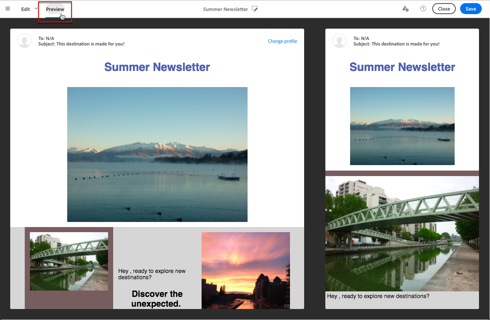

# 预览投放 {#previewing-messages}

## 預覽電子郵件 {#previewing-emails}

Campaign Standard可讓您在傳送訊息之前預覽訊息，以檢查其個人化及收件者將如何看到訊息。

使用執行訊息預覽 **測試設定檔** 新增至訊息目標的專案。

對象 **電子郵件** 訊息，Campaign Standard可讓您使用目標設定檔預覽訊息，而非測試設定檔。 這可讓您取得特定設定檔將收到的訊息的精確表示。 有关更多信息，请参阅[使用定向用户档案测试电子邮件消息](../../sending/using/testing-messages-using-target.md)。

若要使用測試設定檔預覽訊息，請遵循下列步驟：

1. 在 [電子郵件設計工具](../../designing/using/designing-content-in-adobe-campaign.md)，按一下 **[!UICONTROL Preview]** 按鈕。

   

   同時顯示您電子郵件的案頭檢視和回應式行動檢視。

1. 每次預覽期間都會執行自動反垃圾郵件檢查。 按一下 **[!UICONTROL Anti-spam analysis]** 按鈕以進一步瞭解警告。

   

1. 選取 **[!UICONTROL Change profile]** 按鈕，以選擇要在其上測試個人化元素的測試設定檔。

   

1. 若要結束 **[!UICONTROL Preview]** 模式，按一下 **[!UICONTROL Edit]** 按鈕。

   

**相关主题**

* [管理测试用户档案](../../audiences/using/managing-test-profiles.md)
* [使用目标用户档案测试电子邮件](../../sending/using/testing-messages-using-target.md)
* [发送校样](../../sending/using/sending-proofs.md)

## 預覽SMS訊息 {#previewing-sms}

對象 **簡訊** 訊息，Campaign Standard可讓您使用測試設定檔預覽訊息。 這可讓您取得特定設定檔將收到的訊息的精確表示。 有关更多信息，请参阅[管理测试用户档案](../../audiences/using/managing-test-profiles.md)。

若要使用測試設定檔預覽SMS訊息，請遵循下列步驟：

1. 填入 **[!UICONTROL Properties]** 和選取對象的SMS訊息，您可以個人化傳送。 如需詳細資訊，請參閱 [區段](../../channels/using/personalizing-sms-messages.md).

   

1. 個人化您的內容後，按一下 **[!UICONTROL Create]** 存取 **[!UICONTROL Summary]** 視窗。

1. 從 **[!UICONTROL Summary]** 視窗，按一下 **[!UICONTROL Content]** 以開始預覽您的傳遞。

   

1. 按一下 **[!UICONTROL Preview]** （在工具列中）。

   

1. 按一下 **[!UICONTROL Change profile]** 以選取您的測試設定檔，然後 **[!UICONTROL Confirm]**.

   

您現在可以看到訊息的確切呈現方式，視選取的測試設定檔而定。

**相关主题**

* [关于短信消息](../../channels/using/about-sms-messages.md)
* [创建短信消息](../../channels/using/creating-an-sms-message.md)
* [个性化短信消息](../../channels/using/personalizing-sms-messages.md)

## 預覽推播通知 {#previewing-push}

對象 **推播通知**，Campaign Standard可讓您使用測試設定檔預覽訊息。 這可讓您取得特定設定檔將收到的訊息的精確表示。 有关更多信息，请参阅[管理测试用户档案](../../audiences/using/managing-test-profiles.md)。

若要使用測試設定檔預覽推播通知，請執行以下步驟：

1. 填入 **[!UICONTROL Properties]** 並選取您的對象時，您可以個人化您的傳送。 如需詳細資訊，請參閱 [自訂推播通知](../../channels/using/customizing-a-push-notification.md).

1. 個人化您的內容後，您可以根據預覽視窗中的裝置和作業系統，直接檢查推播通知的呈現。

   

1. 若要使用測試設定檔預覽推播通知，請按一下 **[!UICONTROL Preview with test profile]**.

   

1. 選取您的測試設定檔，然後 **[!UICONTROL Confirm]**.

您現在可以看到訊息的確切呈現方式，視選取的測試設定檔而定。

**相关主题**

* [关于推送通知](../../channels/using/about-push-notifications.md)
* [准备和发送推送通知](../../channels/using/preparing-and-sending-a-push-notification.md)
* [自定义推送通知](../../channels/using/customizing-a-push-notification.md)

## 預覽應用程式內訊息 {#previewing-in-app}

對象 **應用程式內**，Campaign Standard可讓您使用測試設定檔預覽訊息。 這可讓您取得特定設定檔將收到的訊息的精確表示。 有关更多信息，请参阅[管理测试用户档案](../../audiences/using/managing-test-profiles.md)。

若要使用測試設定檔預覽應用程式內訊息，請遵循下列步驟：

1. 填入 **[!UICONTROL Properties]** 應用程式內訊息的預設值，選取您的對象並設定 **[!UICONTROL Triggers]**，您可個人化您的傳遞。 如需詳細資訊，請參閱 [自訂應用程式內訊息](../../channels/using/customizing-an-in-app-message.md).

1. 個人化您的內容後，您可以根據預覽視窗中的裝置和作業系統，直接檢查應用程式內訊息的呈現。

   

1. 若要使用測試設定檔預覽您的應用程式內訊息，請按一下 **[!UICONTROL Preview]**.

   

1. 選取您的測試設定檔，然後 **[!UICONTROL Confirm]**.

您現在可以看到訊息的確切呈現方式，視選取的測試設定檔而定。

**相关主题**

* [关于应用程序内消息传递](../../channels/using/about-in-app-messaging.md)
* [准备和发送应用程序内消息](../../channels/using/preparing-and-sending-an-in-app-message.md)
* [自定义应用程序内消息](../../channels/using/customizing-an-in-app-message.md)
