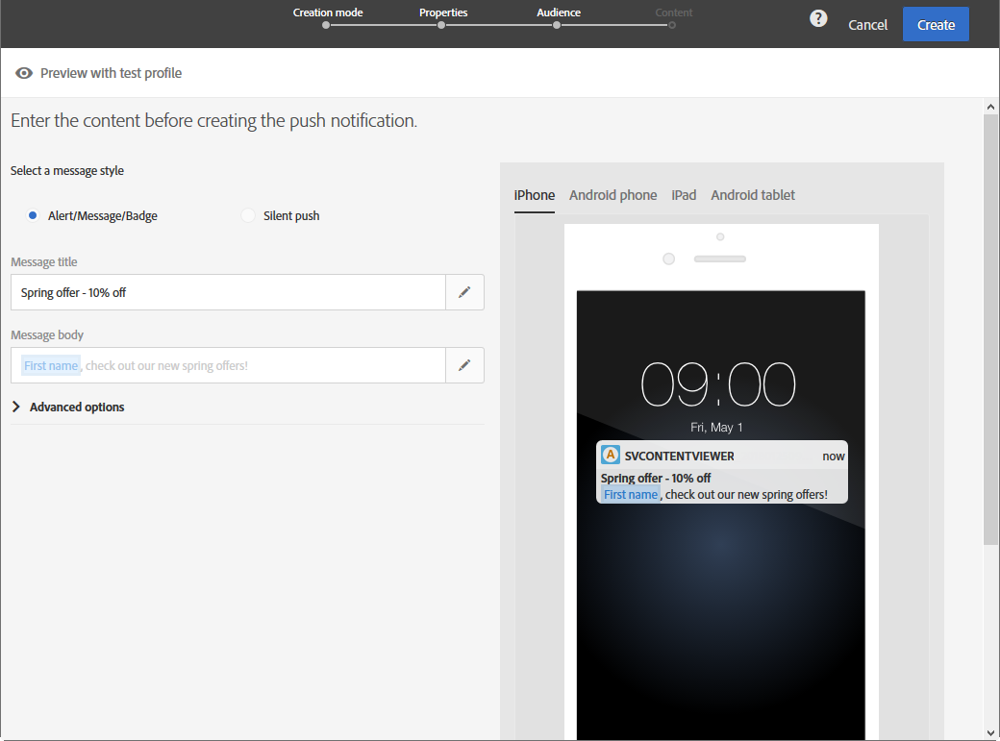
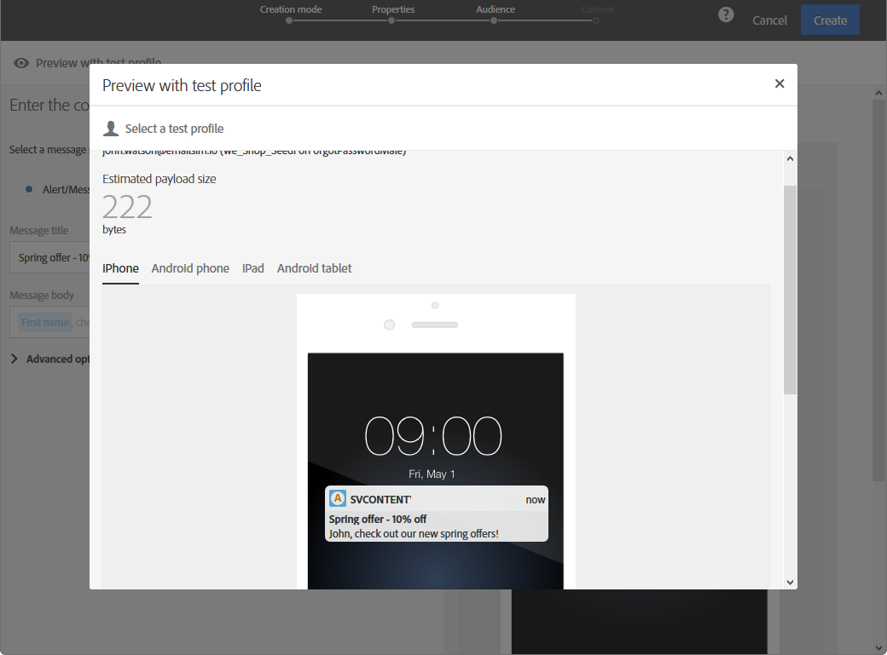

# 预览投放 {#previewing-messages}

## 预览电子邮件 {#previewing-emails}

Campaign Standard允许您在发送邮件前预览邮件，以检查其个性化情况以及收件人将如何看到邮件。

消息预览是使用您 **添加到** 消息目标的测试用户档案执行的。

对于 **电子邮件** ,Campaign Standard允许您使用目标用户档案而不是测试用户档案来预览邮件。 这允许您获得特定用户档案将收到的消息的精确表示形式。 有关更多信息，请参阅[使用定向用户档案测试电子邮件消息](../../sending/using/testing-messages-using-target.md)。

要使用测试预览用户档案消息，请执行以下步骤：

1. 在“电子 [邮件设计器](../../designing/using/designing-content-in-adobe-campaign.md)”中，单击 **[!UICONTROL Preview]** 按钮。

   

   电子邮件的桌面视图和响应式移动视图并排显示。

1. 在每个预览期间执行自动防垃圾邮件检查。 单击该 **[!UICONTROL Anti-spam analysis]** 按钮可进一步了解该警告。

   

1. 选择按 **[!UICONTROL Change profile]** 钮以选择要测试个性化元素的测试用户档案。

   

1. 要退出 **[!UICONTROL Preview]** 模式，请单 **[!UICONTROL Edit]** 击屏幕左上角的按钮。

   

**相关主题**

* [管理测试用户档案](../../audiences/using/managing-test-profiles.md)
* [使用目标用户档案测试电子邮件](../../sending/using/testing-messages-using-target.md)
* [发送校样](../../sending/using/sending-proofs.md)

## 预览SMS消息 {#previewing-sms}

对 **于SMS** 消息，Campaign Standard允许您使用测试用户档案预览消息。 这允许您获得特定用户档案将收到的消息的精确表示形式。 有关更多信息，请参阅[管理测试用户档案](../../audiences/using/managing-test-profiles.md)。

要使用测试预览用户档案SMS消息，请执行以下步骤：

1. 填写SMS消 **[!UICONTROL Properties]** 息并选择受众后，即可个性化投放。 For more information, refer to [section](../../channels/using/personalizing-sms-messages.md).

   

1. 个性化内容后，单 **[!UICONTROL Create]** 击以访问窗 **[!UICONTROL Summary]** 口。

1. 在窗口 **[!UICONTROL Summary]** 中，单击 **[!UICONTROL Content]** 开始以预览投放。

   

1. 在工 **[!UICONTROL Preview]** 具栏中单击。

   

1. 单 **[!UICONTROL Change profile]** 击以选择测试用户档案 **[!UICONTROL Confirm]**。

   

现在，您可以根据选定的测试用户档案，看到消息的确切表示形式。

**相关主题**

* [关于短信消息](../../channels/using/about-sms-messages.md)
* [创建短信消息](../../channels/using/creating-an-sms-message.md)
* [个性化短信消息](../../channels/using/personalizing-sms-messages.md)

## 预览推送通知 {#previewing-push}

对于 **推送通知**,Campaign Standard允许您使用测试用户档案预览消息。 这允许您获得特定用户档案将收到的消息的精确表示形式。 有关更多信息，请参阅[管理测试用户档案](../../audiences/using/managing-test-profiles.md)。

要使用测试预览用户档案推送通知，请执行以下步骤：

1. 填写推送通 **[!UICONTROL Properties]** 知并选择受众后，即可个性化投放。 有关详细信息，请参 [阅自定义推送通知](../../channels/using/customizing-a-push-notification.md)。

1. 个性化内容后，您可以根据设备和操作系统在预览窗口中直接检查推送通知的呈现情况。

   

1. 要使用测试预览用户档案推送通知，请单击 **[!UICONTROL Preview with test profile]**。

   

1. 然后选择测试用户档案 **[!UICONTROL Confirm]**。

现在，您可以根据选定的测试用户档案，看到消息的确切表示形式。

**相关主题**

* [关于推送通知](../../channels/using/about-push-notifications.md)
* [准备和发送推送通知](../../channels/using/preparing-and-sending-a-push-notification.md)
* [自定义推送通知](../../channels/using/customizing-a-push-notification.md)

## 预览应用程序内消息 {#previewing-in-app}

对于 **应用程序内**,Campaign Standard允许您使用测试用户档案预览消息。 这允许您获得特定用户档案将收到的消息的精确表示形式。 有关更多信息，请参阅[管理测试用户档案](../../audiences/using/managing-test-profiles.md)。

要使用测试预览用户档案应用程序内消息，请执行以下步骤：

1. 填写应用程 **[!UICONTROL Properties]** 序内消息、选择受众并设置 **[!UICONTROL Triggers]**&#x200B;后，即可个性化投放。 有关详细信息，请参 [阅自定义应用程序内消息](../../channels/using/customizing-an-in-app-message.md)。

1. 个性化内容后，您可以根据设备和操作系统在预览窗口中直接检查应用程序内消息的呈现。

   

1. 要使用测试预览用户档案应用程序内消息，请单击 **[!UICONTROL Preview]**。

   

1. 然后选择测试用户档案 **[!UICONTROL Confirm]**。

现在，您可以根据选定的测试用户档案，看到消息的确切表示形式。

**相关主题**

* [关于应用程序内消息传递](../../channels/using/about-in-app-messaging.md)
* [准备和发送应用程序内消息](../../channels/using/preparing-and-sending-an-in-app-message.md)
* [自定义应用程序内消息](../../channels/using/customizing-an-in-app-message.md)