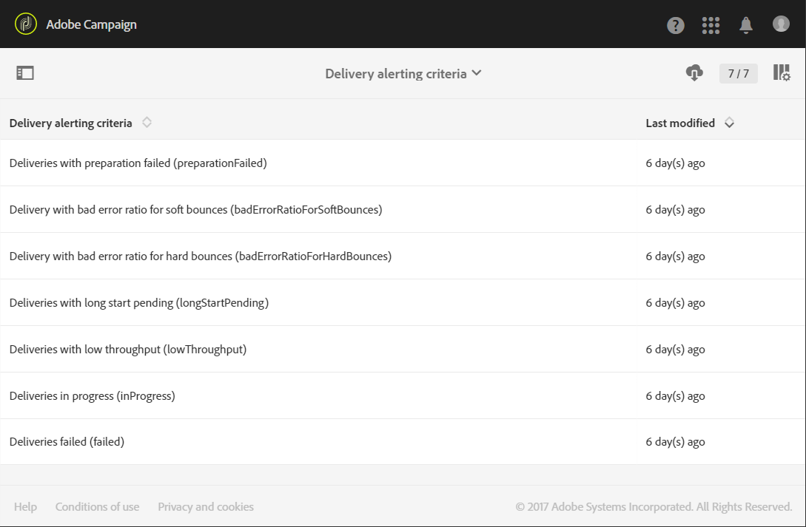

# 在失败时接收提醒{#receiving-alerts-when-failures-happen}

## 关于投放警报 {#about-delivery-alerting}

此 **投放警报** 功能是一个警报管理系统，它允许一组用户自动接收包含其投放执行信息的通知。

默认情况下，发送的通知包含基于以下条件的报告：

* 投放失败
* 准备失败的投放
* 具有不良软退回错误率的投放
* 硬退回错误率不佳的投放
* 具有待定状态的投放比平常更长
* 低吞吐量的投放
* 投放进行中

警报的接收者可以监控Adobe Campaign正在处理的投放，并在执行时出现问题时采取适当措施。

这些警报通知可根据Adobe Campaign界面中通过仪表板定义的特定警报标准进行自定义。

>[!NOTE]
>
>警报通知仅通过电子邮件发送。

发送的通知包含：

* A **[!UICONTROL Summary]** 显示符合您定义的条件的投放数量，以及您为每个条件选择的标签/颜色。
* A **[!UICONTROL Details]** 部分，其中列出了为相应功能板定义的所有投放标准以及每个标准的所有投放。

## 投放警报仪表板 {#delivery-alerting-dashboards}

### 关于投放警报仪表板 {#about-delivery-alerting-dashboards}

要管理通知的收件人、定义警报标准并访问警报历史记录，您需要使用功能板。

>[!NOTE]
>
>要访问和配置功能板和警报标准，您必须具有管理权限或显示在 **投放主管** 安全组。 标准用户无法访问Adobe Campaign界面中的功能板。 他们只能收到警报通知。 有关Adobe Campaign中的用户和安全性的更多信息，请参阅 [用户类型](../../administration/using/users-management.md) 和 [关于安全组](../../administration/using/managing-groups-and-users.md#about-security-groups).

从Adobe Campaign界面中，您可以：

* 创建和管理投放警报仪表板。 参见 [创建投放警报仪表板](#creating-a-delivery-alerting-dashboard).
* 定义和管理每个仪表板的投放警报标准。 例如，您可以基于准备失败的投放或仅低吞吐量的投放构建警报。 参见 [关于警报标准](#about-alerting-criteria).
* 修改每个仪表板的标准参数。 参见 [标准参数](#criteria-parameters).
* 为每个仪表板定义一组收件人。

   例如，您只想通知具有管理权限的用户投放失败。 但是，您希望营销用户收到有关软退回错误率的投放信息。 因此，您需要创建两个不同的功能板，并定义希望用于每个收件人组的标准。

* 访问每个仪表板所有已发送警报的历史记录。

   选择仪表板时，默认显示此仪表板的最后一次发送警报。 屏幕左侧列出了所有已发送的警报。 单击 **[!UICONTROL History]** 列表以访问相应的警报。

### 创建投放警报仪表板 {#creating-a-delivery-alerting-dashboard}

如果要根据特定标准向不同的用户组发送通知，您需要使用多个功能板。 要创建新功能板，请执行以下操作：

1. 转到 **[!UICONTROL Administration]** > **[!UICONTROL Channels]** > **[!UICONTROL Delivery alerting]**。
1. 选择 **[!UICONTROL Delivery alerting dashboards]** 并单击 **[!UICONTROL Create]**。
1. 查看 **[!UICONTROL Enabled]** 框激活当前仪表板。

   如果禁用此选项，则不再发送链接到该仪表板的通知。 此选项默认处于禁用状态。

   

1. 从中选择要通知的收件人组 **[!UICONTROL Alert group]** 下拉列表。 要修改或创建组，请参阅 [创建安全组并分配用户](../../administration/using/managing-groups-and-users.md#creating-a-security-group-and-assigning-users).
1. 从 **[!UICONTROL Delivery alerting criteria]** 部分，单击 **[!UICONTROL Create element]** 以添加标准。 参见 [关于警报标准](#about-alerting-criteria).
1. 选择 **[!UICONTROL Edit properties]** 按钮。在 **[!UICONTROL Criteria parameters]** 选项卡，定义标准的应用方式。 参见 [标准参数](#criteria-parameters).
1. 单击 **[!UICONTROL Create]** 以保存仪表板。

现在，每次投放满足您在此仪表板中定义的标准时，都会向指定的用户组发送警报通知。

## 投放警报标准 {#delivery-alerting-criteria}

### 关于警报标准 {#about-alerting-criteria}

要访问投放警报标准，请转到 **[!UICONTROL Administration]** > **[!UICONTROL Channels]** > **[!UICONTROL Delivery alerting]** 并选择 **[!UICONTROL Delivery alerting criteria]**.

可在投放警报功能板中使用以下标准：

* **[!UICONTROL Deliveries failed]**：在定义的范围内计划的任何投放，具有错误状态。
* **[!UICONTROL Deliveries with preparation failed]**：在定义的范围内修改的任何投放，其准备步骤（目标计算和内容生成）已失败。 有关此内容的更多信息，请参阅 [准备发送](../../sending/using/preparing-the-send.md).
* **[!UICONTROL Delivery with bad error ratio for soft bounces]**：在定义的范围内计划的任何投放，状态至少为 **[!UICONTROL In progress]**，软退回错误率大于定义的百分比。
* **[!UICONTROL Delivery with bad error ratio for hard bounces]**：在定义的范围内计划的任何投放，状态至少为 **[!UICONTROL In progress]**，硬退回错误率大于定义的百分比。
* **[!UICONTROL Deliveries with long start pending]**：在定义的范围内计划的任何投放，使用 **[!UICONTROL Start pending]** 超过规定持续时间的状态， **[!UICONTROL Start pending]** 状态表示系统尚未考虑这些消息。
* **[!UICONTROL Deliveries with low throughput]**：任何投放开始的持续时间均超过定义的持续时间，并且已处理消息的百分比少于定义的，吞吐量低于定义的值。
* **[!UICONTROL Deliveries in progress]**：在定义的范围内计划的任何投放，使用 **[!UICONTROL In progress]** 状态。

>[!NOTE]
>
>应用于上述标准的所有参数都有默认值。 这些值可在 **[!UICONTROL Criteria parameters]** 投放警报功能板的选项卡。 参见 [标准参数](#criteria-parameters).

您可以从中选择任意项目 **[!UICONTROL Delivery alerting criteria]** 列表以访问其详细信息。

对于每个标准，可以定义以下设置：

* **[!UICONTROL Indicators to add in alerts]**，即将显示在通知的列中的列 **[!UICONTROL Details]** 与所选标准对应的投放部分。

   

* **[!UICONTROL Alert type]**：表示在通知摘要中投放条件旁边的标签和颜色。

   

* **[!UICONTROL Criteria frequency]**：如果满足一次投放的标准，则在监控时段内发送的每个通知中重复显示该标准。 否则，对于一次投放，每天只按警报条件发送一个警报（在第一次发生时）。

   默认情况下，所有标准的此选项均设置为每天一次。

**相关主题：**

* [发送日志](../../sending/using/monitoring-a-delivery.md#sending-logs)
* [警报频率](#alerting-frequency)
* [营销活动的图标和状态](../../start/using/marketing-activities.md#marketing-activity-icons-and-statuses)

### 创建投放警报条件 {#creating-a-delivery-alerting-criterion}

您可以创建新的投放警报标准，以更好地满足您的需求。

例如，您可以创建一个新条件，以便能够发送包含以下内容的通知：列出所有投放 **[!UICONTROL Finished]** 状态。

要执行此操作，您首先需要 **投放** 并添加新过滤器，以便您仅选择具有的投放 **[!UICONTROL Finished]** 状态。

1. 转到 **Adobe Campaign** > **管理** > **开发** > **自定义资源** 并单击 **[!UICONTROL Create]**.
1. 选择 **[!UICONTROL Extend an existing resource]**，选择 **[!UICONTROL Delivery]** 资源，然后单击 **[!UICONTROL Create]** 以编辑它。

   

   有关扩展现有资源的更多信息，请参阅 [定义资源](../../developing/using/creating-or-extending-the-resource.md).

1. 在 **[!UICONTROL Delivery]** 资源，转到 **[!UICONTROL Filter definition]** 选项卡，然后单击 **[!UICONTROL Add an element]** 以创建过滤器。

   

1. 编辑新的过滤器定义：在 **[!UICONTROL Filter definition]** 窗口，拖放 **[!UICONTROL Status]** 项并选中 **[!UICONTROL Finished]** 作为筛选条件。

   

   有关创建和编辑自定义筛选器的更多信息，请参阅 [定义过滤器](../../developing/using/configuring-filter-definition.md).

1. 保存更改并发布资源。 有关此内容的更多信息，请参阅 [发布自定义资源](../../developing/using/updating-the-database-structure.md#publishing-a-custom-resource).

   筛选器已创建，现在可以在新的投放警报条件中选择。

1. 转到 **[!UICONTROL Administration]** > **[!UICONTROL Channels]** > **[!UICONTROL Delivery alerting]**，选择 **[!UICONTROL Delivery alerting criteria]** 并单击 **[!UICONTROL Create]**.
1. 在 **[!UICONTROL Delivery filter applied by this criterion]** 从下拉列表中，选择之前创建的过滤器。

   

   可以使用与默认标准相同的方式定义标准的设置。 参见 [关于警报标准](#about-alerting-criteria).

创建后，可以将这些标准以及其他标准添加到投放警报仪表板。 参见 [关于投放警报仪表板](#about-delivery-alerting-dashboards).

**相关主题：**

[添加或扩展资源](../../developing/using/key-steps-to-add-a-resource.md)

## 投放警报参数 {#delivery-alerting-parameters}

### 标准参数 {#criteria-parameters}

在 **[!UICONTROL Criteria parameters]** 选项卡 [投放警报仪表板](#creating-a-delivery-alerting-dashboard)，您可以定义应用于此功能板中选择的标准的设置。

* **[!UICONTROL Delivery target minimum size]**：例如，如果在此字段中输入100，则仅会为目标等于或大于100个收件人的投放发送通知。 此参数适用于所有标准。
* **[!UICONTROL Monitoring period before and after the contact date (in hours)]**：当前时间之前和之后的小时数。 仅考虑联系日期在此时间范围内的投放。 此参数适用于所有标准。 默认情况下，此字段值设置为24小时。

   有关联系日期的详细信息，请参阅 [关于计划](../../sending/using/about-scheduling-messages.md).

* **[!UICONTROL Maximum ratio of soft bounce errors]**：对于软退回错误率大于指定值的所有投放，将发送通知。 默认情况下，此字段值设置为0.05 (5%)。

   有关软退回错误的更多信息，请参阅 [退回邮件鉴别](../../sending/using/understanding-delivery-failures.md#bounce-mail-qualification) 和 [投放失败类型列表](../../sending/using/understanding-delivery-failures.md#delivery-failure-types-and-reasons).

* **[!UICONTROL Maximum ratio of hard bounce errors]**：对于硬退回错误率大于指定值的所有投放，将发送通知。 默认情况下，此字段值设置为0.05 (5%)。

   有关硬退回错误的更多信息，请参阅 [退回邮件鉴别](../../sending/using/understanding-delivery-failures.md#bounce-mail-qualification) 和 [投放失败类型列表](../../sending/using/understanding-delivery-failures.md#delivery-failure-types-and-reasons).

* **[!UICONTROL Minimum time threshold for delivery in 'Start pending' status (in minutes)]**：为所有投放发送一个通知，其中包含 **[!UICONTROL Start pending]** 超过该字段中指定持续时间的状态， **[!UICONTROL Start pending]** 状态表示系统尚未考虑这些消息。
* **[!UICONTROL Minimum time required for the computation of the throughput (in minutes)]**：仅投放开始(使用 **[!UICONTROL In progress]** “ ”考虑的持续时间超过指定的持续时间 **[!UICONTROL Deliveries with low throughput]** 标准。
* **[!UICONTROL Maximum percentage of processed messages for the computation of the throughput]**：只有消息处理百分比低于指定百分比的投放，才会考虑投放 **[!UICONTROL Deliveries with low throughput]** 标准。
* **[!UICONTROL Minimum expected throughput (in sent messages per hour)]**：只考虑吞吐量低于指定值的投放 **[!UICONTROL Deliveries with low throughput]** 标准。
* **[!UICONTROL Minimum processed ratio required for 'Deliveries in progress' criterion]**：仅考虑其处理消息百分比高于指定百分比的投放。

### 警报频率 {#alerting-frequency}

此 **[!UICONTROL Frequency of delivery alerting]** 选项允许定义两个警报发送之间的延迟。 默认情况下，设置为10分钟。

您可以通过以下方式更改此设置 **[!UICONTROL Administration]** > **[!UICONTROL Application settings]** > **[!UICONTROL Options]** 菜单。

>[!NOTE]
>
>此选项适用于Adobe Campaign中定义的所有功能板。 不能为每个仪表板设置特定的频率。

## 投放警报原因 {#delivery-alerting-reasons}

此 **投放警报** 该功能可让您通过电子邮件和控制板，将所有涉及的Adobe Campaign用户自动告知投放执行状态。

现在，当您收到投放警报通知时，您可以按照以下提示进行操作。

首先，检查投放的 **日志** 选项卡，以查看与投放和验证相关的所有信息。 红色和黄色图标允许您识别错误或警告。 红色图标表示阻止启动投放的严重错误。

要查看每次投放的历史记录，请选择 **[!UICONTROL Sending logs]** 选项卡。 它包含已发送消息的列表及其状态。 您可以在此处检查每个收件人的投放状态( **[!UICONTROL Sent]**， **[!UICONTROL Pending]**， **[!UICONTROL Failed]**、等)。 有关此内容的更多信息，请参阅 [发送日志](../../sending/using/monitoring-a-delivery.md#sending-logs).

以下是一些根据投放所满足的标准接收警报通知的可能原因。

* **[!UICONTROL Deliveries failed]**：此标准会告知您所有状态错误的投放。 原因可能是：

   * 投放服务器（MTA、消息传输代理）出现问题
   * Adobe Campaign投放服务器与接收服务器之间的连接超时
   * 投放能力问题
   * 错误的工作流

   如果通过工作流触发投放，请检查该工作流是否已正确启动。 有关此内容的更多信息，请参阅 [执行工作流](../../automating/using/about-workflow-execution.md). 否则，请与Adobe Campaign管理员联系以解决此问题。

* **[!UICONTROL Deliveries with preparation failed]**：在以下情况中，在投放准备期间可能会出错：

   * 投放缺少主题。
   * 个性化字段中存在错误的语法。
   * 目标丢失。
   * 投放超出大小限制。

   有关此内容的更多信息，请参阅 [准备发送](../../sending/using/preparing-the-send.md). 但是，这些错误通常会在消息分析期间发现。 参见 [控制规则](../../sending/using/control-rules.md).

* 出现以下问题的可能原因： **[!UICONTROL Delivery with bad error ratio for soft bounces]** 警报可以是：

   * 收件人的服务器已关闭。
   * 收件人的邮箱已满。

   欲了解更多信息，请查看 **[!UICONTROL Exclusion logs]** 和 **[!UICONTROL Exclusion causes]** 投放日志的选项卡。 参见 [排除日志](../../sending/using/monitoring-a-delivery.md#exclusion-logs).

   出现以下问题的可能原因： **[!UICONTROL Delivery with bad error ratio for hard bounces]** 警报可以是：

   * 收件人被添加到阻止列表，这意味着他们不再希望被联系。
   * 收件人的电子邮件地址不存在。
   * 收件人的域不存在。
   * 收件人的服务器正在阻止投放。

   要避免软退回和硬退回错误，请遵循以下最佳实践：

   * 构建筛选类型规则，以在投放分析期间排除部分消息目标，如隔离的收件人。 参见 [创建筛选规则](../../sending/using/filtering-rules.md).
   * 定期更新客户数据库以保持良好的隔离管理流程。 参见 [关于隔离](../../sending/using/understanding-quarantine-management.md#about-quarantines).
   * 一般而言，尽可能提高可投放性。 请参阅Adobe Campaign [可投放性](../../sending/using/about-deliverability.md) 详细文档，并联系Adobe Campaign管理员寻求帮助。

* **[!UICONTROL Deliveries with long start pending]**：这通常意味着MTA（消息传输代理）级别出现问题。 执行进程正在等待某些资源的可用性。 MTA可能尚未启动。

   **[!UICONTROL Deliveries with low throughput]**：同样地，这是可投放性问题，这意味着MTA太慢。

   有关这些问题的更多信息，请联系您的Adobe Campaign管理员。

**相关主题：**

* [了解投放失败](../../sending/using/understanding-delivery-failures.md)
* [了解隔离管理](../../sending/using/understanding-quarantine-management.md)
* [关于 Campaign 中的选择启用和选择禁用](../../audiences/using/about-opt-in-and-opt-out-in-campaign.md)
