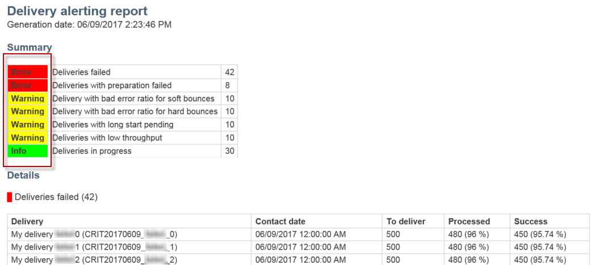
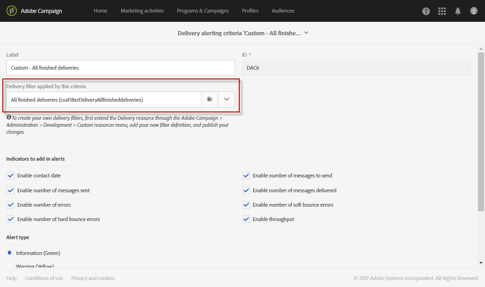

# 在失败时接收提醒{#receiving-alerts-when-failures-happen}

## 关于交付警报 {#about-delivery-alerting}

提 **交警报功能** ，是一种警报管理系统，它使一组用户能够自动接收包含有关其发送的执行信息的通知。

发送的通知默认包含基于以下条件的报告：

* 交付失败
* 准备失败的交付
* 弹跳错误率不佳的交货
* 硬弹回率不佳的交货
* 状态为“待定”的交货时间比通常长
* 低吞吐量的交付
* 正在交付

警报的接收方可以监控Adobe Campaign正在处理的提交内容，并在其执行过程中出现问题时采取相应的操作。

这些警报通知可以根据Adobe Campaign界面中通过仪表板定义的特定警报标准进行自定义。

>[!NOTE]
>
>警报通知仅通过电子邮件发送。

发送的通知包含：

* 显示 **[!UICONTROL Summary]** 满足您定义的条件的提交数量以及您为每个标准选择的标签／颜色。
* 一个 **[!UICONTROL Details]** 部分列出了为相应仪表板定义的所有交付标准以及每个标准的所有交付。

## 交付警报仪表板 {#delivery-alerting-dashboards}

### 关于交付警报仪表板 {#about-delivery-alerting-dashboards}

要管理通知的收件人，请定义警报标准并访问警报的历史记录，您需要使用仪表板。

>[!NOTE]
>
>要访问和配置仪表板和警报标准，您必须具有管理权限或显示在“交付监 **督者”安全组** 。 标准用户无法访问Adobe Campaign界面中的仪表板。 他们只能接收警报通知。 有关Adobe Campaign中用户和安全性的详细信息，请参 [阅用户类型](../../administration/using/users-management.md) 和 [关于安全组](../../administration/using/managing-groups-and-users.md#about-security-groups)。

从Adobe Campaign界面，您可以：

* 创建和管理交付警报仪表板。 请参 [阅创建交付警报仪表板](#creating-a-delivery-alerting-dashboard)。
* 为每个仪表板定义和管理交付警报标准。 例如，您可以基于准备失败的交付或仅吞吐量低的交付来构建警报。 请参 [阅关于警报标准](#about-alerting-criteria)。
* 修改每个功能板的条件参数。 请参阅 [标准参数](#criteria-parameters)。
* 为每个功能板定义一组收件人。

   例如，您希望仅向具有管理权限的用户通知失败的分发。 但是，您希望营销用户以软弹跳错误率接收有关交付的信息。 因此，您需要创建两个不同的仪表板并为每组收件人定义所需的条件。

* 访问每个功能板的所有已发送警报的历史记录。

   选择功能板时，默认情况下会显示此功能板的上次发送的警报。 所有发送的警报都列在屏幕左侧。 单击列表中的某 **[!UICONTROL History]** 个项目以访问相应的警报。

### 创建交付警报仪表板 {#creating-a-delivery-alerting-dashboard}

如果要根据特定条件向不同用户组发送通知，您需要使用多个仪表板。 要创建新功能板，请执行以下操作：

1. 转到 **[!UICONTROL Administration]** &gt; **[!UICONTROL Channels]** &gt; **[!UICONTROL Delivery alerting]**。
1. 选择 **[!UICONTROL Delivery alerting dashboards]** 并单击 **[!UICONTROL Create]**。
1. 选中该 **[!UICONTROL Enabled]** 框可激活当前功能板。

   如果禁用此选项，则不再发送链接到此功能板的通知。 此选项默认处于禁用状态。

   

1. 从下拉列表中选择要通知的收 **[!UICONTROL Alert group]** 件人组。 要修改或创建用户组，请参阅 [创建安全组和分配用户](../../administration/using/managing-groups-and-users.md#creating-a-security-group-and-assigning-users)。
1. 在部分 **[!UICONTROL Delivery alerting criteria]** 中，单击以 **[!UICONTROL Create element]** 添加条件。 请参 [阅关于警报标准](#about-alerting-criteria)。
1. 选择按 **[!UICONTROL Edit properties]** 钮。 在选项卡 **[!UICONTROL Criteria parameters]** 中，定义如何应用条件。 请参阅 [标准参数](#criteria-parameters)。
1. Click **[!UICONTROL Create]** to save the dashboard.

现在，每当分发满足您在此功能板中定义的条件时，都会向指定的用户组发送警报通知。

## 交付警报标准 {#delivery-alerting-criteria}

### 关于警报标准 {#about-alerting-criteria}

要访问交付警报标准，请转到 **[!UICONTROL Administration]** &gt; **[!UICONTROL Channels]** &gt;并 **[!UICONTROL Delivery alerting]** 选择 **[!UICONTROL Delivery alerting criteria]**。

以下标准可用于交付警报仪表板：

* **[!UICONTROL Deliveries failed]**:预定范围内的任何交货，状态错误。
* **[!UICONTROL Deliveries with preparation failed]**:在定义范围内修改的任何交付，其准备步骤（目标计算和内容生成）已失败。 有关此问题的详细信息，请参 [阅准备发送](../../sending/using/preparing-the-send.md)。
* **[!UICONTROL Delivery with bad error ratio for soft bounces]**:在定义范围内计划的任何交货(至少具有状态 **[!UICONTROL In progress]**)，软弹回错误率大于定义的百分比。
* **[!UICONTROL Delivery with bad error ratio for hard bounces]**:在定义范围内计划的任何交货(至少具有状态 **[!UICONTROL In progress]**)，其硬弹回错误率大于定义的百分比。
* **[!UICONTROL Deliveries with long start pending]**:在定义范围内计划的任何传送，其状 **[!UICONTROL Start pending]** 态长于定义的持续时间，状态 **[!UICONTROL Start pending]** 意味着系统尚未考虑这些消息。
* **[!UICONTROL Deliveries with low throughput]**:任何开始的传送时间都长于定义的持续时间，并且小于定义的已处理消息百分比，吞吐量低于定义的值。
* **[!UICONTROL Deliveries in progress]**:在定义范围内计划的任何交货，其状 **[!UICONTROL In progress]** 态为。

>[!NOTE]
>
>应用于上述标准的所有参数都具有默认值。 这些值可以在传送警报仪表 **[!UICONTROL Criteria parameters]** 板的选项卡中更改。 请参阅 [标准参数](#criteria-parameters)。

您可以从列表中选择任 **[!UICONTROL Delivery alerting criteria]** 意项目以访问其详细信息。

对于每个标准，您可以定义以下设置：

* **[!UICONTROL Indicators to add in alerts]**，表示将在通知的部分中显示与选定标 **[!UICONTROL Details]** 准对应的分发的列。

   

* **[!UICONTROL Alert type]**，表示将在通知摘要中的传送标准旁边显示的标签和颜色。

   

* **[!UICONTROL Criteria frequency]**:如果一个交付满足一个标准，则在监控期间内发送的每个通知中重复该标准。 否则，对于一个分发，每天（在第一次出现时）只会发送一个警报。

   默认情况下，此选项在所有标准中设置为每天一次。

**相关主题：**

* [发送日志](../../sending/using/monitoring-a-delivery.md#sending-logs)
* [警报频率](#alerting-frequency)
* [营销活动图标和状态](../../start/using/marketing-activities.md#marketing-activity-icons-and-statuses)

### 创建交付警报标准 {#creating-a-delivery-alerting-criterion}

您可以创建新的交付警报标准以更好地满足您的需求。

例如，您可以创建新标准，以便发送列出所有具有状态的传送的通知 **[!UICONTROL Finished]** 。

为此，您首先需要扩展 **Delivery** 资源并添加新筛选器，以便只选择具有状态的提交 **[!UICONTROL Finished]** 。

1. 转到 **Adobe Campaign** &gt; “管 **理”** &gt; “开发 **”** &gt; “自定义资源 ******[!UICONTROL Create]**&#x200B;和点击”。
1. 选 **[!UICONTROL Extend an existing resource]**&#x200B;择，从下拉 **[!UICONTROL Delivery]** 列表中选择资源，然后单击 **[!UICONTROL Create]** 以编辑它。

   

   有关扩展现有资源的详细信息，请参 [阅定义资源](../../developing/using/creating-or-extending-the-resource.md)。

1. 在资 **[!UICONTROL Delivery]** 源中，转到选项卡并 **[!UICONTROL Filter definition]** 单击以 **[!UICONTROL Add an element]** 创建过滤器。

   

1. 编辑新的过滤器定义：在窗 **[!UICONTROL Filter definition]** 口中，将项目拖放到工 **[!UICONTROL Status]** 作区中，然后选择 **[!UICONTROL Finished]** 作为筛选条件。

   

   有关创建和编辑自定义滤镜的详细信息，请参阅定 [义滤镜](../../developing/using/configuring-filter-definition.md)。

1. 保存更改并发布资源。 有关此功能的详细信息，请参 [阅发布自定义资源](../../developing/using/updating-the-database-structure.md#publishing-a-custom-resource)。

   过滤器已创建，现在可以在新的分发警报标准中选择。

1. 转到 **[!UICONTROL Administration]** &gt; **[!UICONTROL Channels]** &gt; **[!UICONTROL Delivery alerting]**，选择并 **[!UICONTROL Delivery alerting criteria]** 单击 **[!UICONTROL Create]**。
1. 在下 **[!UICONTROL Delivery filter applied by this criterion]** 拉列表中，选择您刚刚创建的筛选器。

   

   您可以按与默认标准相同的方式定义标准的设置。 请参 [阅关于警报标准](#about-alerting-criteria)。

创建后，这些标准可以添加到分发警报功能板以及其他标准。 请参阅 [关于交付警报仪表板](#about-delivery-alerting-dashboards)。

**相关主题：**

[添加或扩展资源](../../developing/using/key-steps-to-add-a-resource.md)

## 传送警报参数 {#delivery-alerting-parameters}

### 标准参数 {#criteria-parameters}

在交付 **[!UICONTROL Criteria parameters]** 警报功能板的 [选项卡中](#creating-a-delivery-alerting-dashboard)，您可以定义适用于此功能板中选定标准的设置。

* **[!UICONTROL Delivery target minimum size]**:例如，如果在此字段中输入100，则只会为目标等于或大于100个收件人的分发发送通知。 此参数适用于所有条件。
* **[!UICONTROL Monitoring period before and after the contact date (in hours)]**:当前时间前后的小时数。 只考虑具有此时间范围内的联系日期的交货。 此参数适用于所有条件。 默认情况下，此字段的值设置为24小时。

   有关联系日期的详细信息，请参 [阅关于日程安排](../../sending/using/about-scheduling-messages.md)。

* **[!UICONTROL Maximum ratio of soft bounce errors]**:系统会为所有具有大于指定值的软跳出错误率的交付发送通知。 默认情况下，此字段的值设置为0.05(5%)。

   有关软弹回错误的详细信息，请参 [阅弹回邮件资格](../../sending/using/understanding-delivery-failures.md#bounce-mail-qualification)[和交付失败类型列表](../../sending/using/understanding-delivery-failures.md#delivery-failure-types-and-reasons)。

* **[!UICONTROL Maximum ratio of hard bounce errors]**:系统会为所有具有大于指定值的硬跳出错误率的交付发送通知。 默认情况下，此字段的值设置为0.05(5%)。

   有关硬弹回错误的详细信息，请参 [阅弹回邮件资格](../../sending/using/understanding-delivery-failures.md#bounce-mail-qualification)[和交付失败类型列表](../../sending/using/understanding-delivery-failures.md#delivery-failure-types-and-reasons)。

* **[!UICONTROL Minimum time threshold for delivery in 'Start pending' status (in minutes)]**:系统会为状态长于此字段中 **[!UICONTROL Start pending]** 指定持续时间的所有发送发送发送通知，该状态 **[!UICONTROL Start pending]** 表示系统尚未考虑消息。
* **[!UICONTROL Minimum time required for the computation of the throughput (in minutes)]**:在该标准中，只 **[!UICONTROL In progress]** 考虑超过指定持续时间的开始交付（状态） **[!UICONTROL Deliveries with low throughput]** 。
* **[!UICONTROL Maximum percentage of processed messages for the computation of the throughput]**:该标准只考虑具有低于指定百分比的已处理消息百分比的发送情 **[!UICONTROL Deliveries with low throughput]** 况。
* **[!UICONTROL Minimum expected throughput (in sent messages per hour)]**:该标准只考虑吞吐量低于指定值的交 **[!UICONTROL Deliveries with low throughput]** 付。
* **[!UICONTROL Minimum processed ratio required for 'Deliveries in progress' criterion]**:只考虑已处理消息百分比高于指定百分比的发送。

### 警报频率 {#alerting-frequency}

该选 **[!UICONTROL Frequency of delivery alerting]** 项允许定义两个警报发送之间的延迟。 默认情况下，它设置为10分钟。

可以通过&gt; **[!UICONTROL Administration]** &gt;菜单更改 **[!UICONTROL Application settings]** 此 **[!UICONTROL Options]** 设置。

>[!NOTE]
>
>此选项适用于在Adobe Campaign中定义的所有仪表板。 不能为每个仪表板设置特定的频率。

## 交付警报原因 {#delivery-alerting-reasons}

“交 **付警报** ”功能可通过电子邮件和仪表板自动向所有参与的Adobe Campaign用户通知交付执行状态。

现在，当您收到发送通知时，请提供一些提示，说明您可以做什么。

首先，检查传送的“日志” **选项卡** ，以查看与传送和校样相关的所有信息。 红色和黄色图标允许您识别错误或警告。 红色图标表示阻止开始交付的严重错误。

要查看每次发送的历史记录，请选择选 **[!UICONTROL Sending logs]** 项卡。 它包含已发送消息及其状态的列表。 您可以在此处检查每个收件人( **[!UICONTROL Sent]**、 **[!UICONTROL Pending]**、 **[!UICONTROL Failed]**&#x200B;等)的传送状态。 有关此方面的详细信息，请参 [阅发送日志](../../sending/using/monitoring-a-delivery.md#sending-logs)。

以下是根据交付时满足的条件接收警报通知的几个可能原因。

* **[!UICONTROL Deliveries failed]**:此标准会通知您所有状态错误的提交。 这可能是由于：

   * 传送服务器（MTA，消息传送代理）的问题
   * Adobe Campaign交付服务器与接收服务器之间的连接超时
   * 可交付性问题
   * 错误的工作流
   如果使用工作流触发交付，请检查该工作流是否正确启动。 有关此功能的详细信息，请参 [阅执行工作流](../../automating/using/executing-a-workflow.md)。 否则，请与Adobe Campaign管理员联系以解决此问题。

* **[!UICONTROL Deliveries with preparation failed]**:在以下情况下，交付准备过程中可能会发生错误：

   * 送货缺少一个主题。
   * 个性化字段中的语法错误。
   * 目标缺失。
   * 交付超出大小限制。
   有关此问题的详细信息，请参 [阅准备发送](../../sending/using/preparing-the-send.md)。 但是，这些错误通常会在消息分析过程中发现。 请参阅 [控制规则](../../administration/using/control-rules.md)。

* 发出警报的可 **[!UICONTROL Delivery with bad error ratio for soft bounces]** 能原因包括：

   * 收件人的服务器关闭。
   * 收件人的邮箱已满。
   有关详细信息，请查 **[!UICONTROL Exclusion logs]** 看交 **[!UICONTROL Exclusion causes]** 付日志的选项卡和选项卡。 请参阅 [排除日志](../../sending/using/monitoring-a-delivery.md#exclusion-logs)。

   发出警报的可 **[!UICONTROL Delivery with bad error ratio for hard bounces]** 能原因包括：

   * 收件人已被列入黑名单，这意味着他们不再希望与他们联系。
   * 收件人的电子邮件地址不存在。
   * 收件人的域不存在。
   * 接收方的服务器正在阻止交付。
   要避免软弹回和硬弹回错误，请遵循以下最佳实践：

   * 构建过滤排版规则以在传送分析过程中排除邮件目标的一部分，如隔离的收件人。 请参 [阅创建筛选规则](../../administration/using/filtering-rules.md)。
   * 定期更新客户数据库，以保持良好的隔离管理流程。 请参 [阅关于检疫](../../sending/using/understanding-quarantine-management.md#about-quarantines)。
   * 一般而言，尽可能提高可交付性。 请参阅Adobe Campaign可交付 [性详细文档](../../sending/using/about-deliverability.md) ，并与您的Adobe Campaign管理员联系以获得帮助。

* **[!UICONTROL Deliveries with long start pending]**:通常，这意味着在MTA（消息传输代理）级别存在问题。 执行过程正在等待某些资源的可用性。 MTA可能尚未启动。

   **[!UICONTROL Deliveries with low throughput]**:同样，这是一个可交付性问题，这意味着MTA太慢。

   有关这些问题的更多信息，请与Adobe Campaign管理员联系。

**相关主题：**

* [了解投放失败](../../sending/using/understanding-delivery-failures.md)
* [了解隔离管理](../../sending/using/understanding-quarantine-management.md)
* [管理Campaign中的黑名单](../../audiences/using/about-opt-in-and-opt-out-in-campaign.md)

