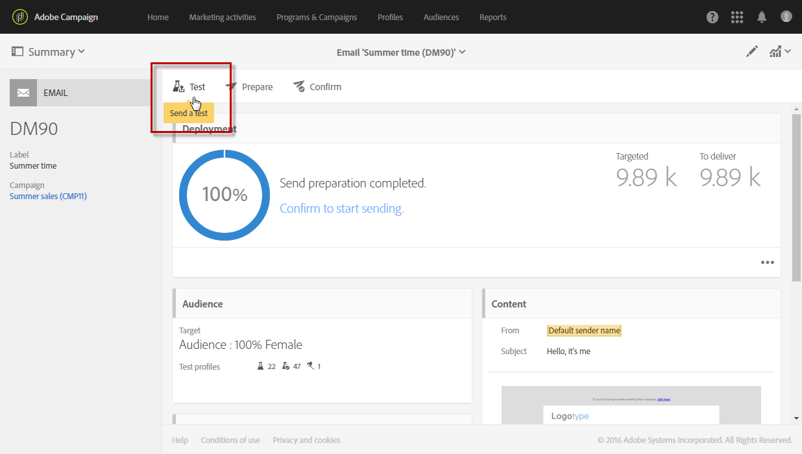

# 发送校样 {#sending-proofs}

## 关于校样 {#about-proofs}

利用校样这种特定的消息，可在将消息发送到主目标之前对消息进行测试。校样的收件人负责审阅消息（的内容和形式）。

有两种校样收件人:

* 利用&#x200B;**测试用户档案**&#x200B;可定向不符合所规定定向标准的其他收件人。

  可以将校样收件人添加到消息的受众，以检测收件人数据库是否用于任何欺诈行为，或确保电子邮件送达收件箱中。有关更多信息，请参阅[管理测试用户档案](../../audiences/using/managing-test-profiles.md)。

  >[!NOTE]
  >
  >要发送校样，消息的受众中必须包含测试用户档案。

* 利用&#x200B;**替换用户档案**，可将您自己置于某一个定向用户档案的位置，并获得该用户档案将会收到的精确消息。有关更多信息，请参阅[使用定向用户档案测试电子邮件消息](../../sending/using/testing-messages-using-target.md)。

  >[!NOTE]
  >
  >此功能仅适用于电子邮件渠道。

## 发送校样 {#sending-a-proof}

要发送校样，请执行以下步骤：

1. 确保已配置校样收件人:
   * 消息的受众中必须包含&#x200B;**测试用户档案**。
   * 一旦成功地准备了消息，必须添加&#x200B;**替换用户档案**（请参阅[此章节](../../sending/using/testing-messages-using-target.md)）。

1. 单击 **[!UICONTROL Send a test]** 按钮。

   

1. 选择要使用的校样类型：

   * **[!UICONTROL Email rendering]**：选择此选项可根据定向的收件箱测试接收消息的方式。有关更多信息，请参见[电子邮件渲染](../../sending/using/email-rendering.md)。
   * **[!UICONTROL Proof]**：选择此选项，可在将消息发送到主目标之前对消息进行测试。校样收件人负责审阅投放，检查投放的内容和格式。
   * **[!UICONTROL Proof + Email rendering]**：此选项是前两个选项的组合。

   

   >[!NOTE]
   >
   >电子邮件渲染仅适用于测试用户档案。如果尚未向消息添加测试用户档案，则只提供 **[!UICONTROL Proof]** 选项供您选择。

1. 确认您的选择。

   校样会发送给已配置的收件人。

   

1. 您可以使用 **[!UICONTROL Proofs]** 下拉列表查看校样。

   

1. 选择校样以访问其摘要。对于电子邮件，如果您已选择了 **Email rendering** 选项作为校样类型，则验证标签的右侧将显示 **[!UICONTROL Access email rendering]** 图标。请参阅[电子邮件渲染](../../sending/using/email-rendering.md)。

   

根据校样收件人的评论，可能会要求您修改投放的内容。进行修改后，您必须重新开始准备电子邮件，然后重新发送校样。可使用 **[!UICONTROL Show proofs]** 按钮访问每个新校样。

您必须发送所需数量的校样，直到完成投放的内容为止。完成此操作后，您可以将投放发送到主目标并结束审阅循环。

## 配置校样的主题行 {#configuring-proofs-subject-line}

发送校样时，其主题行默认配置了&#x200B;**“Proof”**&#x200B;前缀，以及指示校样编号的计数。

要更改使用的默认主题行，请执行以下步骤：

1. 在消息仪表板中，单击 **[!UICONTROL Open properties]** 按钮。
1. 在 **[!UICONTROL Advanced parameters]** 部分中，定义想要用在主题行中的默认前缀。

要在主题行中隐藏校样的编号，请激活 **[!UICONTROL Hide proof prefix counter]** 选项。

>[!NOTE]
>
>如果要隐藏整个校样前缀，请将 **[!UICONTROL Subject line prefix]** 字段留空。

1. 单击 **[!UICONTROL Confirm]**。这些设置将默认应用于为选定消息发送的所有校样。

**相关主题：**

* [发送测试、准备和发送电子邮件](../../sending/using/get-started-sending-messages.md#video)视频
* [使用目标用户档案测试电子邮件](../../sending/using/testing-messages-using-target.md)
* [管理测试用户档案](../../audiences/using/managing-test-profiles.md)
* [预览消息](../../sending/using/previewing-messages.md)
* [配置电子邮件渠道](../../administration/using/configuring-email-channel.md)
