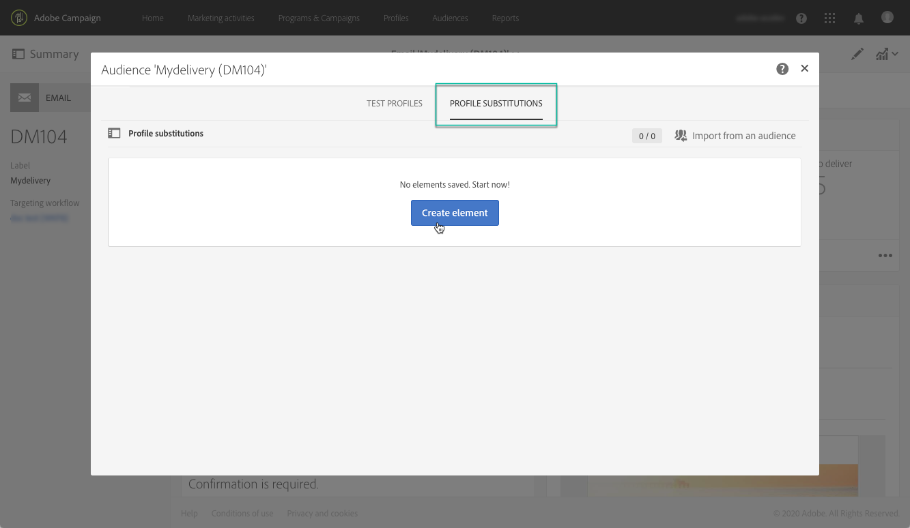
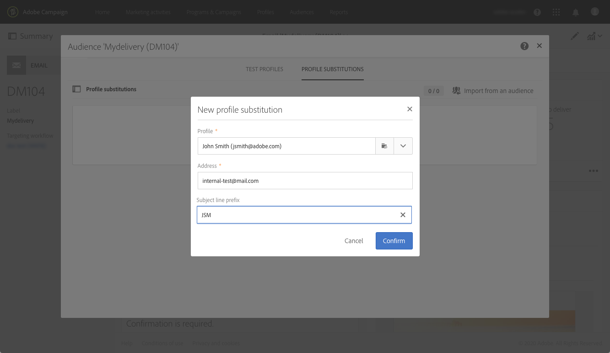
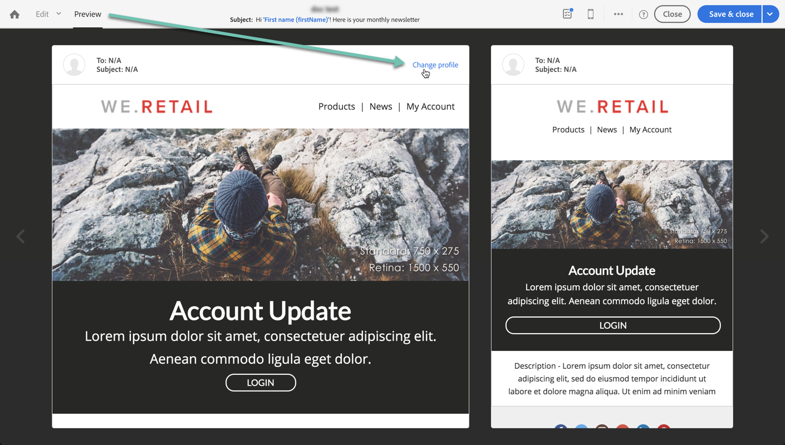

# 使用目标用户档案测试电子邮件 {#testing-message-profiles}

## 概述 {#overview}

此外， [测试用户档案](../../audiences/using/managing-test-profiles.md)，通过将您自己置于某一个定向用户档案的位置，可以测试电子邮件。 利用此功能，可获取用户档案将收到之消息（自定义字段、动态和个性化信息，包括来自工作流的附加数据……）的精确表示形式。

>[!IMPORTANT]
>
>此功能允许您向外部电子邮件地址发送用户档案个人信息。请记住，在 Campaign Standard 中执行隐私请求（GDPR 和 CCPA）不会在外部执行该请求。

主要步骤如下：

1. 配置消息，然后启动 **准备** 阶段。
1. **选择一个或多个配置文件** 消息定向的用户档案中。
1. 与每个用户档案a关联 **替换地址** 将向其发送校样。
1. （可选）对于每个用户档案，定义 **前缀** 添加到验证主题行。
1. **预览** 在Email Designer中，消息为用户档案的显示方式。
1. 发送校样。

   >[!IMPORTANT]
   >
   >验证处理方式 [!DNL Campaign Standard] 作为标准投放。 因此，使用用户档案替换发送校样将向所选用户档案的投放和跟踪日志添加记录。

 [在视频中发现此功能](#video)

## 选择用户档案和替换地址 {#selecting-profiles}

要使用目标用户档案进行测试，必须先选择它们，然后定义将接收校样的替换地址。 要执行此操作，您可以 [选择特定配置文件](#selecting-individual-profiles) 在目标用户档案中，或者 [从现有受众导入用户档案](#importing-from-audience).

>[!NOTE]
>
>您最多可以选择100个配置文件进行测试。

### 选择单个配置文件 {#selecting-individual-profiles}

1. 在消息仪表板中，确保消息准备成功，然后单击 **[!UICONTROL Audience]** 封锁。

   

1. 在 **[!UICONTROL Profile substitutions]** 选项卡，单击 **[!UICONTROL Create element]** 按钮以选择要用于测试的用户档案。

   

1. 单击用户档案选择按钮以显示消息定向的用户档案列表。

   

1. 选择要用于测试的配置文件，然后在 **[!UICONTROL Address]** 填写所需的替换地址，然后单击 **[!UICONTROL Confirm]**. 定向用户档案的所有校样都将发送到此电子邮件地址，而不是发送到数据库中为此用户档案定义的电子邮件地址。

   如果要为校样的主题行添加特定前缀，请填写 **[!UICONTROL Subject line prefix]** 字段。

   >[!NOTE]
   >
   >主题行前缀最多可包含500个字符。

   

   前缀将显示如下：

   

1. 用户档案将添加到列表中，并带有其关联的替换地址和前缀。 对要用于测试的所有配置文件重复上述步骤，然后单击 **[!UICONTROL Confirm]**.

   

   如果要向同一配置文件的多个替代地址发送验证，则必须根据需要多次添加此配置文件。

   在下面的示例中，基于用户档案John Smith的验证将发送到两个不同的替换地址：

   

1. 定义所有用户档案和替换地址后，您可以发送校样以测试消息。 要执行此操作，请单击 **[!UICONTROL Test]** 按钮，然后选择要执行的测试类型。

   请注意，如果未将测试用户档案添加到消息目标， **[!UICONTROL Email rendering]** 和 **[!UICONTROL Proof + Email rendering]** 选项不可用。  有关发送校样的更多信息，请参阅 [本节](../../sending/using/sending-proofs.md).

   

>[!IMPORTANT]
>
>如果对消息进行了任何更改，请确保再次启动消息准备。 否则，更改将不会反映在验证中。

### 从受众导入用户档案 {#importing-from-audience}

Campaign Standard允许您导入可用于测试的用户档案受众。 例如，这可让您将针对不同用户档案的整组消息发送到唯一的电子邮件地址。

此外，如果您的受众已配置了地址列和前缀列，您将能够在以下位置导入这些信息： **[!UICONTROL Profile substitutions]** 选项卡。 有关使用替换地址导入受众的详情，请参阅 [本节](#use-case).

>[!NOTE]
>
>导入受众时，只会选择与消息目标对应的用户档案并将其添加到 **[!UICONTROL Profile substitutions]** 选项卡。

要导入用户档案以用于从受众进行测试，请执行以下步骤：

1. 在消息仪表板中，确保消息准备成功，然后单击 **[!UICONTROL Audience]** 封锁。

   

1. 在 **[!UICONTROL Profile substitutions]** 选项卡中，单击 **[!UICONTROL Import from an audience]**。

   

1. 选择要使用的受众，然后输入用于发送给受众的验证的替换地址和前缀。

   >[!NOTE]
   >
   >主题行前缀最多可包含500个字符。

   

   如果受众中已定义要使用的替换地址和/或前缀，请选择 **[!UICONTROL From Audience]** 选项，然后指定用于检索这些信息的列。

   

1. 单击 **[!UICONTROL Import]** 按钮。与消息目标对应的受众用户档案将添加到 **[!UICONTROL Profile substitution]** 制表符以及关联的替换地址和前缀。

>[!NOTE]
>
>如果再次导入相同的受众，并且使用不同的替换地址和/或前缀，则除了上次导入的受众之外，还会将用户档案添加到列表中。

## 使用定向的用户档案预览消息

>[!NOTE]
>
>预览仅在Email Designer中可用。

要能够使用定向的用户档案预览消息，请确保已将这些用户档案添加到 **[!UICONTROL Profile substitution]** 列表(请参阅 [定义用户档案和替换地址](#selecting-profiles))。

如果要在消息中使用个性化字段，则必须添加这些字段 **早于** 启动消息准备。 否则，在预览中不会考虑这些量度。 因此，如果对个性化字段进行了任何更改，请确保再次启动消息准备。

要使用用户档案替换预览消息，请执行以下步骤：

1. 在消息仪表板中，单击内容快照以在Email Designer中打开消息。

   

1. 选择 **[!UICONTROL Preview]** 选项卡，然后单击 **[!UICONTROL Change profile]**.

   

1. 单击 **[!UICONTROL Profile Substitution]** 选项卡，显示已添加以供测试的替换用户档案。

   选择要用于预览的配置文件，然后单击 **[!UICONTROL Select]**.

   

1. 此时将显示消息预览。 使用箭头在选定的配置文件之间导航。

   

## 用例 {#use-case}

在本使用案例中，我们希望向一组特定用户档案发送个性化电子邮件新闻稿。 在发送新闻稿之前，我们希望使用一些定向的用户档案预览新闻稿，并将校样发送到外部文件中定义的内部电子邮件地址。

此用例的主要步骤如下：

1. 创建受众以用于测试。
1. 构建工作流以定向用户档案并发送新闻稿。
1. 配置消息的用户档案替换。
1. 使用定向的用户档案预览消息。
1. 发送校样。

### 步骤1：创建用于测试的受众

1. 准备要导入的文件以创建受众。 在我们的用例中，它应包含用于验证的替换地址以及添加到验证主题行中的前缀。

   在此示例中，“oliver.vaughan@internal.com”电子邮件地址将收到针对具有“john.doe@mail.com”电子邮件地址的用户档案的消息的证明。 “JD”前缀将添加到验证的主题行中。

   

1. 构建工作流以从文件创建受众。 为此，请添加并配置以下活动：

   * **[!UICONTROL Load file]** 活动：导入CSV文件(有关此活动的更多信息，请参阅 [本节](../../automating/using/load-file.md))。
   * **[!UICONTROL Reconciliation]** 活动：将文件中的信息链接到数据库中的信息。 在此示例中，使用用户档案的电子邮件地址作为协调字段(有关此活动的更多信息，请参阅 [本节](../../automating/using/reconciliation.md))。
   * **[!UICONTROL Save audience]** 活动：根据导入的文件创建受众(有关此活动的更多信息，请参阅 [本节](../../automating/using/save-audience.md))。

   

1. 运行工作流，然后转到 **[!UICONTROL Audiences]** 选项卡，以检查是否已使用所需信息创建受众。

   在此示例中，受众由三个用户档案组成。 每个模板都链接到将接收验证的替换电子邮件地址，前缀为用于验证的主题行。

   

### 第2步：构建工作流以定向用户档案并发送新闻稿

1. 添加 **[!UICONTROL Query]** 和 **[!UICONTROL Email delivery]** 活动，然后根据需要进行配置(请参阅 [查询](../../automating/using/query.md) 和 [电子邮件投放](../../automating/using/email-delivery.md) 部分)。

   

1. 运行工作流并确保消息准备成功。

### 步骤3：配置消息的“配置文件替换”选项卡

1. 打开 **[!UICONTROL Email delivery]** 活动。 在消息仪表板中，单击 **[!UICONTROL Audience]** 封锁。

   

1. 选择 **[!UICONTROL Profile substitutions]** 选项卡，然后单击 **[!UICONTROL Import from an audience]**.

   

1. 在 **[!UICONTROL Audience]**  字段中，选择从文件创建的受众。

   

1. 定义发送校样时要使用的替换地址和主题行前缀。

   要执行此操作，请选择 **[!UICONTROL From audience]** 选项，然后从受众中选择包含该信息的列。

   

1. 单击 **[!UICONTROL Import]** 按钮。受众中的用户档案及其关联的替换地址和主题行前缀将添加到列表中。

   

   >[!NOTE]
   >
   >在本例中，受众的所有用户档案均被 **[!UICONTROL Query]** 活动。 如果这些用户档案之一不是消息目标的一部分，则不会将其添加到列表中。

### 步骤4：使用定向的用户档案预览消息

1. 在消息仪表板中，单击内容快照以在Email Designer中打开消息。

   

1. 选择 **[!UICONTROL Preview]** 选项卡，然后单击 **[!UICONTROL Change profile]**.

   

1. 单击 **[!UICONTROL Profile Substitution]** 选项卡，显示之前添加的替换用户档案。

   选择要用于预览的配置文件，然后单击 **[!UICONTROL Select]**.

   

1. 此时将显示消息预览。 使用箭头在选定的配置文件之间导航。

   

### 步骤5：发送验证

1. 在消息仪表板中，单击 **[!UICONTROL Test]** 按钮，然后确认。

   

1. 校样将根据中配置的内容发送 **[!UICONTROL Profile substitutions]** 选项卡。

   

## 教程视频 {#video}

本视频说明如何使用用户档案替换测试电子邮件。

>[!VIDEO](https://video.tv.adobe.com/v/32368?quality=12)

提供了其他Campaign Standard操作方法视频 [此处](https://experienceleague.adobe.com/docs/campaign-standard-learn/tutorials/overview.html?lang=zh-Hans).
