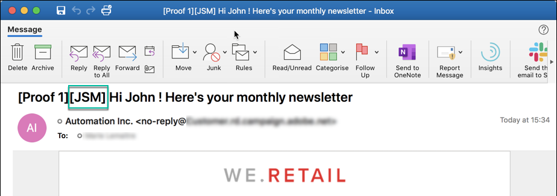
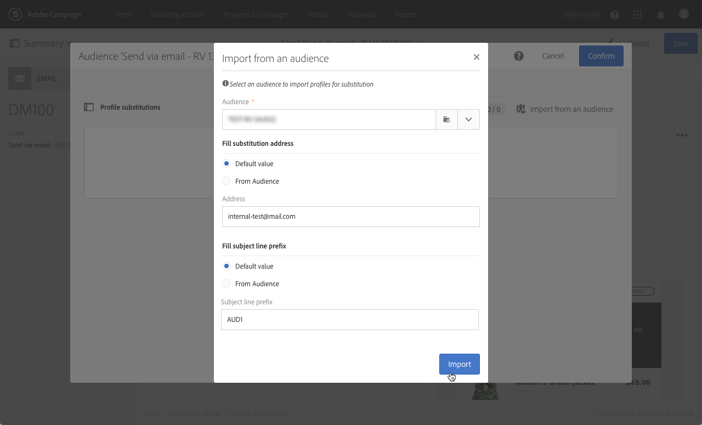
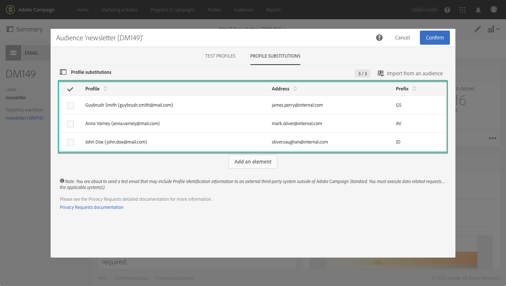

# 使用目标用户档案测试电子邮件 {#testing-message-profiles}

## 概述 {#overview}

除了[测试用户档案](../../audiences/using/managing-test-profiles.md)之外，您还可以通过将自己置于目标用户档案之一的位置来测试电子邮件。 这样，您就可以准确地了解用户档案将收到的消息(自定义字段、动态和个性化信息，包括来自工作流的其他数据……)。

>[!NOTE]
>
> 此功能仅对电子邮件提供。

主要步骤如下：

1. 配置消息，然后启动&#x200B;**准备**&#x200B;阶段。
1. **在消息所针对的** 用户档案中选择一个或多个配置文件。
1. 将&#x200B;**用户档案地址**&#x200B;关联到每个验证。
1. （可选）对于每个用户档案，定义要添加到验证主题行的&#x200B;**前缀**。
1. **预** 览电子邮件设计器如何为用户档案显示消息。
1. 发送验证。

>[!IMPORTANT]
>
>此功能允许您向外部电子邮件地址发送用户档案个人信息。请记住，在 Campaign Standard 中执行隐私请求（GDPR 和 CCPA）不会在外部执行该请求。

 [在视频中发现此功能](#video)

## 选择用户档案和替换地址{#selecting-profiles}

要使用目标用户档案进行测试，您必须首先选择这些验证，然后定义将接收这些数据的替换地址。 为此，您可以在目标用户档案中选择[特定用户档案](#selecting-individual-profiles)，或从现有受众](#importing-from-audience)导入用户档案。[

>[!NOTE]
>
>最多可以选择100个用户档案进行测试。

### 选择单个用户档案{#selecting-individual-profiles}

1. 在消息仪表板中，确保消息准备成功，然后单击&#x200B;**[!UICONTROL Audience]**&#x200B;块。

   

1. 在&#x200B;**[!UICONTROL Profile substitutions]**&#x200B;选项卡中，单击&#x200B;**[!UICONTROL Create element]**&#x200B;按钮以选择要用于测试的用户档案。

   

1. 单击用户档案选择按钮可显示消息所针对的用户档案的列表。

   

1. 选择要用于测试的用户档案，然后在&#x200B;**[!UICONTROL Address]**&#x200B;字段中输入所需的替代地址，然后单击&#x200B;**[!UICONTROL Confirm]**。 所有针对用户档案的验证都将发送到此电子邮件地址，而不是此用户档案在数据库中定义的地址。

   如果要向验证主题行添加特定前缀，请填写&#x200B;**[!UICONTROL Subject line prefix]**&#x200B;字段。

   >[!NOTE]
   >
   >主题行前缀最多可包含500个字符。

   

   前缀将显示如下：

   

1. 用户档案将添加到列表中，并带有其关联的替换地址和前缀。 对要用于测试的所有用户档案重复上述步骤，然后单击&#x200B;**[!UICONTROL Confirm]**。

   

   如果要向同一验证的多个替换地址发送用户档案，则必须根据需要多次添加此用户档案。

   在以下示例中，将基于用户档案John Smith的验证发送到两个不同的替代地址：

   

1. 定义所有用户档案和替换地址后，您可以发送验证来测试消息。 要执行此操作，请单击&#x200B;**[!UICONTROL Test]**&#x200B;按钮，然后选择要执行的测试类型。

   请注意，如果未将测试用户档案添加到消息目标，则&#x200B;**[!UICONTROL Email rendering]**&#x200B;和&#x200B;**[!UICONTROL Proof + Email rendering]**&#x200B;选项不可用。  有关验证发送的详细信息，请参阅[本节](../../sending/using/sending-proofs.md)。

   

>[!IMPORTANT]
>
>如果您对消息做了任何更改，请确保再次启动消息准备。 否则，更改不会反映在验证中。

### 从受众{#importing-from-audience}导入用户档案

Campaign Standard允许您导入可用于测试的受众用户档案。 例如，这允许您向唯一的电子邮件地址发送针对不同用户档案的整组邮件。

此外，如果受众已配置了地址列和前缀列，您将能够在&#x200B;**[!UICONTROL Profile substitutions]**&#x200B;选项卡中导入这些信息。 [本节](#use-case)中详细介绍了使用替代地址导入受众的示例。

>[!NOTE]
>
>导入受众时，只选择与消息目标对应的用户档案并将其添加到&#x200B;**[!UICONTROL Profile substitutions]**&#x200B;选项卡。

要导入用户档案以用于从受众进行测试，请执行以下步骤：

1. 在消息仪表板中，确保消息准备成功，然后单击&#x200B;**[!UICONTROL Audience]**&#x200B;块。

   

1. 在 **[!UICONTROL Profile substitutions]** 选项卡中，单击 **[!UICONTROL Import from an audience]**。

   

1. 选择要使用的受众，然后输入要用于发送到受众的验证的替代地址和前缀。

   >[!NOTE]
   >
   >主题行前缀最多可包含500个字符。

   

   如果您的受众中已定义要使用的替换地址和/或前缀，请选择&#x200B;**[!UICONTROL From Audience]**&#x200B;选项，然后指定用于检索这些信息的列。

   

1. 单击 **[!UICONTROL Import]** 按钮。来自与消息目标对应的用户档案的受众被添加到&#x200B;**[!UICONTROL Profile substitution]**&#x200B;标签，以及相关的替换地址和前缀。

>[!NOTE]
>
>如果您再次导入同一受众，且替换地址和/或前缀不同，则除了上次导入的用户档案之外，这些还将添加到列表。

## 使用目标用户档案预览消息

>[!NOTE]
>
>预览仅在电子邮件设计器中提供。

要能够使用目标用户档案预览消息，请确保已将这些用户档案添加到&#x200B;**[!UICONTROL Profile substitution]**&#x200B;列表(请参阅[定义用户档案和替换地址](#selecting-profiles))。

如果要在消息中使用个性化字段，则必须在&#x200B;**启动消息准备之前添加这些字符。**&#x200B;否则，在预览中不会考虑这些因素。 因此，如果对个性化字段做了任何更改，请确保再次启动消息准备。

要使用预览替换用户档案消息，请执行以下步骤：

1. 在邮件仪表板中，单击内容快照以在电子邮件设计器中打开邮件。

   

1. 选择&#x200B;**[!UICONTROL Preview]**&#x200B;选项卡，然后单击&#x200B;**[!UICONTROL Change profile]**。

   

1. 单击&#x200B;**[!UICONTROL Profile Substitution]**&#x200B;选项卡以显示已添加用于测试的替换用户档案。

   选择要用于预览的用户档案，然后单击&#x200B;**[!UICONTROL Select]**。

   

1. 此时将显示消息的预览。 使用箭头在选定用户档案之间导航。

   

## 用例 {#use-case}

在此用例中，我们希望向一组特定用户档案发送个性化的电子邮件新闻快讯。 在发送新闻稿之前，我们希望使用某些目标用户档案预览新闻稿，并将验证发送到外部文件中定义的内部电子邮件地址。

此用例的主要步骤如下：

1. 创建用于测试的受众。
1. 构建工作流以目标用户档案并发送新闻稿。
1. 配置消息的用户档案替换。
1. 使用目标用户档案预览消息。
1. 发送校样。

### 第1步：创建用于测试的受众

1. 准备要导入的文件以创建受众。 在我们的情况下，它应包含用于验证的替代地址和添加到验证主题行中的前缀。

   在此示例中，“oliver.vaughan@internal.com”电子邮件地址将收到一条验证，其中显示以“john.doe@mail.com”电子邮件地址为目标的邮件。 “JD”前缀将添加到验证的主题行。

   

1. 构建工作流以从文件创建受众。 为此，请添加并配置以下活动:

   * **[!UICONTROL Load file]** 活动:导入CSV文件(有关此活动的详细信息，请参 [阅此部分](../../automating/using/load-file.md))。
   * **[!UICONTROL Reconciliation]** 活动:将文件中的信息链接到数据库中的信息。在此示例中，我们将使用用户档案的电子邮件地址作为协调字段(有关此活动的详细信息，请参阅[此部分](../../automating/using/reconciliation.md))。
   * **[!UICONTROL Save audience]** 活动:根据导入的文件创建受众(有关此活动的详细信息，请参 [阅此部分](../../automating/using/save-audience.md))。

   

1. 运行工作流，然后转到&#x200B;**[!UICONTROL Audiences]**&#x200B;选项卡，检查是否已使用所需信息创建受众。

   在此示例中，受众由三个用户档案组成。 每个链接都链接到一个将接收验证的替代电子邮件地址，并在验证的主题行中使用前缀。

   

### 第2步：构建工作流以目标用户档案并发送新闻稿

1. 添加&#x200B;**[!UICONTROL Query]**&#x200B;和&#x200B;**[!UICONTROL Email delivery]**&#x200B;活动，然后根据您的需要配置它们(请参阅[查询](../../automating/using/query.md)和[电子邮件投放](../../automating/using/email-delivery.md)部分)。

   

1. 运行工作流，并确保消息准备成功。

### 第3步：配置消息的用户档案替换选项卡

1. 打开&#x200B;**[!UICONTROL Email delivery]**&#x200B;活动。 在消息仪表板中，单击&#x200B;**[!UICONTROL Audience]**&#x200B;块。

   

1. 选择&#x200B;**[!UICONTROL Profile substitutions]**&#x200B;选项卡，然后单击&#x200B;**[!UICONTROL Import from an audience]**。

   

1. 在&#x200B;**[!UICONTROL Audience]**&#x200B;字段中，选择从文件创建的受众。

   

1. 定义在发送验证时要使用的替代地址和主题行前缀。

   为此，请选择&#x200B;**[!UICONTROL From audience]**&#x200B;选项，然后从包含该信息的受众中选择列。

   

1. 单击 **[!UICONTROL Import]** 按钮。来自受众的用户档案将添加到列表，并具有其关联的替代地址和主题行前缀。

   

   >[!NOTE]
   >
   >在我们的情况下，来自受众的所有用户档案都由&#x200B;**[!UICONTROL Query]**&#x200B;活动定位。 如果这些用户档案中的某个不是消息目标的一部分，则不会将其添加到列表。

### 第4步：使用目标预览用户档案

1. 在邮件仪表板中，单击内容快照以在电子邮件设计器中打开邮件。

   

1. 选择&#x200B;**[!UICONTROL Preview]**&#x200B;选项卡，然后单击&#x200B;**[!UICONTROL Change profile]**。

   

1. 单击&#x200B;**[!UICONTROL Profile Substitution]**&#x200B;选项卡以显示之前添加的替换用户档案。

   选择要用于预览的用户档案，然后单击&#x200B;**[!UICONTROL Select]**。

   

1. 此时将显示消息的预览。 使用箭头在选定用户档案之间导航。

   

### 第5步：发送验证

1. 在消息仪表板中，单击&#x200B;**[!UICONTROL Test]**&#x200B;按钮，然后确认。

   

1. 验证根据在&#x200B;**[!UICONTROL Profile substitutions]**&#x200B;选项卡中配置的内容发送。

   

## 教程视频{#video}

此视频显示了如何使用用户档案替换测试电子邮件。

>[!VIDEO](https://video.tv.adobe.com/v/32368?quality=12)

其他Campaign Standard操作视频[此处](https://experienceleague.adobe.com/docs/campaign-standard-learn/tutorials/overview.html?lang=zh-Hans)可用。
