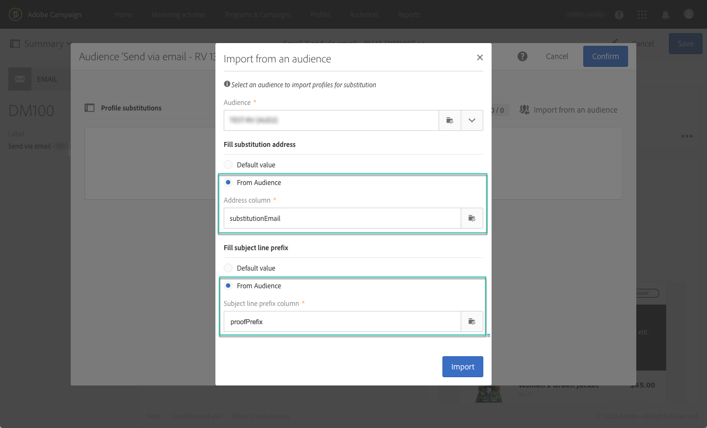
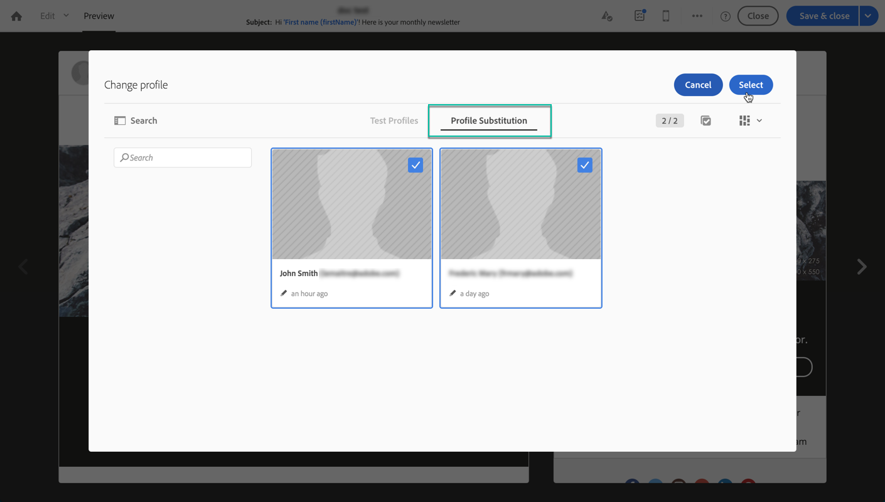

# 使用目标配置文件测试电子邮件 {#testing-message-profiles}

## 概述 {#overview}

除了测 [试配置文件](../../audiences/using/managing-test-profiles.md)，您还可以通过将自己置于某个目标配置文件的位置来测试电子邮件。 这样，您就可以获得配置文件将收到的消息的精确表示形式（自定义字段、动态和个性化信息，包括工作流中的其他数据……）。

>[!NOTE]
>
> 此功能仅对电子邮件提供。

主要步骤如下：

1. 配置消息，然后启动准 **备阶段** 。
1. **在消息所定位的配置文件中** ，选择一个或多个配置文件。
1. 将校样发送到的替 **换地址** ，与每个配置文件相关联。
1. （可选）对于每个配置文件，定义 **要添加到** “证明主题行”的前缀。
1. **在** “电子邮件设计器”中预览配置文件的消息显示方式。
1. 发送校样。

>[!IMPORTANT]
>
>此功能允许您向外部电子邮件地址发送个人资料信息。 请记住，在Campaign Standard中执行隐私请求（GDPR和CCPA）不会在外部执行该请求。

## 选择配置文件和替换地址 {#selecting-profiles}

要使用目标配置文件进行测试，您必须先选择它们，然后定义接收校样的替换地址。 为此，您可以在目标配置 [文件中选择特定配置文件](#selecting-individual-profiles) ，或从现 [有受众导入配置文件](#importing-from-audience)。

>[!NOTE]
>
>您最多可以选择100个配置文件进行测试。

### 选择单个配置文件 {#selecting-individual-profiles}

1. 在消息功能板中，确保消息准备成功，然后单击 **[!UICONTROL Audience]** 块。

   

1. 在选项 **[!UICONTROL Profile substitutions]** 卡中，单击按 **[!UICONTROL Create element]** 钮以选择要用于测试的配置文件。

   

1. 单击配置文件选择按钮以显示消息所针对的配置文件列表。

   

1. 选择要用于测试的配置文件，然后在字段中输 **[!UICONTROL Address]** 入所需的替代地址，然后单击 **[!UICONTROL Confirm]**。 所有以配置文件为目标的校样都将发送到此电子邮件地址，而不是发送到此配置文件在数据库中定义的校样。

   如果要在校样的主题行中添加特定前缀，请填写该字 **[!UICONTROL Subject line prefix]** 段。

   

   前缀将显示如下：

   

1. 配置文件会添加到列表中，并带有其关联的替换地址和前缀。 对要用于测试的所有配置文件重复上述步骤，然后单击 **[!UICONTROL Confirm]**。

   

   如果要向同一配置文件的多个替换地址发送证明，则必须根据需要多次添加此配置文件。

   在以下示例中，将基于John Smith个人资料的证明发送到两个不同的替代地址：

   

1. 定义所有配置文件和替代地址后，您可以发送证明来测试消息。 为此，请单击按 **[!UICONTROL Test]** 钮，然后选择要执行的测试类型。

   请注意，如果尚未将测试配置文件添加到消息目标，则 **[!UICONTROL Email rendering]** 和 **[!UICONTROL Proof + Email rendering]** 选项将不可用。  For more information on proofs sending, refer to [this section](../../sending/using/sending-proofs.md).

   

>[!IMPORTANT]
>
>如果对消息进行了任何更改，请确保再次启动消息准备。 否则，更改不会反映在证明中。

### 从受众导入档案 {#importing-from-audience}

Campaign Standard允许您导入可用于测试的档案受众。 例如，这允许您向唯一的电子邮件地址发送针对不同配置文件的整组消息。

此外，如果您的受众已配置了地址和前缀列，您将能够在选项卡中导入这些信 **[!UICONTROL Profile substitutions]** 息。 本节详细介绍了带替代地址的受众导入 [示例](#use-case)。

>[!NOTE]
>
>导入受众时，只会选择与消息目标对应的配置文件并将其添加到选 **[!UICONTROL Profile substitutions]** 项卡。

要导入配置文件以用于从受众进行测试，请执行以下步骤：

1. 在消息功能板中，确保消息准备成功，然后单击该 **[!UICONTROL Audience]** 块。

   

1. 在选项卡 **[!UICONTROL Profile substitutions]** 中，单击 **[!UICONTROL Import from an audience]**。

   

1. 选择要使用的受众，然后输入替代地址和前缀以用于发送给受众的校样。

   

   如果要使用的替换地址和／或前缀已在您的受众中定义，请选择该选 **[!UICONTROL From Audience]** 项，然后指定用于检索这些信息的列。

   

1. Click the **[!UICONTROL Import]** button. 来自与消息目标相对应的受众的配置文件被添加到选 **[!UICONTROL Profile substitution]** 项卡，以及关联的替换地址和前缀。

>[!NOTE]
>
>如果您再次导入具有相同的受众，并且替代地址和／或前缀不同，则除了上次导入的受众之外，配置文件还将添加到列表中。

    

## 使用目标配置文件预览消息

>[!NOTE]
>
>预览功能仅适用于电子邮件设计器。

要能够使用目标配置文件预览消息，请确保已将这些配置文件添加到列表中(请参 **[!UICONTROL Profile substitution]** 阅定义 [配置文件和替代地址](#selecting-profiles))。

如果要在消息中使用个性化字段，则必须在启动消息准备之 **前添加** 这些字段。 否则，预览中不会考虑这些参数。 因此，如果对个性化字段进行了任何更改，请确保再次启动消息准备。

要使用配置文件替换预览消息，请执行以下步骤：

1. 在消息功能板中，单击内容快照以在电子邮件设计器中打开消息。

   

1. 选择选 **[!UICONTROL Preview]** 项卡，然后单击 **[!UICONTROL Change profile]**。

   

1. 单击选 **[!UICONTROL Profile Substitution]** 项卡以显示已添加用于测试的替换配置文件。

   选择要用于预览的配置文件，然后单击 **[!UICONTROL Select]**。

   

1. 此时将显示消息的预览。 使用箭头在选定的配置文件之间导航。

   

## 用例 {#use-case}

在此用例中，我们希望向一组特定配置文件发送个性化的电子邮件新闻稿。 在发送新闻稿之前，我们希望使用一些目标配置文件预览新闻稿，并将校样发送到外部文件中定义的内部电子邮件地址。

此用例的主要步骤如下：

1. 创建用于测试的受众。
1. 构建一个工作流以定位配置文件和发送新闻稿。
1. 配置消息的配置文件替换。
1. 使用目标配置文件预览消息。
1. 发送校样。

### 第1步：创建用于测试的受众

1. 准备要导入的文件以创建受众。 在本例中，它应包含用于证明的替换地址和用于添加到证明主题行中的前缀。

   在此示例中，“oliver.vaughan@internal.com”电子邮件地址将收到以“john.doe@mail.com”电子邮件地址作为定位配置文件的消息证明。 “JD”前缀将添加到证明标的行中。

   

1. 构建从文件创建受众的工作流。 为此，请添加和配置以下活动：

   * **[!UICONTROL Load file]** 活动：导入CSV文件(有关此活动的详细信息，请参阅 [此部分](../../automating/using/load-file.md))。
   * **[!UICONTROL Reconciliation]** 活动：将文件中的信息链接到数据库中的信息。 在此示例中，我们将使用配置文件的电子邮件地址作为对帐字段(有关此活动的详细信息，请参阅 [此部分](../../automating/using/reconciliation.md))。
   * **[!UICONTROL Save audience]** 活动：根据导入的文件创建受众(有关此活动的详细信息，请参阅 [此部分](../../automating/using/save-audience.md))。
   

1. 运行工作流，然后转到选 **[!UICONTROL Audiences]** 项卡，检查是否已使用所需信息创建受众。

   在此示例中，受众由三个档案组成。 每个证书链接到一个替代电子邮件地址，该地址将接收证明，并在证明的主题行中使用前缀。

   

### 第2步：构建一个工作流以定位配置文件并发送新闻稿

1. 添加 **[!UICONTROL Query]** 和活 **[!UICONTROL Email delivery]** 动，然后根据您的需求配置它们(请参阅查 [询](../../automating/using/query.md) 和电子 [邮件传送部分](../../automating/using/email-delivery.md) )。

   

1. 运行工作流并确保消息准备成功。

### 第3步：配置消息的配置文件替换选项卡

1. 打开活 **[!UICONTROL Email delivery]** 动。 在消息功能板中，单击该 **[!UICONTROL Audience]** 块。

   

1. 选择选 **[!UICONTROL Profile substitutions]** 项卡，然后单击 **[!UICONTROL Import from an audience]**。

   

1. 在字段 **[!UICONTROL Audience]** 中，选择从文件创建的受众。

   

1. 定义在发送校样时使用的替换地址和主题行前缀。

   为此，请选择选 **[!UICONTROL From audience]** 项，然后从包含信息的受众中选择列。

   

1. Click the **[!UICONTROL Import]** button. 来自受众的档案将添加到列表中，并包含其关联的替代地址和主题行前缀。

   

   >[!NOTE]
   >
   >在我们的案例中，受众的所有档案都是按活动定位的 **[!UICONTROL Query]** 。 如果其中一个配置文件不是消息目标的一部分，则不会将其添加到列表中。

### 第4步：使用目标配置文件预览消息

1. 在消息功能板中，单击内容快照以在电子邮件设计器中打开消息。

   

1. 选择选 **[!UICONTROL Preview]** 项卡，然后单击 **[!UICONTROL Change profile]**。

   

1. 单击选 **[!UICONTROL Profile Substitution]** 项卡以显示之前添加的替换配置文件。

   选择要用于预览的配置文件，然后单击 **[!UICONTROL Select]**。

   

1. 此时将显示消息的预览。 使用箭头在选定的配置文件之间导航。

   

### 第5步：发送校样

1. 在消息功能板中，单击按 **[!UICONTROL Test]** 钮，然后确认。

   

1. 校样将根据在[!UICONTROL配置文件替换选项卡中配 **置的内[容发送&#x200B;]**。

   
