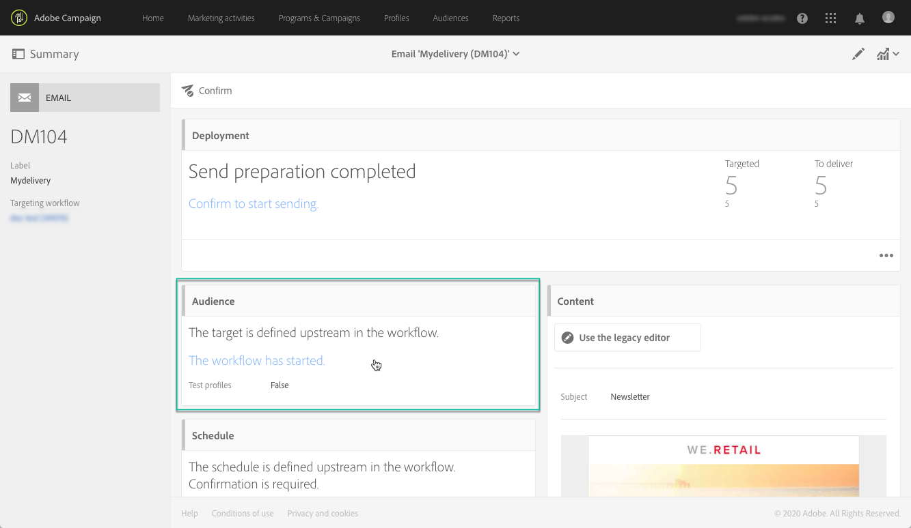
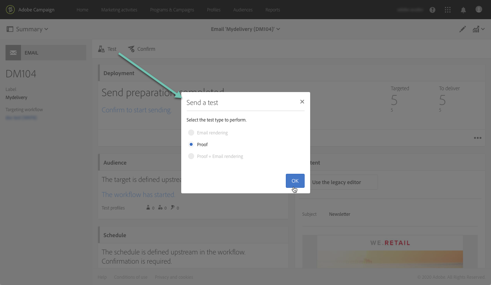

# 使用目标用户档案测试电子邮件 {#testing-message-profiles}

## 概述 {#overview}

除了[测试用户档案](../../audiences/using/managing-test-profiles.md)之外，您还可以通过将自己置于其中一个目标用户档案的位置来测试电子邮件。 这样，您就可以获得用户档案将收到的消息的精确表示形式（自定义字段、动态和个性化信息，包括来自工作流的其他数据……）。

>[!NOTE]
>
> 此功能仅适用于电子邮件。

主要步骤如下：

1. 配置消息，然后启动&#x200B;**准备**&#x200B;阶段。
1. **从消息定向的** 用户档案中选择一个或多个用户档案。
1. 将&#x200B;**替换地址**&#x200B;关联到每个要向其发送校样的用户档案。
1. （可选）对于每个配置文件，定义一个&#x200B;**前缀**&#x200B;以添加到校样主题行。
1. **** 预览Email Designer如何为用户档案显示消息。
1. 发送校样。

>[!IMPORTANT]
>
>此功能允许您向外部电子邮件地址发送用户档案个人信息。请记住，在 Campaign Standard 中执行隐私请求（GDPR 和 CCPA）不会在外部执行该请求。

 [在视频中发现此功能](#video)

## 选择用户档案和替换地址 {#selecting-profiles}

要使用目标用户档案进行测试，必须先选择用户档案，然后定义将接收校样的替换地址。 为此，您可以在目标用户档案中选择[特定用户档案](#selecting-individual-profiles)，或从现有受众](#importing-from-audience)导入用户档案。[

>[!NOTE]
>
>您最多可以选择100个用户档案进行测试。

### 选择单个用户档案 {#selecting-individual-profiles}

1. 在消息仪表板中，确保消息准备成功，然后单击&#x200B;**[!UICONTROL Audience]**&#x200B;块。

   

1. 在&#x200B;**[!UICONTROL Profile substitutions]**&#x200B;选项卡中，单击&#x200B;**[!UICONTROL Create element]**&#x200B;按钮以选择要用于测试的配置文件。

   

1. 单击用户档案选择按钮以显示消息定向的用户档案列表。

   

1. 选择要用于测试的用户档案，然后在&#x200B;**[!UICONTROL Address]**&#x200B;字段中输入所需的替换地址，然后单击&#x200B;**[!UICONTROL Confirm]**。 定向用户档案的所有校样都将发送到此电子邮件地址，而不是发送到此用户档案数据库中定义的校样。

   如果要向校样的主题行添加特定前缀，请填写&#x200B;**[!UICONTROL Subject line prefix]**&#x200B;字段。

   >[!NOTE]
   >
   >主题行前缀最多可包含500个字符。

   

   前缀将显示如下：

   

1. 该用户档案会添加到列表中，并包含其关联的替换地址和前缀。 对要用于测试的所有配置文件重复上述步骤，然后单击&#x200B;**[!UICONTROL Confirm]**。

   

   如果要向同一用户档案的多个替换地址发送校样，则必须根据需要多次添加此用户档案。

   在以下示例中，基于用户档案John Smith的校样将被发送到两个不同的替换地址：

   

1. 定义所有用户档案和替换地址后，即可发送校样以测试消息。 要执行此操作，请单击&#x200B;**[!UICONTROL Test]**&#x200B;按钮，然后选择要执行的测试类型。

   请注意，如果尚未将测试用户档案添加到消息目标，则&#x200B;**[!UICONTROL Email rendering]**&#x200B;和&#x200B;**[!UICONTROL Proof + Email rendering]**&#x200B;选项将不可用。  有关校样发送的更多信息，请参阅[此部分](../../sending/using/sending-proofs.md)。

   

>[!IMPORTANT]
>
>如果对消息进行任何更改，请确保再次启动消息准备工作。 否则，更改将不会反映在校样中。

### 从受众导入用户档案 {#importing-from-audience}

Campaign Standard允许您导入可用于测试的用户档案受众。 例如，这允许您向唯一电子邮件地址发送针对不同用户档案的整套消息。

此外，如果受众已配置了地址和前缀列，则将能够在&#x200B;**[!UICONTROL Profile substitutions]**&#x200B;选项卡中导入这些信息。 [此部分](#use-case)中详细介绍了使用替换地址导入受众的示例。

>[!NOTE]
>
>导入受众时，只会选择与消息目标对应的用户档案并将其添加到&#x200B;**[!UICONTROL Profile substitutions]**&#x200B;选项卡。

要导入用于从受众进行测试的用户档案，请执行以下步骤：

1. 在消息仪表板中，确保消息准备成功，然后单击&#x200B;**[!UICONTROL Audience]**&#x200B;块。

   

1. 在 **[!UICONTROL Profile substitutions]** 选项卡中，单击 **[!UICONTROL Import from an audience]**。

   

1. 选择要使用的受众，然后输入要用于发送给受众的校样的替换地址和前缀。

   >[!NOTE]
   >
   >主题行前缀最多可包含500个字符。

   

   如果要使用的替换地址和/或前缀已在受众中定义，请选择&#x200B;**[!UICONTROL From Audience]**&#x200B;选项，然后指定用于检索这些信息的列。

   

1. 单击 **[!UICONTROL Import]** 按钮。与消息目标对应的受众用户档案将添加到&#x200B;**[!UICONTROL Profile substitution]**&#x200B;选项卡，以及关联的替换地址和前缀。

>[!NOTE]
>
>如果您再次导入同一受众，且使用不同的替换地址和/或前缀，则除了之前导入的受众之外，用户档案还将添加到列表中。

## 使用目标用户档案预览消息

>[!NOTE]
>
>仅Email Designer提供预览。

要能够使用目标用户档案预览消息，请确保已将这些用户档案添加到&#x200B;**[!UICONTROL Profile substitution]**&#x200B;列表（请参阅[定义用户档案和替换地址](#selecting-profiles)）。

如果要在消息中使用个性化字段，则必须在&#x200B;**启动消息准备之前添加这些字段。**&#x200B;否则，预览中将不会考虑这些参数。 因此，如果对个性化字段进行了任何更改，请确保再次启动消息准备。

要使用用户档案替换来预览消息，请执行以下步骤：

1. 在消息仪表板中，单击内容快照以在Email Designer中打开消息。

   

1. 选择&#x200B;**[!UICONTROL Preview]**&#x200B;选项卡，然后单击&#x200B;**[!UICONTROL Change profile]**。

   

1. 单击&#x200B;**[!UICONTROL Profile Substitution]**&#x200B;选项卡以显示已添加进行测试的替换配置文件。

   选择要用于预览的配置文件，然后单击&#x200B;**[!UICONTROL Select]**。

   

1. 此时将显示消息的预览。 使用箭头在选定的配置文件之间导航。

   

## 用例 {#use-case}

在此用例中，我们希望向一组特定用户档案发送一个个性化电子邮件新闻稿。 在发送新闻稿之前，我们希望使用某些目标用户档案预览新闻稿，并将校样发送到外部文件中定义的内部电子邮件地址。

此用例的主要步骤如下：

1. 创建要用于测试的受众。
1. 构建工作流以定向用户档案并发送新闻稿。
1. 配置消息的用户档案替换。
1. 使用目标用户档案预览消息。
1. 发送校样。

### 步骤1:创建要用于测试的受众

1. 准备要导入的文件以创建受众。 在本例中，它应包含用于校样的替换地址以及用于添加到校样主题行的前缀。

   在此示例中，“oliver.vaughan@internal.com”电子邮件地址将收到消息的验证，该消息将定向带有“john.doe@mail.com”电子邮件地址的用户档案。 “JD”前缀将添加到校样的主题行。

   

1. 构建工作流以从文件创建受众。 为此，请添加并配置以下活动：

   * **[!UICONTROL Load file]** 活动：导入CSV文件(有关此活动的更多信息，请参阅 [此章节](../../automating/using/load-file.md))。
   * **[!UICONTROL Reconciliation]** 活动：将文件中的信息链接到数据库中的信息。在此示例中，我们将使用用户档案的电子邮件地址作为协调字段（有关此活动的更多信息，请参阅[此部分](../../automating/using/reconciliation.md)）。
   * **[!UICONTROL Save audience]** 活动：根据导入的文件创建受众(有关此活动的更多信息，请参阅 [此章节](../../automating/using/save-audience.md))。

   

1. 运行工作流，然后转到&#x200B;**[!UICONTROL Audiences]**&#x200B;选项卡，以检查是否已使用所需信息创建受众。

   在本例中，受众由三个用户档案组成。 每个校样都链接到将接收校样的替换电子邮件地址，并在校样的主题行中使用前缀。

   

### 步骤2:构建工作流以定向用户档案并发送新闻稿

1. 添加&#x200B;**[!UICONTROL Query]**&#x200B;和&#x200B;**[!UICONTROL Email delivery]**&#x200B;活动，然后根据您的需求对其进行配置（请参阅[Query](../../automating/using/query.md)和[电子邮件投放](../../automating/using/email-delivery.md)章节）。

   

1. 运行工作流并确保消息准备成功。

### 步骤3:配置消息的“用户档案替换”选项卡

1. 打开&#x200B;**[!UICONTROL Email delivery]**&#x200B;活动。 在消息仪表板中，单击&#x200B;**[!UICONTROL Audience]**&#x200B;块。

   

1. 选择&#x200B;**[!UICONTROL Profile substitutions]**&#x200B;选项卡，然后单击&#x200B;**[!UICONTROL Import from an audience]**。

   

1. 在&#x200B;**[!UICONTROL Audience]**&#x200B;字段中，选择从文件创建的受众。

   

1. 定义发送校样时使用的替换地址和主题行前缀。

   为此，请选择&#x200B;**[!UICONTROL From audience]**&#x200B;选项，然后从包含该信息的受众中选择列。

   

1. 单击 **[!UICONTROL Import]** 按钮。受众中的用户档案将添加到列表，以及其关联的替换地址和主题行前缀。

   

   >[!NOTE]
   >
   >在本例中，**[!UICONTROL Query]**&#x200B;活动将定向受众中的所有用户档案。 如果其中某个用户档案未包含在消息目标中，则不会将其添加到列表中。

### 步骤4:使用目标用户档案预览消息

1. 在消息仪表板中，单击内容快照以在Email Designer中打开消息。

   

1. 选择&#x200B;**[!UICONTROL Preview]**&#x200B;选项卡，然后单击&#x200B;**[!UICONTROL Change profile]**。

   

1. 单击&#x200B;**[!UICONTROL Profile Substitution]**&#x200B;选项卡以显示之前添加的替换配置文件。

   选择要用于预览的配置文件，然后单击&#x200B;**[!UICONTROL Select]**。

   

1. 此时将显示消息的预览。 使用箭头在选定的配置文件之间导航。

   

### 步骤5:发送校样

1. 在消息仪表板中，单击&#x200B;**[!UICONTROL Test]**&#x200B;按钮，然后确认。

   

1. 校样将根据&#x200B;**[!UICONTROL Profile substitutions]**&#x200B;选项卡中配置的内容进行发送。

   

## 教程视频 {#video}

此视频演示如何使用用户档案替换来测试电子邮件。

>[!VIDEO](https://video.tv.adobe.com/v/32368?quality=12)

其他Campaign Standard操作方法视频可在[此处](https://experienceleague.adobe.com/docs/campaign-standard-learn/tutorials/overview.html?lang=zh-Hans)获取。
