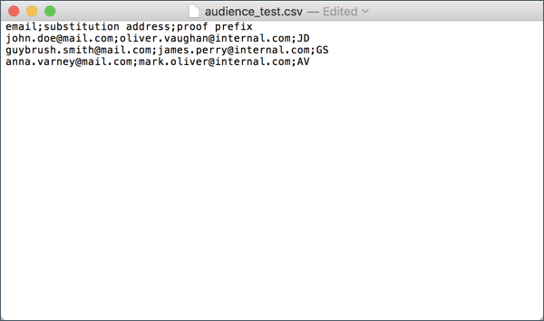

# 使用目标用户档案测试电子邮件 {#testing-message-profiles}

## 概述 {#overview}

此外 ，您还可以将自己置于某个目标用户档案的位置，以测试电子邮件。 这样，您就可以获得用户档案将收到的消息的精确表示形式(自定义字段、动态和个性化信息，包括来自工作流的其他数据……)。

>[!NOTE]
>
> 此功能仅对电子邮件提供。

主要步骤如下：

1. 配置消息，然后启动准 **备阶段** 。
1. **在消息所针对的用户档案中** ，选择一个或多个用户档案。
1. 与每个用户档案关联 **一个将向** 其发送验证的替换地址。
1. （可选）对于每个用户档案，定义 **要添加到** “验证”主题行的前缀。
1. **预览** ，在电子邮件设计器中如何为用户档案显示消息。
1. 发送验证。

有关全局进程的详细信息，请参阅此处提供的教程视 [频](https://docs.adobe.com/content/help/en/campaign-standard-learn/tutorials/communication-channels/email/profile-substitution.html)。

>[!IMPORTANT]
>
>此功能允许您将用户档案个人信息发送到外部电子邮件地址。 请记住，在Campaign Standard中执行隐私请求（GDPR和CCPA）不会在外部执行该请求。

## 选择用户档案和替换地址 {#selecting-profiles}

要使用目标用户档案进行测试，您必须首先选择这些验证，然后定义将接收这些替换地址。 为此，您可以在目标 [用户档案中选择特定用户档案](#selecting-individual-profiles) ，或从现 [有受众导入用户档案](#importing-from-audience)。

>[!NOTE]
>
>最多可选择100个用户档案进行测试。

### 选择单个用户档案 {#selecting-individual-profiles}

1. 在消息仪表板中，确保消息准备成功，然后单击块 **[!UICONTROL Audience]** 。

   

1. 在选 **[!UICONTROL Profile substitutions]** 项卡中，单 **[!UICONTROL Create element]** 击按钮以选择用于测试的用户档案。

   

1. 单击用户档案选择按钮以显示消息所针对的用户档案的列表。

   

1. 选择要用于测试的用户档案，然后在字段中输 **[!UICONTROL Address]** 入所需的替代地址，然后单击 **[!UICONTROL Confirm]**。 所有针对用户档案的验证都将发送到此电子邮件地址，而不是发送到此用户档案在数据库中定义的电子邮件地址。

   如果要向验证主题行添加特定前缀，请填写该字 **[!UICONTROL Subject line prefix]** 段。

   >[!NOTE]
   >
   >主题行前缀最多可包含500个字符。

   

   前缀将显示如下：

   

1. 该用户档案被添加到列表中，并带有其关联的替换地址和前缀。 对要用于测试的所有用户档案重复上述步骤，然后单击 **[!UICONTROL Confirm]**。

   

   如果要将验证发送到同一用户档案的多个替换地址，则必须根据需要多次添加此用户档案。

   在以下示例中，将基于用户档案John Smith的验证发送到两个不同的替换地址：

   

1. 定义所有用户档案和替代地址后，您可以发送验证来测试消息。 为此，请单击按 **[!UICONTROL Test]** 钮，然后选择要执行的测试类型。

   请注意，如果未将测试用户档案添加到消息目标，则 **[!UICONTROL Email rendering]** 和 **[!UICONTROL Proof + Email rendering]** 选项不可用。  For more information on proofs sending, refer to [this section](../../sending/using/sending-proofs.md).

   

>[!IMPORTANT]
>
>如果对消息进行了任何更改，请确保再次启动消息准备。 否则，更改不会反映在验证中。

### 从用户档案导入受众 {#importing-from-audience}

Campaign Standard允许您导入可用于测试的受众。 例如，这允许您向唯一的电子邮件地址发送针对不同用户档案的整组消息。

此外，如果受众已配置了地址列和前缀列，您将能够在选项卡中导入这些信 **[!UICONTROL Profile substitutions]** 息。 本节详细介绍了带替代地址的受众导入 [示例](#use-case)。

>[!NOTE]
>
>导入受众时，只选择与消息目标对应的用户档案并将其添加到选项 **[!UICONTROL Profile substitutions]** 卡。

要导入用户档案以用于从受众测试，请执行以下步骤：

1. 在消息仪表板中，确保消息准备成功，然后单击块 **[!UICONTROL Audience]** 。

   

1. 在选项卡 **[!UICONTROL Profile substitutions]** 中，单击 **[!UICONTROL Import from an audience]**。

   

1. 选择要使用的受众，然后输入要用于发送到受众的验证的替换地址和前缀。

   >[!NOTE]
   >
   >主题行前缀最多可包含500个字符。

   

   如果要使用的替换地址和／或前缀已在受众中定义，请选择该选 **[!UICONTROL From Audience]** 项，然后指定用于检索这些信息的列。

   

1. Click the **[!UICONTROL Import]** button. 与消息用户档案对应的受众的目标被添加到标签，以及相 **[!UICONTROL Profile substitution]** 关的替换地址和前缀。

>[!NOTE]
>
>如果您再次导入具有不同替换地址和／或前缀的同一受众，则除了之前导入的用户档案之外，这些替换还将添加到该列表。

## 使用目标用户档案预览消息

>[!NOTE]
>
>预览仅适用于电子邮件设计人员。

要能够使用目标用户档案预览消息，请确保已将这些用户档案添加到 **[!UICONTROL Profile substitution]** 列表(请参阅 [定义用户档案和替换地址](#selecting-profiles))。

如果要在消息中使用个性化字段，则必须在启动消息准备之 **前添** 加这些语句。 否则，预览中不予考虑。 因此，如果对个性化字段做了任何更改，请确保再次启动消息准备。

要使用预览替换来用户档案消息，请执行以下步骤：

1. 在消息仪表板中，单击内容快照以在电子邮件设计器中打开消息。

   

1. 选择选 **[!UICONTROL Preview]** 项卡，然后单击 **[!UICONTROL Change profile]**。

   

1. 单击选 **[!UICONTROL Profile Substitution]** 项卡以显示已添加用于测试的替换用户档案。

   选择要用于用户档案的预览，然后单击 **[!UICONTROL Select]**。

   

1. 此时将显示消息的预览。 使用箭头在选定用户档案之间导航。

   

## 用例 {#use-case}

在此用例中，我们希望向一组特定用户档案发送个性化的电子邮件时事通讯。 在发送新闻稿之前，我们希望使用一些目标预览将其用户档案，并将验证发送到外部文件中定义的内部电子邮件地址。

此用例的主要步骤如下：

1. 创建用于测试的受众。
1. 构建工作流以目标用户档案和发送新闻稿。
1. 配置消息的用户档案替换。
1. 使用目标用户档案预览消息。
1. 发送验证。

### 第1步：创建用于测试的受众

1. 准备要导入的文件以创建受众。 在我们的例子中，它应包含用于验证的替换地址和添加到验证主题行的前缀。

   在此示例中，“oliver.vaughan@internal.com”电子邮件地址将收到一条消息验证，其目标为具有“john.doe@mail.com”电子邮件地址的用户档案。 “JD”前缀将添加到验证的主题行。

   

1. 构建工作流以从文件创建受众。 为此，请添加和配置以下活动:

   * **[!UICONTROL Load file]** 活动:导入CSV文件(有关此活动的详细信息，请参阅 [此部分](../../automating/using/load-file.md))。
   * **[!UICONTROL Reconciliation]** 活动:将文件中的信息链接到数据库中的信息。 在此示例中，我们将使用用户档案的电子邮件地址作为协调字段(有关此活动的详细信息，请参 [阅本节](../../automating/using/reconciliation.md))。
   * **[!UICONTROL Save audience]** 活动:根据导入的文件创建受众(有关此活动的详细信息，请参 [阅本节](../../automating/using/save-audience.md))。
   

1. 运行工作流，然后转到选 **[!UICONTROL Audiences]** 项卡，检查是否已使用所需信息创建受众。

   在本例中，受众由三个用户档案组成。 每个链接都链接到一个将接收验证的替代电子邮件地址，并带有一个用于验证主题行的前缀。

   

### 第2步：构建工作流以目标用户档案并发送新闻稿

1. 添 **[!UICONTROL Query]** 加和 **[!UICONTROL Email delivery]** 活动，然后根据您的需要配置它们(请参阅 [查询](../../automating/using/query.md) 和 [电子邮件投放部分](../../automating/using/email-delivery.md) )。

   

1. 运行工作流并确保消息准备成功。

### 第3步：配置消息的用户档案替换选项卡

1. 打开 **[!UICONTROL Email delivery]** 活动。 在消息仪表板中，单击该 **[!UICONTROL Audience]** 块。

   

1. 选择选 **[!UICONTROL Profile substitutions]** 项卡，然后单击 **[!UICONTROL Import from an audience]**。

   

1. 在字段 **[!UICONTROL Audience]** 中，选择从文件创建的受众。

   

1. 定义发送验证时要使用的替代地址和主题行前缀。

   为此，请选择选 **[!UICONTROL From audience]** 项，然后从包含信息的受众中选择列。

   

1. Click the **[!UICONTROL Import]** button. 来自受众的用户档案被添加到列表，其中包括其关联的替换地址和主题行前缀。

   

   >[!NOTE]
   >
   >就我们而言，受众的所有用户档案都是活动的目标 **[!UICONTROL Query]** 。 如果这些用户档案中的某个不是消息目标的一部分，则不会将其添加到列表。

### 第4步：使用目标用户档案预览消息

1. 在消息仪表板中，单击内容快照以在电子邮件设计器中打开消息。

   

1. 选择选 **[!UICONTROL Preview]** 项卡，然后单击 **[!UICONTROL Change profile]**。

   

1. 单击选 **[!UICONTROL Profile Substitution]** 项卡以显示之前添加的替换用户档案。

   选择要用于用户档案的预览，然后单击 **[!UICONTROL Select]**。

   

1. 此时将显示消息的预览。 使用箭头在选定用户档案之间导航。

   

### 第5步：发送验证

1. 在消息仪表板中，单击按 **[!UICONTROL Test]** 钮，然后确认。

   

1. 验证会根据选项卡中已配置的内容发送出 **[!UICONTROL Profile substitutions]** 来。

   
