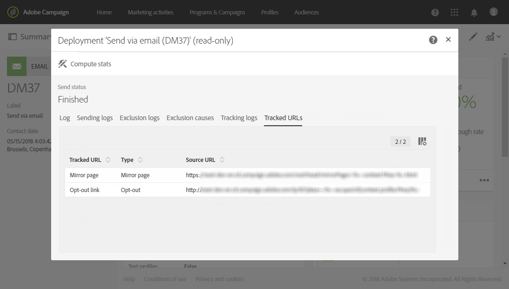

# 跟踪消息{#tracking-messages}

## 关于跟踪{#about-tracking}

凭借其跟踪功能，Adobe Campaign使您能够跟踪投放收件人的行为。 Adobe Campaign 使用会话 Cookie 和永久性 Cookie 实现上述功能。

您可以通过授权请求（例如，页面上出现的请求）通知用户您的网站已配备Web跟踪工具，该请求带有一个复选框，用于授权使用Cookie，或在其登录的首个页面顶部添加横幅等。 应避免弹出窗口，因为它们经常被浏览器阻止。

跟踪信息可用于&#x200B;**[!UICONTROL integrated customer profiles]**&#x200B;中数据库的每个联系人。 如需详细信息，请参阅[此部分](../../audiences/using/integrated-customer-profile.md)。

Adobe Campaign 使用两种类型的 Cookie：

* 会话Cookie(nid)。 它包含发送给联系人的电子邮件标识符(broadlogId)和消息模板的标识符(deliveryId)。 联系人单击由 Adobe Campaign 发送的电子邮件中包含的 URL 后即可添加标识符，让您能够跟踪他们在网络上的行为。关闭浏览器时，将自动擦除会话 Cookie。联系人可以将浏览器配置为拒绝 Cookie。
* 在Adobe Experience Cloud解决方案之间共享的Cookie。 这使您能够识别访问网站时与Experience Cloud解决方案交互的用户。 [此处](https://docs.adobe.com/content/help/en/core-services/interface/ec-cookies/cookies-mc.html)提供了此Cookie的说明。

通过Adobe Campaign Standard跟踪，您可以访问以下功能：

<table>
<tr>
    <td valign="top">
        
    </td>
    <td valign="top">
        
    </td>
    <td valign="top">
        
    </td>
        <td valign="top">
          
    </td>
    </td>
    <td valign="top">
          
</tr>
<tr>
<td>电子邮件跟踪</td>
<td>推送跟踪</td>
<td>跟踪的URL</td>
<td>跟踪日志</td>
<td>跟踪报告</td>
</tr>
</table>

## 跟踪日志{#tracking-logs}

**[!UICONTROL Tracking logs]**&#x200B;选项卡列表此投放的跟踪历史记录。 此选项卡显示已发送消息的跟踪信息，如Adobe Campaign跟踪的所有URL。 此选项卡中的跟踪信息每10分钟更新一次。

>[!NOTE]
>
>如果未为投放启用跟踪，则不显示此选项卡。 跟踪日志仅适用于&#x200B;**email**&#x200B;和&#x200B;**推送通知**&#x200B;渠道。

在上例中，收件人:

* 已打开消息。
* 已单击镜像页面链接。
* 已单击“了解更多”自定义链接。

在&#x200B;**[!UICONTROL Type]**&#x200B;列中，可能的值为：

* **[!UICONTROL Email click]**:收件人单击了自定义链接。
* **[!UICONTROL Mirror page]**:收件人单击了指向该镜像页面的链接。
* **[!UICONTROL Open]**:收件人打开了电子邮件。
* **[!UICONTROL Opt-out]**:收件人单击了退订链接。

>[!NOTE]
>
>对于&#x200B;**推送通知**&#x200B;渠道，只跟踪移动通知的点击。 在这种情况下，值将为&#x200B;**[!UICONTROL Click on mobile notification]**。

有关如何插入跟踪链接的详细信息，请参阅[此页](../../designing/using/links.md#inserting-a-link)。

**[!UICONTROL Tracking indicators]**&#x200B;报告包含在收到电子邮件消息后跟踪行为的关键指示符。 有关详细信息，请参见此 [ 页面](../../reporting/using/tracking-indicators.md)。

## 跟踪的URL {#tracked-urls}

**[!UICONTROL Tracked URLs]**&#x200B;选项卡重新分组已发送邮件中包含的URL，包括其URL类型和源URL。

有关跟踪链接的详细信息，请参阅[本节](../../designing/using/links.md#about-tracked-urls)。
