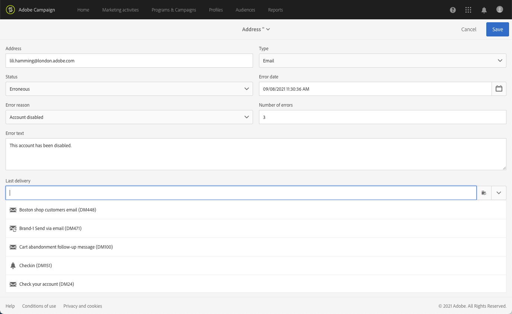

# 了解隔离管理{#understanding-quarantine-management}

## 关于隔离 {#about-quarantines}

举例来说，当信箱已满或地址不存在时，可以隔离某个电子邮件地址或电话号码。

无论如何，隔离过程都必须遵循[此章节](#conditions-for-sending-an-address-to-quarantine)所述的具体规则。

### 通过隔离优化投放 {#optimizing-your-delivery-through-quarantines}

在准备消息时，电子邮件地址或电话号码处于隔离状态的用户档案会被自动被排除（请参阅[确定投放的隔离地址](#identifying-quarantined-addresses-for-a-delivery)）。这样可加快投放速度，因为错误率对投放速度有显著的影响。

如果无效地址率过高，某些互联网访问提供商会自动将电子邮件判断为垃圾邮件。因此，隔离可让您避免被这些提供商添加到阻止列表。

此外，隔离还可避免向错误的电话号码投放短信，有助于降低短信发送成本。

有关安全防护和优化投放之最佳做法的更多信息，请参阅[此页面](../../sending/using/delivery-best-practices.md)。

### 隔离与阻止列表 {#quarantine-vs-denylist}

隔离和阻止列表不适用于同一对象：

* **隔离** 仅适用于 **地址** （或电话号码等），而不是配置文件本身。 例如，其电子邮件地址被隔离的用户档案可以更新其用户档案并输入新地址，然后再次被投放操作定向。 同样，如果两个用户档案碰巧拥有相同的电话号码，则隔离该号码将会同时影响这两个用户档案。

   隔离的地址或电话号码显示在 [排除日志](#identifying-quarantined-addresses-for-a-delivery) （对于投放）或在 [隔离列表](#identifying-quarantined-addresses-for-the-entire-platform) （适用于整个平台）。

* 位于 **阻止列表**&#x200B;另一方面，将导致 **个人资料** 不再被投放定位，如针对给定渠道的退订（选择退出）后。 例如，如果电子邮件渠道阻止列表上的用户档案有两个电子邮件地址，则这两个地址都将排除在投放之外。 有关阻止列表过程的更多信息，请参阅 [关于Campaign中的选择启用和选择禁用](../../audiences/using/about-opt-in-and-opt-out-in-campaign.md).

   您可以检查配置文件是否在阻止列表上，以查找中的一个或多个通道 **[!UICONTROL No longer contact (on denylist)]** 用户档案的部分 **[!UICONTROL General]** 选项卡。 请参阅[此小节](../../audiences/using/managing-opt-in-and-opt-out-in-campaign.md#managing-opt-in-and-opt-out-from-a-profile)。

>[!NOTE]
>
>隔离包括 **在阻止列表** 状态，当收件人将您的消息报告为垃圾邮件或回复带有关键词（如“STOP”）的短信消息时适用。 在这种情况下，该用户档案的相关地址或电话号码将被添加到隔离，并包含 **[!UICONTROL On denylist]** 状态。 有关管理停止短信消息的更多信息，请参阅 [本节](../../channels/using/managing-incoming-sms.md#managing-stop-sms).

&lt;!阻止列表 — 当用户回复的短信带有用于选择退出短信投放的STOP等关键字时，其用户档案不会添加到中，就像电子邮件选择退出过程那样。 相反，用户档案的电话号码将通过 **[!UICONTROL On denylist]** 状态。 此状态仅适用于电话号码，这意味着用户档案将继续接收电子邮件。<!-- Also, if the profile has another phone number, he can still receive SMS messages on the other number. For more on this, refer to [this section](../../channels/using/managing-incoming-sms.md#managing-stop-sms).-->

## 确定隔离的地址 {#identifying-quarantined-addresses}

可以为特定投放或整个平台显示隔离的地址。

<!--
If you need to remove an address from quarantine, contact your technical administrator.
-->

### 确定投放的隔离地址 {#identifying-quarantined-addresses-for-a-delivery}

在投放准备阶段期间，投放仪表板的 **[!UICONTROL Exclusion logs]** 选项卡中会列出特定投放的隔离地址（请参阅[此章节](../../sending/using/monitoring-a-delivery.md#exclusion-logs)）。有关投放准备的更多信息，请参阅[此章节](../../sending/using/preparing-the-send.md)。

### 确定整个平台的隔离地址 {#identifying-quarantined-addresses-for-the-entire-platform}

管理员可以从以下位置访问整个平台隔离区中电子邮件地址的详细列表 **[!UICONTROL Administration > Channels > Quarantines > Addresses]** 菜单。

<!--
This menu lists quarantined elements for **Email**, **SMS** and **Push notification** channels.
-->

>[!NOTE]
>
>隔离数量的增加是正常的，这与数据库的“磨损”有关。 例如，如果将电子邮件地址的生命周期视为三年，而收件人表每年增加50%，则隔离的增加可以按如下方式计算：第1年年末：(1&#42;0.33)/(1+0.5)=22%。 第2年年末：((1.22)&#42;0.33)+0.33)/(1.5+0.75)=32.5%。

筛选器可帮助您浏览列表。 您可以根据地址、状态和/或渠道进行筛选。

您可以编辑或 [delete](#removing-a-quarantined-address) 以及创建新条目。

要编辑条目，请单击相应的行并根据需要修改字段。

要手动添加新条目，请使用 **[!UICONTROL Create]** 按钮。

定义地址（或电话号码等） 和渠道类型。 您可以设置隔离列表中的状态和错误原因。 您还可以指明发生错误的日期、错误数并输入错误文本。 如果需要，请从下拉列表中选择发送到该地址的最后一次投放。

## 从隔离中删除地址 {#removing-a-quarantined-address}

### 自动更新 {#unquarantine-auto}

数据库清理工作流会自动从隔离列表中删除符合特定条件的地址。 了解有关技术工作流的更多信息，请参阅 [本节](../../administration/using/technical-workflows.md#list-of-technical-workflows).

在以下情况下，地址会自动从隔离列表中删除：

* 中的地址 **[!UICONTROL Erroneous]** 成功投放后，状态将从隔离列表中删除。
* 中的地址 **[!UICONTROL Erroneous]** 如果最后一次软退回发生在10天之前，则会从隔离列表中删除状态。 有关软错误管理的更多信息，请参阅 [本节](#soft-error-management).
* 中的地址 **[!UICONTROL Erroneous]** 退回的状态 **[!UICONTROL Mailbox full]** 错误将在30天后从隔离列表中删除。

然后，其状态更改为 **[!UICONTROL Valid]**.

在下列情况下要执行的最大重试次数 **[!UICONTROL Erroneous]** 现在，状态以及重试之间的最短延迟取决于IP在给定域名的历史和当前表现如何。

>[!IMPORTANT]
>
>地址在中的收件人 **[!UICONTROL Quarantine]** 或 **[!UICONTROL Denylisted]** 即使他们收到电子邮件，状态也不会被删除。

### 手动更新 {#unquarantine-manual}

您还可以手动取消隔离地址。  要从隔离列表中手动删除地址，您可以将其从隔离列表中删除或将其状态更改为 **[!UICONTROL Valid]**.

* 从中选择地址 **[!UICONTROL Administration > Channels > Quarantines > Addresses]** 列出并选择 **[!UICONTROL Delete element]**.

   

* 选择地址并更改其地址 **[!UICONTROL Status]** 到 **[!UICONTROL Valid]**.

   

### 批量更新 {#unquarantine-bulk}

您可能需要对隔离列表执行批量更新，例如，在ISP中断的情况下。 在这种情况下，电子邮件会错误地标记为跳出，因为它们无法成功传递给收件人。 必须从隔离列表中删除这些地址。

要执行此操作，请创建工作流并添加 **[!UICONTROL Query]** 活动以过滤掉所有受影响的收件人。 确定后，可以将它们从隔离列表中删除，并包含在将来的Campaign电子邮件投放中。

根据事件的时间范围，以下是此查询的建议准则。

* **错误文本（隔离文本）** 包含“550-5.1.1”和 **错误文本（隔离文本）** 包含“support.ISP.com”

   其中“support.ISP.com”可以是：例如“support.apple.com”或“support.google.com”

* **更新状态(@lastModified)** 在YYYY/MM/DD上或之后HH:MM:SS AM
* **更新状态(@lastModified)** 在YYYY/MM/DD或之前HH:MM:SS PM

获得受影响的收件人列表后，添加 **[!UICONTROL Update data]** 活动，将其电子邮件地址状态设置为 **[!UICONTROL Valid]** 因此它们将被从隔离列表中删除 **[!UICONTROL Database cleanup]** 工作流。 您也可以直接从隔离表中删除它们。

## 将地址加入隔离的条件 {#conditions-for-sending-an-address-to-quarantine}

Adobe Campaign 可根据投放失败类型和在错误消息鉴别过程中分配的原因管理隔离（请参阅[投放失败类型和原因](../../sending/using/understanding-delivery-failures.md#delivery-failure-types-and-reasons)以及[退回邮件鉴别](../../sending/using/understanding-delivery-failures.md#bounce-mail-qualification)）。

* **已忽略的错误**：已忽略的错误不会将地址添加到隔离。
* **硬错误**：相应的电子邮件地址会立即添加到隔离。
* **软错误**：软错误不会立即将地址添加到隔离，但会增加错误计数。有关此内容的更多信息，请参阅 [软错误管理](#soft-error-management).

   <!--
  When the error counter reaches the limit threshold, the address goes into quarantine. In the default configuration, the threshold is set at five errors, where two errors are significant if they occur at least 24 hours apart. The address is placed in quarantine at the fifth error. The error counter threshold can be modified. For more on this, refer to this [page](../../administration/using/configuring-email-channel.md#email-channel-parameters).
  When a delivery is successful after a retry, the error counter of the address which was prior to that quarantined is reinitialized. The address status changes to **[!UICONTROL Valid]** and it is deleted from the list of quarantines after two days by the **[!UICONTROL Database cleanup]** workflow.
  -->

如果用户将电子邮件标记为垃圾邮件([反馈环](https://experienceleague.adobe.com/docs/deliverability-learn/deliverability-best-practice-guide/transition-process/infrastructure.html#feedback-loops))，邮件会自动重定向到由Adobe管理的技术邮箱。 随后，该用户的电子邮件地址会自动添加到隔离，并附加 **[!UICONTROL On denylist]** 状态。阻止列表此状态仅适用于地址，用户档案不在上，因此用户可继续接收SMS消息和推送通知。

>[!NOTE]
>
>Adobe Campaign 中的隔离会区分大小写字母。请确保以小写方式导入电子邮件地址，这样以后就不会重新定向这些地址。

隔离地址列表（请参阅[确定整个平台的隔离地址](#identifying-quarantined-addresses-for-the-entire-platform)）中的&#x200B;**[!UICONTROL Error reason]** 字段，说明了将选定地址置于隔离状态的原因。

### 软错误管理 {#soft-error-management}

与硬错误相反，软错误不会立即将地址添加到隔离，而是会增加错误计数。

重试将在 [投放持续时间](../../administration/using/configuring-email-channel.md#validity-period-parameters). 当错误计数达到限制阈值时，即会将地址添加到隔离。有关更多信息，请参阅 [投放临时失败后重试](understanding-delivery-failures.md#retries-after-a-delivery-temporary-failure).

<!--In the default configuration, the threshold is set at five errors, where two errors are significant if they occur at least 24 hours apart. The address is placed in quarantine at the fifth error.
The error counter threshold can be modified.-->

如果最后一次重大错误发生在10天之前，则错误计数器会重新初始化。 然后，地址状态更改为 **有效** 它将被从隔离列表中删除 **数据库清理** 工作流。 (有关技术工作流的详细信息，请参阅 [本节](../../administration/using/technical-workflows.md#list-of-technical-workflows).)
