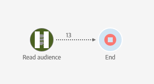

# Adobe Campaign Standard 中的辅助功能 {#accessibility-acs}

了解 Adobe Campaign Standard 工作区中的辅助功能支持。

辅助功能是指使产品可用于患有视觉、听觉、认知、运动和其他残疾的人员。软件产品的辅助功能示例包括语义结构化内容、屏幕阅读器支持、图形的对等文本、键盘快捷键等。

Adobe Campaign Standard 提供使其更便于使用的功能，例如对比度、标签、结构化内容、键盘导航和上下文帮助。

## 辅助功能 {#accessibility-features}

### 对比度和颜色 {#contrast}

Adobe Campaign Standard 用户界面努力在应用程序中提供足够的对比度，以确保视力低下或色觉缺失的用户具有无障碍的观看体验。

* 大文本和标题已得到增强，达到 3:1 的对比度。

   

* 应用程序中的帮助内容和正文文本已更新，达到 4.5:1 的对比度。

* 工作流的暂停和取消图标已更新，以提高背景色和前景色之间的对比度。

   

* 颜色、形状和位置不是应用程序中用于传递信息或层次结构的唯一方法。

### 用户界面 {#user-interface}

Adobe Campaign Standard 用户界面通过向可视元素添加替代文本以及使用语义结构以直观且程序化的方式传递信息，使所有用户更轻松地与内容交互。

* 当用户将必需的 ID 字段留空时，图形会直观地指示哪个字段的消息文本出错，并且同一信息通过屏幕阅读器等辅助技术以程序化方式传递给用户。

   

* 鼠标悬停或聚焦时显示的内容可被用户忽略，并且不会模糊其他内容。

   

* 添加了图像的替代文本和按钮的辅助名称，并且可以使用辅助技术大声读取，而不是只依赖视觉提示来识别元素。

<!--
### Create responsive resize for multiple devices {#resize-devices}

When designing for multiple devices and platforms, it's important to create a seamless experience for screen sizes across mobile and desktop resolutions.

Adobe Campaign Standard allows you to design and test emails and push notifications on different devices such as: iPhone, Android devices, iPad, Android tablet and desktop.

-->

## 上下文帮助 {#contextual-help}

上下文帮助可以帮助您更好地了解所请求的不同可用字段和功能。它还会指导您阅读产品文档，以了解有关所选功能的更多信息。

在设计电子邮件时，您可以访问工具提示，其中将提供功能描述和产品文档链接。

## 支持辅助技术 {#screen-magnifiers}

我们努力通过各种辅助技术提高 Adobe Campaign Standard 应用程序的易用性，这些技术包括但不限于改进键盘、屏幕放大软件、屏幕阅读器、语音识别软件和其他辅助设备。

## 使用首选语言 {#languages}

Adobe Campaign Standard 提供不同语言形式：英语、法语和德语。

请注意，语言在安装时进行设置，此后不能更改。

## 键盘快捷键 {#shortcuts}

### 主页 {#homepage-shortcuts}

| 快捷键 | 操作 |
|:-:|:-:|
| 选项卡 | 浏览用户界面的各个元素 |
| 回车或空格键 | 激活选定项 |

### Email Designer {#email-designer-shortcuts}

| 快捷键 | 操作 |
|:-:|:-:|
| CTRL + Z | 撤消 |
| CTRL + Y | 重做 |

### 动态报告 {#report-shortcuts}

| 快捷键 | 操作 |
|:-:|:-:|
| CTRL + O | 打开项目 |
| CTRL + S | 保存 |
| Shift + CTRL + S | 另存为 |
| Alt + R | 刷新项目 |
| Shift + CTRL + V | 下载 CSV |
| Alt + P | 打印 |
| CTRL + Z | 撤消 |
| CTRL + Shift + Z | 重做 |
| Alt + B | 新建空白面板 |
| Alt + A | 新建自由格式 |
| Alt + 1 | 新建自由格式表 |
| Alt + 2 | 换行 |
| Alt + 3 | 新建栏 |
| Alt + S | 立即发送报告 |
| Shift + Alt + S | 按计划发送报告 |
| Shift = Alt + L | 计划报告 |

## 进一步阅读 {#further-reading}

Adobe Campaign Standard 致力于提供不断增强的辅助功能，从而使产品对于每个人都易于使用。

我们建议您使用 [Adobe 辅助功能反馈表](https://www.adobe.com/accessibility/feedback.html)向我们发送改进建议和您遇到的辅助功能问题。

您还可以参阅 [Adobe Campaign Standard 发行说明](https://experienceleague.adobe.com/docs/campaign-standard/using/release-notes/release-notes.html?lang=zh-Hans#release-notes)，以了解最新的改进和功能。