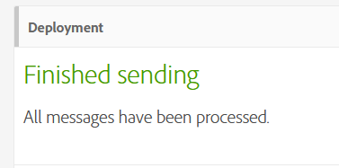

# Adobe Campaign Standard 中的辅助功能 {#accessibility-acs}

了解 Adobe Campaign Standard 工作区中的辅助功能支持。

辅助功能是指使产品可用于患有视觉、听觉、认知、运动和其他残疾的人员。软件产品的辅助功能示例包括屏幕阅读器支持、图形的对等文本、键盘快捷键、显示颜色更改为高对比度等等。

Adobe Campaign Standard 提供了一些可供使用的工具，如对比度、键盘导航、上下文帮助和响应式调整大小。

## 辅助功能 {#accessibility-features}

### 对比度 {#contrast}

Adobe Campaign Standard 用户界面努力在应用程序中提供足够的对比度，以确保视力低下或色觉缺失的用户具有可访问的观看体验。

* 工作流的暂停和取消图标已更新，以提高背景和前景之间的对比度。

   

* 投放成功时显示的文本包含背景和前景之间对比度不足的大型绿色文本。对比度已更新，最小比率为 3:1。

   

* Adobe Campaign Standard 确保颜色、形状或位置不是用于传达信息或层次结构的唯一方法。

### 用户界面 {#user-interface}

通过 Adobe Campaign Standard 用户界面，用户可更轻松地查看和收听内容，包括区分前景与背景，以及向不同可用按钮添加替代文本。

* 当用户将必填 ID 字段留空时，图形会以可视方式指示哪个字段出错并显示错误消息文本。

   

* 鼠标悬停或聚焦时显示的内容可被用户忽略，并且不会模糊其他内容。

   

* 已添加图像按钮的替代文本，并且可以读取而不是查看插图。

   

* 使用列表时，数据表标题单元格不会在表的角落留空。

### 为多个设备创建响应式大小调整 {#resize-devices}

为多个设备和平台进行设计时，针对各种移动和桌面分辨率的屏幕大小创建无缝体验至关重要。

Adobe Campaign Standard 允许您在不同设备上设计并测试电子邮件和推送通知，例如：iPhone、Android 设备、iPad、Android 平板电脑和桌面。

## 上下文帮助 {#contextual-help}

上下文帮助可以帮助您更好地了解所请求的不同可用字段和功能。它还会指导您阅读产品文档，以了解有关所选功能的更多信息。

设计电子邮件时，可以将鼠标悬停在信息按钮上。系统将显示工具提示，其中会提供功能描述和产品文档链接。

## 支持屏幕放大器 {#screen-magnifiers}

屏幕阅读器读取显示在计算机屏幕上的文本。它还会读取辅助功能标签或属性中提供的非文本信息，如应用程序中的按钮标签或图像描述。

在 Adobe Campaign Standard 中，即使用户覆盖文本间距属性，内容和功能仍然可用。

## 使用首选语言 {#languages}

Adobe Campaign Standard 提供不同语言形式：英语、法语和德语。

请注意，语言在安装时进行设置，此后不能更改。

## 键盘快捷键 {#shortcuts}

### 主页 {#homepage-shortcuts}

| 快捷键 | 操作 |
|:-:|:-:|
| 选项卡 | 浏览用户界面的各个元素 |
| 回车或空格键 | 激活选定项 |

### Email Designer {#email-designer-shortcuts}

| 快捷键 | 操作 |
|:-:|:-:|
| CTRL + Z | 撤消 |
| CTRL + Y | 重做 |

### 动态报告 {#report-shortcuts}

| 快捷键 | 操作 |
|:-:|:-:|
| CTRL + O | 打开项目 |
| CTRL + S | 保存 |
| Shift + CTRL + S | 另存为 |
| Alt + R | 刷新项目 |
| Shift + CTRL + V | 下载 CSV |
| Alt + P | 打印 |
| CTRL + Z | 撤消 |
| CTRL + Shift + Z | 重做 |
| Alt + B | 新建空白面板 |
| Alt + A | 新建自由格式 |
| Alt + 1 | 新建自由格式表 |
| Alt + 2 | 换行 |
| Alt + 3 | 新建栏 |
| Alt + S | 立即发送报告 |
| Shift + Alt + S | 按计划发送报告 |
| Shift = Alt + L | 计划报告 |

## 进一步阅读 {#further-reading}

Adobe Campaign Standard 致力于提供不断增强的辅助功能，从而使产品对于每个人都易于使用。

我们建议您使用 [Adobe 辅助功能反馈表](https://www.adobe.com/accessibility/feedback.html)向我们发送改进建议和您遇到的辅助功能问题。

您还可以参阅 [Adobe Campaign Standard 发行说明](https://experienceleague.adobe.com/docs/campaign-standard/using/release-notes/release-notes.html?lang=zh-Hans#release-notes)，以了解最新的改进和功能。