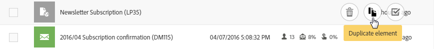

# 自定义列表{#customizing-lists}

**列表** 屏幕允许您显示一个或多个给定资源的元素。

Adobe Campaign有两种类型的列表：

* A **齐次** 列表，即包含单种资源类型时。 例如，用户档案列表仅包含用户档案。
* A **异构** 列表，即包含多种类型资源时。 例如，营销活动列表包含登陆页面、工作流、电子邮件、短信等。

列表以列显示。 每列可以按升序或降序顺序一次排序。

列表中的元素有一个允许您选择这些元素的复选框。 通过选择一个或多个元素，可以执行多个操作，如编辑、复制和删除这些元素。

将鼠标悬停在列表中的某个元素上时， **快速操作**. 这些操作允许用户对悬停在上方的元素执行各种操作，例如编辑、选择、删除或显示详细信息。

您还可以配置是否显示列表中的列。 要添加或删除列，请执行以下操作：

1. 确保屏幕位于 **列表** 模式。

   

1. 通过选择  按钮。

   

1. 添加要包含在列表中的列。 为此，请从窗口的左侧选择一列，然后使用  按钮来添加列。

   可选列对应于列表资源。

   对于添加的每列，指定是否默认应用排序：

   * **[!UICONTROL NO]**:不对列排序
   * **[!UICONTROL ASC]**:对列应用升序（上升）排序
   * **[!UICONTROL DESC]**:对列应用降序（拒绝）排序。

1. 通过选中要删除的列对应的复选框，删除您不希望显示的列。 然后，使用  按钮以确认将其删除。
1. 列表包含正确的列后，您可以通过检查要移动的列来更改列表中这些列的显示顺序。 然后，使用  和  箭头。
1. 通过选择 **[!UICONTROL OK]**.

现在，您的列表会在您配置时显示。
