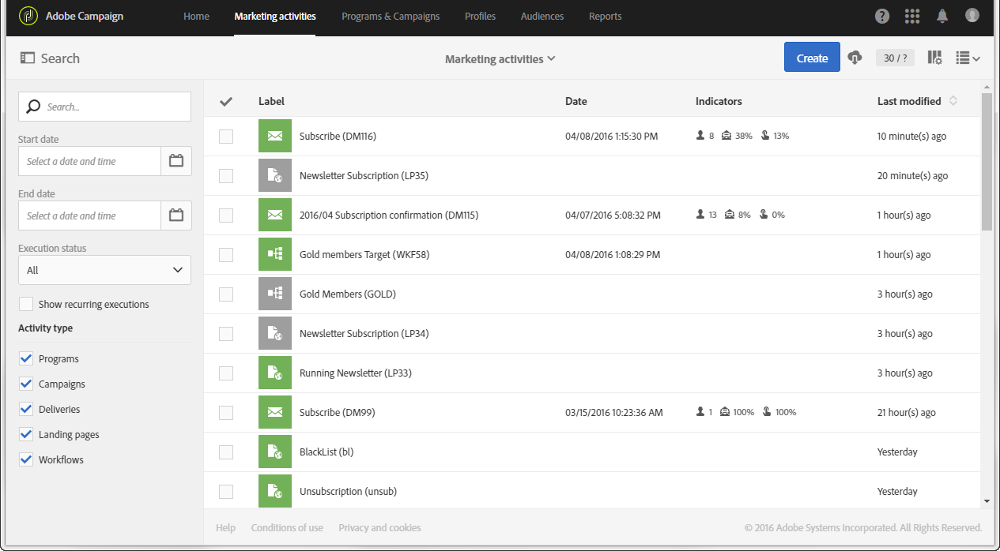

# 界面描述{#interface-description}

通过 Adobe Campaign，可在不同的菜单和屏幕中导航，以管理营销策划。

所有 Adobe Campaign 屏幕都由以下元素组成：

* 用于导航的顶部栏
* 用于访问特定功能和配置的高级菜单
* 用于处理特定元素的中心区域
* 根据上下文在显示的元素中进行筛选或搜索的侧面板。

## 主页 {#home-page}

主页由一系列卡组成，利用这些卡可快速访问 Adobe Campaign 的主要功能。Campaign 主页中显示的功能列表，取决于为您的组织配置的权限和选项。

* 利用 **[!UICONTROL Create an email]** 卡，可使用电子邮件创建助手。利用此助手，可选择电子邮件类型、选择消息收件人并定义内容。请参阅[创建电子邮件](../../channels/using/creating-an-email.md)一节。
* 利用 **[!UICONTROL Create an SMS]** 卡，可使用短信创建助手。利用此助手，可选择短信类型、选择消息收件人并定义内容。请参阅[创建短信](../../channels/using/creating-an-sms-message.md)一节。
* 利用 **[!UICONTROL Create a Direct mail]** 卡，可使用直邮创建助手。请参阅[创建直邮](../../channels/using/creating-the-direct-mail.md)一节。
* 利用 **[!UICONTROL Create a push notification]** 卡，可使用通知创建助手。利用此助手，可选择推送通知的类型、选择消息收件人并定义内容。请参阅[创建推送通知](../../channels/using/preparing-and-sending-a-push-notification.md)一节。
* 此 **[!UICONTROL Create an In-App message]** 卡片會帶您前往應用程式內建立助理。 此助理可以讓您選取您要建立的應用程式內訊息型別、定義其屬性、對象和內容。 請參閱 [建立應用程式內訊息](../../channels/using/about-in-app-messaging.md) 區段。
* 利用 **[!UICONTROL Marketing activities]** 卡，可访问所有活动、项目和营销策划的完整列表，特别是电子邮件、短信、工作流和登陆页面。然后，您可以在此处按名称、日期、状态或活动类型进行搜索，以筛选元素。有关更多信息，请参阅[营销活动列表](../../start/using/marketing-activities.md#about-marketing-activities)一节。
* 利用 **[!UICONTROL Programs & campaigns]** 卡可转到项目列表，您可以在其中创建和管理营销策划。请参阅[项目列表](../../start/using/programs-and-campaigns.md#about-plans--programs-and-campaigns)。
* 利用 **[!UICONTROL Timeline]** 卡可直接转到营销活动的交互式时间线，您可以在该时间线中查看正在进行的项目及其内容。请参阅[时间线](../../start/using/timeline.md)。
* 利用 **[!UICONTROL Customer profiles]** 卡可直接转到用户档案列表。在此，您可以查看与列表中各个用户档案有关的事件。请参阅[管理用户档案](../../audiences/using/about-profiles.md)。
* 利用 **[!UICONTROL Audiences]** 卡可直接转到受众列表。在此，您可以访问现有受众和构建新受众。请参阅[管理受众](../../audiences/using/about-audiences.md)。

## 顶部栏 {#top-bar}

每個畫面上都會顯示頂端列，讓您透過Adobe Campaign瀏覽各項功能，並存取已連線的Adobe設定檔、通知、Adobe Experience Cloud解決方案和Campaign檔案。

导航规则为：

* 此 **Adobe** 頁面左上角的標誌可讓您存取進階功能和設定。 具体的菜单取决于您的用户档案和权限。

   有关高级菜单的详情，请参阅[高级菜单](#advanced-menu)一节。

* 利用 **[!UICONTROL Home]** 链接，可显示 Adobe Campaign 主页。
* 利用 **[!UICONTROL Marketing activities]**、**[!UICONTROL Programs & Campaigns]**、**[!UICONTROL Profiles]**、**[!UICONTROL Audiences]** 和 **[!UICONTROL Reports]** 链接，可访问与这些功能关联的视图。
* 此 **解決方案切換器** 圖示可讓您切換您的組織或切換至不同的應用程式。
* 此 **[!UICONTROL Help]** 圖示說明 [以下](#help).
* **Notifications** 图标可显示最新的警报或信息。
* **User** 图标可显示链接到用户档案的信息。如有需要，請使用此圖示 **[!UICONTROL Sign out]**.

### 帮助 {#help}

在右上角， **說明** 圖示將Adobe Experience League帶入產品中。

使用 **[!UICONTROL Search]** 尋找指引的欄位。 搜尋結果包括檔案和說明文章、社群論壇的結果以及影片內容，讓您更輕鬆地存取更多內容，以協助您充分運用應用程式。

三個索引標籤可協助您尋找說明和協助：

1. 此 **[!UICONTROL Help]** 索引標籤包含：
   * 透過內容連結快速存取Adobe Campaign Standard檔案。
   * a **[!UICONTROL Learning]** 可讓您存取Adobe Campaign課程庫的連結。
   * a **[!UICONTROL Community]** 連結以存取專屬於您Campaign問題的論壇。
   * 直接存取：說明中心、客戶服務、Experience Cloud產品狀態、開發人員連線、發行說明、發行計畫及 **[!UICONTROL About]** 畫面。
1. 此 **[!UICONTROL Support]** 索引標籤可讓您開啟支援案例，並透過電話或Twitter聯絡我們。
1. 此 **[!UICONTROL Feedback]**  標籤可讓您更輕鬆地報告問題或分享您的想法。

## 高级菜单 {#advanced-menu}

按一下「 」即可顯示進階功能表。 **Adobe Campaign** 圖示，在每個畫面的左上角。 显示的高级菜单，可能会因合同和用户权限的不同而有所差异。

利用此菜单，可导航到特定功能和设置。

### 营销计划 {#marketing-plans}

利用 **[!UICONTROL Marketing plans]** 图标，可访问以下功能：

* **[!UICONTROL Marketing activities]** - 有关更多信息，请参阅[营销活动列表](../../start/using/marketing-activities.md#about-marketing-activities)一节。
* **[!UICONTROL Programs & Campaigns]** - 有关更多信息，请参阅[项目列表](../../start/using/programs-and-campaigns.md#about-plans--programs-and-campaigns)一节。
* **[!UICONTROL Timeline]** - 有关更多信息，请参阅[时间线](../../start/using/timeline.md)一节。
* **[!UICONTROL Transactional messages]**，其中包含子菜单 **[!UICONTROL Deliveries]** 和 **[!UICONTROL Event configuration]** - 有关更多信息，请参 阅[事务型消息传递](../../channels/using/getting-started-with-transactional-msg.md)一节。

### 用户档案和受众 {#profiles-e-audiences}

利用 **[!UICONTROL Profiles & audiences]** 图标，可访问以下功能：

* **[!UICONTROL Profiles]** - 有关更多信息，请参阅[管理用户档案](../../audiences/using/about-profiles.md)一节。
* **[!UICONTROL Test profiles]** - 有关更多信息，请参阅[管理测试用户档案](../../audiences/using/managing-test-profiles.md)一节。
* **[!UICONTROL Audiences]** - 有关更多信息，请参阅[管理受众](../../audiences/using/about-audiences.md)一节。
* **[!UICONTROL Services]** - 有关更多信息，请参阅[创建服务](../../audiences/using/creating-a-service.md)一节。

### 资源 {#resources}

利用 **[!UICONTROL Resources]** 图标，可访问以下功能：

* **[!UICONTROL Templates]**，其中包含各种类型模板的子菜单 - 有关更多信息，请参阅[管理模板](../../start/using/marketing-activity-templates.md)一节。
* **[!UICONTROL Content blocks]** - 有关更多信息，请参阅[添加内容块](../../designing/using/personalization.md#adding-a-content-block)一节。
* **[!UICONTROL Content templates & fragments]** - 有关更多信息，请参阅[内容模板](../../designing/using/using-reusable-content.md#content-templates)一节。

### 管理 {#administration}

利用 **[!UICONTROL Administration]** 图标，可访问仅可由功能管理员执行的高级功能。有关更多信息，请参阅[管理](../../administration/using/get-started-campaign-administration.md)一节。

## 中心区域 {#central-zone}

用户界面的中心区域是一个动态区域，由元素列表或一系列卡之类的分区组成。利用该区域，可编辑现有元素和创建资源。

中心区域的内容和显示格式可能会有所不同：

* **列表**&#x200B;可显示各种元素，如项目、营销策划、用户档案等。可以在 **[!UICONTROL Card]** 或 **[!UICONTROL List]** 模式中查看这些元素。使用“更改模式”按钮，可从一个模式切换到另一个模式。每个元素都会显示指标。

   

   利用“计数器”，可了解元素的数量。如果此数字超过 30，则需要单击此计数器以获取总数。

* **仪表板**&#x200B;显示链接到活动之所有参数的概况。此屏幕包括交互区域，可用于单独分离和配置各种概念。

   

* 如果在创建元素时可选用多种类型，则可利用&#x200B;**选择屏幕**&#x200B;中可以选择要添加的元素类型（营销策划、投放）。此选择屏幕还可用于访问报告。

   

* 对于工作流和查询编辑器，提供了带面板的&#x200B;**工作区**&#x200B;以供您设计对象。

   您可以将面板中的元素拖放到工作区中，以配置相关元素。

   

## 操作栏 {#action-bar}

根据显示的屏幕类型，顶部将显示一个包含屏幕相关操作的操作栏。

此栏不仅包含搜索和筛选等常见操作，还包含与所显示屏幕相关的操作：

* 有关与&#x200B;**工作区**&#x200B;类型屏幕相关的操作，请参阅工作流的[操作栏](../../automating/using/workflow-interface.md#action-bar)一节。
* 有关与&#x200B;**仪表板**&#x200B;屏幕相关的操作，请参阅[消息仪表板](../../channels/using/message-dashboard.md)一节，以了解更多信息。
* 有关&#x200B;**列表**&#x200B;类型屏幕相关的操作，请参阅下方的[自定义列表](../../start/using/customizing-lists.md)一节。
