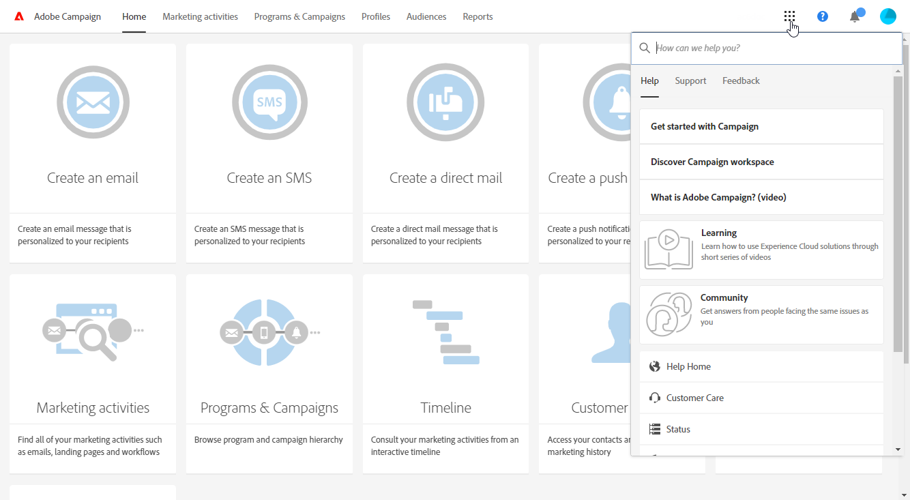

# 界面描述{#interface-description}

Adobe Campaign允许您浏览不同的菜单和屏幕以管理活动。

所有Adobe Campaign屏幕由以下元素组成：

* 用于导航的顶栏
* 可访问特定功能和配置的高级菜单
* 处理某些元素的中心区域
* 根据上下文在显示的元素中过滤或搜索的侧面板。

## 主页 {#home-page}

主页由一组卡组成，这些卡使您能够快速访问主Adobe Campaign功能。 在活动主页中可以看到的容量列表取决于您的权限和为您的组织配置的选项。

* 卡片 **[!UICONTROL Create an email]** 会将您带到电子邮件创建助手。 此助手允许您选择电子邮件类型、选择邮件收件人并定义内容。 请参阅创 [建电子邮件](../../channels/using/creating-an-email.md) 。
* 卡 **[!UICONTROL Create an SMS]** 将您带到SMS创建助手。 此助手允许您选择SMS类型、选择消息收件人并定义内容。 请参阅创 [建SMS部分](../../channels/using/creating-an-sms-message.md) 。
* 卡片 **[!UICONTROL Create a Direct mail]** 会将您带到直接邮件创建助手。 请参阅创 [建直邮部分](../../channels/using/creating-the-direct-mail.md) 。
* 卡 **[!UICONTROL Create a push notification]** 将带您进入通知创建助手。 此助手允许您选择推送通知类型、选择消息收件人并定义内容。 请参阅创 [建推送通知部分](../../channels/using/preparing-and-sending-a-push-notification.md) 。
* 卡 **[!UICONTROL Create an InApp message]** 将带您进入InApp创建助手。 此助手允许您选择要创建的InApp消息类型、定义其属性、受众和内容。 请参阅创 [建InApp消息部分](../../channels/using/about-in-app-messaging.md) 。
* 该 **[!UICONTROL Marketing activities]** 卡可帮您完成所有活动、项目和活动的列表，特别是电子邮件、短信、工作流和登陆页。 然后，您可以在此处按名称、日期、状态或活动类型搜索元素。 有关此内容的详细信息，请参 [阅营销活动列表](../../start/using/marketing-activities.md#about-marketing-activities) 部分。
* 该 **[!UICONTROL Programs & campaigns]** 卡会带您进入项目列表，您可以在其中创建和管理活动。 请参阅 [项目列表](../../start/using/programs-and-campaigns.md#about-plans--programs-and-campaigns)。
* 该 **[!UICONTROL Timeline]** 卡将您直接带到营销活动的交互式时间轴，您可以在该时间轴中咨询当前项目及其内容。 请参阅 [时间轴](../../start/using/timeline.md)。
* 卡 **[!UICONTROL Customer profiles]** 将您直接带到用户档案列表。 在此，您可以咨询事件有关列表中每个用户档案的信息。 请参阅管 [理用户档案](../../audiences/using/about-profiles.md)。
* 卡 **[!UICONTROL Audiences]** 将您直接带到受众列表。 从此处，您可以访问现有受众并创建新客户。 请参阅管 [理受众](../../audiences/using/about-audiences.md)。

## 顶栏 {#top-bar}

顶栏显示在每个屏幕上，允许您浏览Adobe Campaign功能，访问连接的Adobe用户档案、通知、其他Adobe Experience Cloud服务和解决方案以及文档。

导航原则有：

* 页 **[!UICONTROL Adobe Campaign]** 面左上角的徽标允许您访问高级功能和配置。 菜单取决于您的用户档案和权限。

   高级菜单显示在高级 [菜单部分](#advanced-menu) 。

* 链接 **[!UICONTROL Home]** 允许您显示Adobe Campaign主页。
* 通过 **[!UICONTROL Marketing activities]**、 **[!UICONTROL Programs & Campaigns]**、和链 **[!UICONTROL Profiles]**&#x200B;接，您可 **[!UICONTROL Audiences]** 以访 **[!UICONTROL Reports]** 问与这些功能链接的视图。
* 通过 **[!UICONTROL Help]** 该按钮可访问产品文档和上下文帮助、发行说明、版本号、法律声明，以及指向Adobe Experience Cloud社区和客户关怀的链接。

   

* 通过 **选择解决方** 案图标，您可以切换到其他Adobe Experience Cloud解决方案以及用户档案设置。
* 通知 **图标** ，显示最新的警报或信息。
* 用户 **图标** 允许您显示链接到用户档案的信息。 它允许访问按 **[!UICONTROL Sign out]** 钮。

## 高级菜单 {#advanced-menu}

通过单击每个屏幕左上角 **的Adobe Campaign** 图标，可显示高级菜单。 高级菜单可能因合同和用户权限而异。

此菜单允许您导航到特定功能和设置。

### 营销计划 {#marketing-plans}

该图 **[!UICONTROL Marketing plans]** 标允许您访问以下功能：

* **[!UICONTROL Marketing activities]** -有关详细信息，请参阅营销 [活动列表部分](../../start/using/marketing-activities.md#about-marketing-activities) 。
* **[!UICONTROL Programs & Campaigns]** -有关详细信息，请参阅 [项目列表](../../start/using/programs-and-campaigns.md#about-plans--programs-and-campaigns) 。
* **[!UICONTROL Timeline]** -有关详细信息，请参阅“时 [间轴](../../start/using/timeline.md) ”部分。
* **[!UICONTROL Transactional messages]**，其中包含子菜单 **[!UICONTROL Deliveries]** 和 **[!UICONTROL Event configuration]** -有关详细信息，请参 [阅Transactional messaging](../../channels/using/about-transactional-messaging.md) section。

### Profiles &amp; audiences {#profiles-e-audiences}

该图 **[!UICONTROL Profiles & audiences]** 标允许您访问以下功能：

* **[!UICONTROL Profiles]** -有关详细信息，请参阅管理 [用户档案部分](../../audiences/using/about-profiles.md) 。
* **[!UICONTROL Test profiles]** -有关详细信息，请参阅管理 [测试用户档案部分](../../audiences/using/managing-test-profiles.md) 。
* **[!UICONTROL Audiences]** -有关详细信息，请参阅管理 [受众部分](../../audiences/using/about-audiences.md) 。
* **[!UICONTROL Services]** -有关详细信息，请参阅创 [建服务部分](../../audiences/using/creating-a-service.md) 。

### 资源 {#resources}

该图 **[!UICONTROL Resources]** 标允许您访问以下功能：

* **[!UICONTROL Templates]**，其中包含每种类型模板的子菜单——有关详细信息，请参阅管理 [模板部分](../../start/using/marketing-activity-templates.md) 。
* **[!UICONTROL Content blocks]** -有关详细信息，请参阅添 [加内容块部分](../../designing/using/personalization.md#adding-a-content-block) 。
* **[!UICONTROL Content templates & fragments]** -有关详细信息，请参阅“内 [容模板](../../designing/using/using-reusable-content.md#content-templates) ”部分。

### 管理 {#administration}

该图 **[!UICONTROL Administration]** 标允许您访问仅可由功能管理员执行的高级功能。 For more on this, refer to the [Administration](../../administration/using/get-started-campaign-administration.md) section.

## 中区 {#central-zone}

用户界面的中心区域是一个动态区域，它包含元素列表或卡集（例如）。 它允许您编辑现有元素和创建资源。

中心区域的内容和显示格式可能会有所不同：

* 一 **个列表** ，呈现各种元素，如项目、活动、用户档案等。 这些元素可以在或模 **[!UICONTROL Card]** 式中 **[!UICONTROL List]** 查看。 使用“更改模式”按钮从一个模式切换到另一个模式。 每个元素都显示指示符。

   

   计数器允许您了解元素的数量。 如果此数量超过30，则需要单击此计数器以获取总数。

* 一 **个仪表板** ，概述了链接到活动的所有参数。 此屏幕包括交互区域，它们允许您独立分离和配置不同概念。

   

* 如果在创建元素时可能有多个优惠, **则在选择屏** 幕中可以选择要添加的元素类型(活动、投放)。 此选择屏幕还提供用于访问报告的功能。

   

* 对于工作流和查询编辑器，您 **可以使用** 带调板的工作区来设计对象。

   您可以将组件面板中的元素拖放到工作区中以配置相关元素。

   

## 操作栏 {#action-bar}

根据显示的屏幕类型，顶部将显示一个包含链接到屏幕的操作的栏。

此栏不仅包含搜索和筛选等常见操作，还包含与显示的屏幕相关的操作：

* 有关与工作区类 **型屏** 幕相关的操作，请参 [阅工作流的“操](../../automating/using/workflow-interface.md#action-bar) 作栏”部分。
* 有关仪表板屏 **幕的相** 关操作，请参阅 [消息仪表板](../../channels/using/message-dashboard.md) 部分，以了解更多信息。
* 有关列表类 **型屏** 幕的相关操作，请参 [阅以下自定义列表](../../start/using/customizing-lists.md) 部分。
