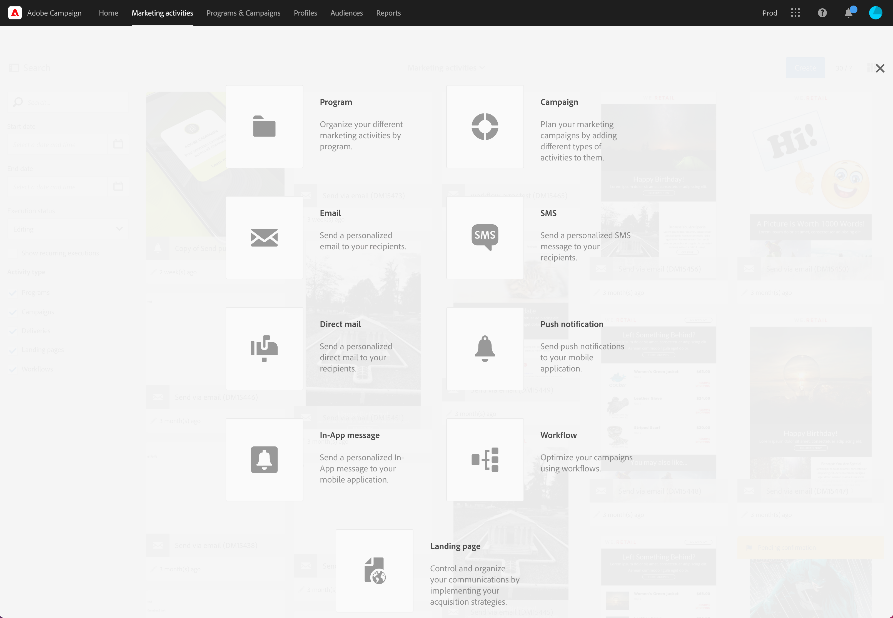

# 营销活动{#marketing-activities}

## 关于营销活动 {#about-marketing-activities}

您可以从所属的项目和营销策划创建和管理营销活动，也可以通过营销活动的列表进行创建和管理。

营销活动列表中集中了所有的活动，无论其基于什么项目和营销策划创建。因此按特定的层次结构顺序，逐项列出了项目、营销策划、投放（电子邮件、短信消息和推送通知）、登陆页面和工作流。

要访问营销活动列表，请从顶部栏中选择 **[!UICONTROL Marketing activities]** 链接。

>[!NOTE]
>
>您还可以通过从主页中选择 **[!UICONTROL Marketing activities]** 卡以访问营销活动。

利用 **[!UICONTROL Search]** 窗格，可根据不同的条件筛选元素：名称（标签和 ID）、日期、状态或活动类型。默认情况下，会选择除项目以外的所有活动类型。

要直接访问每个活动的内容，请从列表中选择一个元素。

可使用 **[!UICONTROL Create]** 按钮创建新活动。有关更多信息，请参阅[创建营销活动](#creating-a-marketing-activity)一节。

## 营销活动的图标和状态 {#marketing-activity-icons-and-statuses}

在主区域中，列表中的每种活动类型都拥有一个图标：

*  项目
*  营销活动
* 电子邮件
*  短信
*  推送通知
*  应用程序内消息
*  登陆页面
*  工作流

根据有效期和状态，与此图标关联的颜色，指示相应活动的执行状态。

* 灰色：活动尚未开始 - **[!UICONTROL Editing]** 状态。
* 蓝色：活动正在进行 - **[!UICONTROL In progress]** 状态。
* 绿色：活动已完成 - **[!UICONTROL Finished]** 状态。
* 黄色：活动收到警告 - **[!UICONTROL Warning]** 状态。
* 红色：发生错误 - **[!UICONTROL Erroneous]** 状态。

## 创建营销活动 {#creating-a-marketing-activity}

在现有的营销策划中，您可以创建不同类型的消息（**电子邮件**、**短信**、**推送通知**&#x200B;等）、工作流和登陆页面。

您可以从现有项目创建其他项目、营销策划、工作流和登陆页面。

>[!NOTE]
>
>可以考虑直接在营销策划中创建工作流。如果您在项目中创建工作流，则以后将无法将其移至营销策划。

有关项目和营销策划的信息，请参阅[项目和营销策划](../../start/using/programs-and-campaigns.md)一节 。

1. 在项目或营销策划的仪表板中，使用 **[!UICONTROL Create]** 按钮创建新的营销活动。

   

1. 选择要创建的活动类型。

   

根据环境，您可以：

* 创建电子邮件 — [了解详情](../../channels/using/creating-an-email.md)
* 创建短信 — [了解详情](../../channels/using/creating-an-sms-message.md)
* 创建推送通知 — [了解详情](../../channels/using/preparing-and-sending-a-push-notification.md)
* 创建应用程序内消息 — [了解详情](../../channels/using/about-in-app-messaging.md)
* 创建工作流 — [了解详情](../../automating/using/building-a-workflow.md#creating-a-workflow)
* 创建登陆页面 — [了解详情](../../channels/using/getting-started-with-landing-pages.md)
* 创建营销活动 — [了解详情](../../start/using/programs-and-campaigns.md#creating-a-campaign)
* 创建程序 — [了解详情](../../start/using/programs-and-campaigns.md#creating-a-program)

>[!NOTE]
>
>您还可以从营销活动列表创建营销活动。在这种情况下，您可以创建任何类型的活动，然后选择通过活动的属性将营销活动链接到父营销活动（如果创建项目，则链接到父项目）。
