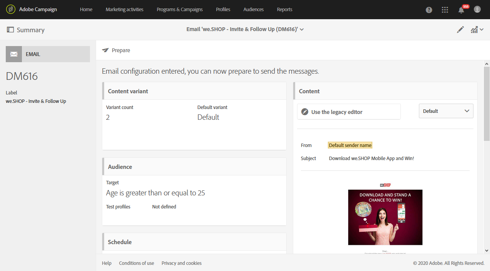

# 营销活动模板 {#marketing-activity-templates}

## 关于模板 {#about-templates}

创建新的营销活动时，向导中的第一个屏幕会要求您选择类型或模板。利用模板可以根据需要预配置某些参数。模板可以包含营销活动的完整或部分配置。模板管理由功能管理员执行。

用于最终用户的界面经过简化。创建新营销活动时，只需选择要使用的模板即可。无需担心任何技术配置。这些配置已由功能管理员在模板中进行了预配置。

例如，对于电子邮件模板，您可以预填充 HTML 内容、受众和投放的任何其他参数：日程安排、测试用户档案、投放的常规属性、高级参数等。这样可让您在创建新活动时节省时间。

对于每种类型的营销活动，都提供了带有最低程度配置的一个或多个现成模板。无法修改或删除这些现成模板。

模板可用于以下营销活动：

* 项目
* 营销策划
* 电子邮件投放
* 短信投放
* 推送通知
* 登陆页面
* 工作流
* 服务
* 导入
* 事务型消息传递

## 创建新模板 {#creating-a-new-template}

平台的功能管理员可通过 **[!UICONTROL Resources > Templates]** 菜单管理消息模板。无法修改或删除现成模板。要创建新模板，必须复制现有模板之一。

1. 选择现有模板。在本例中，我们选择了 **[!UICONTROL Delivery template]**。

   

1. 将鼠标指针悬停在其上方，然后选择 **[!UICONTROL Duplicate element]** 选项。

   

1. 与从头开始[创建新营销活动](../../start/using/marketing-activities.md#creating-a-marketing-activity)类似，配置所需的全部设置。

   

之后，创建营销活动时，标准用户可在向导的第一个屏幕中选择之前创建的模板。

## 使用模板 {#using-a-template}

我们现在将介绍如何使用前文中创建的模板。

>[!NOTE]
>
>基于模板创建的营销活动，通常由标准用户类型用户档案执行。

1. 创建新的营销活动。

   

1. 在向导的第一个屏幕中，选择要使用的模板。

   

   营销活动会使用模板中定义的参数，进行预配置。

   
