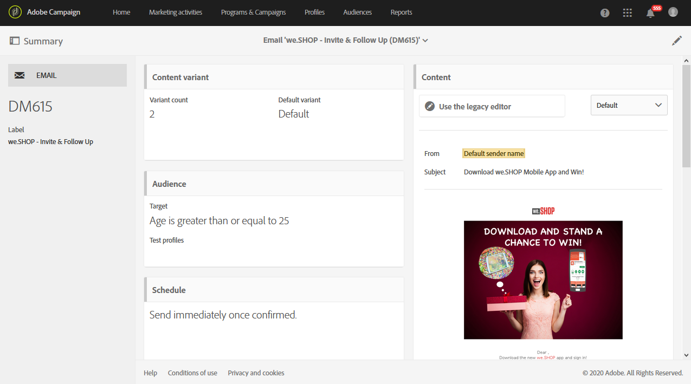

# 营销活动模板 {#marketing-activity-templates}

## 关于模板 {#about-templates}

创建新的营销活动时，向导中的第一个屏幕会要求您选择类型或模板。 模板允许您根据需要预配置某些参数。 模板可能包含营销活动的完整或部分配置。 模板管理由职能管理员执行。

最终用户的界面已简化。 创建新营销活动时，您只需选择要使用的模板。 无需担心任何技术配置。 该模板已由职能管理员在模板中预配置。

例如，对于电子邮件模板，您可以预填充HTML内容、受众和您分发的任何其他参数：计划、测试配置文件、交付的常规属性、高级参数等。 这样，您就可以在创建新活动时节省时间。

对于每种类型的营销活动，可以使用一个或多个现成模板，只需极少的配置。 无法修改或删除这些现成模板。

模板可用于以下营销活动：

* 计划
* 营销活动
* 电子邮件发送
* SMS交付
* 推送通知
* 登陆页面
* 工作流
* 服务
* 导入
* 交易消息

## 创建新模板 {#creating-a-new-template}

消息模板可以由平台的功能管理员在菜单下进行管 **[!UICONTROL Resources > Templates]**理。 无法修改或删除现成模板。 要创建新模板，必须复制现有模板。

1. 选择现有模板。 在我们的例子中，我们选择了一个 **[!UICONTROL Delivery template]**。

   

1. 用鼠标将鼠标悬停在它上方，然后选择 **[!UICONTROL Duplicate element]**选项。

   

1. 像从头开始创建新的营销活动一样，配置您 [需要的任何设置](../../start/using/marketing-activities.md#creating-a-marketing-activity) 。

   

创建营销活动时，标准用户随后可以在向导的第一个屏幕中选择创建的模板。

## 使用模板 {#using-a-template}

我们现在将研究如何使用在前面部分中创建的模板。

>[!NOTE]
>
>基于模板创建营销活动通常由标准用户类型配置文件执行。

1. 创建新的营销活动。

   

1. 在向导的第一个屏幕中，选择要使用的模板。

   

   市场营销活动是使用模板中定义的参数预配置的。

   
