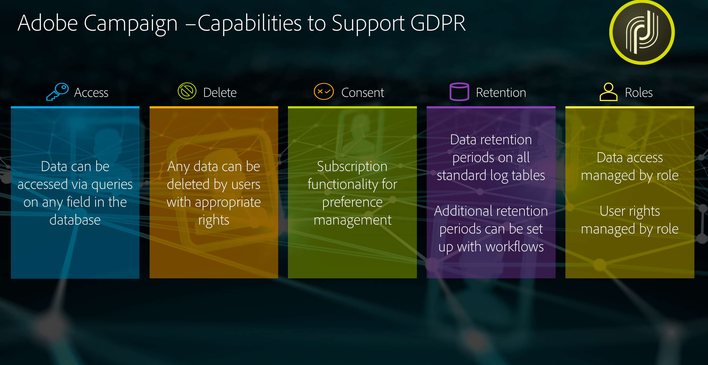

# 隐私管理 {#privacy-management}

Adobe Campaign 提供一套工具来帮助您遵守[隐私法规](#privacy-management-regulations)（包括 GDPR、CCPA、PDPA、LGPD）。

以下是 Adobe Campaign 为确保 GDPR 和其他隐私法规就绪性而提供的五大主要功能：

* **访问权**

* **删除权**

要获取与此有关的更多信息，请参阅[访问权和被遗忘权](#right-access-forgotten)。

* **同意管理**

* **数据保留**

* **权限管理**

要获取与此有关的更多信息，请参阅[同意、保留和角色](#consent-retention-roles)。

<!--This section presents general information on what Privacy management is and the features provided by Adobe Campaign to manage the [Right to Access and Right to be Forgotten](#right-access-forgotten).

It also contains information on important features to manage Privacy ([consent, data retention and user roles](#consent-retention-roles)), as well as best practices to help you with your Privacy compliance when using Adobe Campaign.-->

## 隐私管理法规 {#privacy-management-regulations}

Adobe Campaign 功能帮助您遵守以下法规：

* **GDPR**（[通用数据保护条例](https://ec.europa.eu/info/law/law-topic/data-protection/reform/what-does-general-data-protection-regulation-gdpr-govern_en)）是一项欧盟 (EU) 隐私法律，旨在协调欧盟国家或地区的数据保护要求并使之现代化。请访问下面的链接以查找有关 GDPR 的常规信息：

   * https://www.adobe.com/privacy/general-data-protection-regulation.html
   * https://www.adobe.com/marketing-cloud/campaign/general-data-protection-regulation.html

* **CCPA**（[加州消费者隐私法案](https://leginfo.legislature.ca.gov/faces/codes_displayText.xhtml?lawCode=CIV&amp;division=3.&amp;title=1.81.5.&amp;part=4.&amp;chapter=&amp;article=)）为加利福尼亚州居民提供与其个人信息有关的新权利，并要求在加利福尼亚开展业务的特定实体承担数据保护责任。
* **PDPA**（[个人数据保护法案](https://secureprivacy.ai/thailand-pdpa-summary-what-businesses-need-to-know/)）是一项新的隐私法律，旨在协调泰国的数据保护要求并使之现代化。
* **LGPD** ([Lei Geral de Proteção de Dados](https://iapp.org/media/pdf/resource_center/Brazilian_General_Data_Protection_Law.pdf)) 将从 2021 年初生效，适用于巴西境内所有收集或处理个人数据的公司。

所有这些法规均适用于为居住在上述地区或国家（欧盟、加利福尼亚、泰国、巴西）的持有数据主体的数据的 Adobe Campaign 客户。

>[!NOTE]
>
>有关个人数据以及管理数据的不同实体（数据控制者、数据处理者和数据主体）的更多信息，请参阅[个人数据和角色](../../start/using/privacy.md#personal-data)。

## 访问权与被遗忘权 {#right-access-forgotten}

为了帮助您促进隐私就绪，Adobe Campaign 允许您处理&#x200B;**访问**&#x200B;和&#x200B;**删除**&#x200B;请求。

* **访问权**&#x200B;是数据主体从数据控制者处就与其有关的个人数据是否正在进行处理、处理位置和处理目的获得确认的权限。数据控制者应当以电子格式免费提供个人数据副本。

* **被遗忘权**（删除请求）也称为数据擦除，用于授权数据主体通过数据控制者擦除其个人数据，停止进一步散发数据，并可能使第三方停止处理数据。

要了解如何可以创建&#x200B;**访问**&#x200B;和&#x200B;**删除**&#x200B;请求以及 Adobe Campaign 如何处理这些请求，请参阅[实施步骤](../../start/using/privacy-requests.md#about-privacy-requests)。

[此处](https://experienceleague.adobe.com/docs/campaign-standard-learn/tutorials/privacy/privacy-overview.html?lang=zh-Hans#privacy)还提供了有关 Campaign Standard 隐私管理的教程。

>[!NOTE]
>
>有关个人数据以及管理数据的不同实体（数据控制者、数据处理者和数据主体）的更多信息，请参阅[个人数据和角色](../../start/using/privacy.md#personal-data)。

## 同意、保留和角色 {#consent-retention-roles}

除了最新的&#x200B;**访问权**&#x200B;和&#x200B;**被遗忘权**&#x200B;功能外，Adobe Campaign 还提供对于隐私至关重要的其他重要功能：

* [同意管理](#consent-management)：首选项管理的订阅功能
* [数据保留](#data-retention)：所有标准日志表上的数据保留期，可以使用工作流设置其他保留期
* [权限管理](#rights-management)：由指定权限管理的数据访问

### 同意管理 {#consent-management}

同意表示数据主体同意处理与数据主体相关的个人数据。数据控制者负责为该处理获取必要的同意。虽然 Adobe Campaign 可能提供一些功能来帮助客户管理与服务相关的同意，但 Adobe 不负责同意。客户应与自己的法律部门合作，以确定其自己的流程和做法来获取必要的同意。

Adobe Campaign 的核心自始至终便是用于帮助管理同意的某些方面的功能。通过订阅管理流程，客户可以跟踪哪些收件人已选择加入哪种类型的订阅（新闻稿、每日或每周促销，还是任何其他类型的营销计划）。

有关同意管理的更多信息，请参阅[关于订阅](../../audiences/using/about-subscriptions.md)和[登陆页入门](../../channels/using/getting-started-with-landing-pages.md)。

除了 Adobe Campaign 提供的同意管理工具外，您还可能会跟踪消费者是否已选择退出个人信息销售。请参阅[此章节](../../start/using/privacy-requests.md#sale-of-personal-information-ccpa)。

### 数据保留 {#data-retention}

关于保留时间，Campaign 中的内置日志表具有预设的保留期，通常将其数据存储限制为 6 个月或更短时间。

以下是内置表的默认保留时间值。请注意，保留时间配置由 Adobe 技术管理员在实施期间设置，每项实施的值可能因客户要求而异。

* **合并跟踪**：6 个月
* **投放日志**：6 个月
* **跟踪日志**：6 个月
* **事件**：1 个月
* **事件处理统计信息**：6 个月
* **存档事件**：6 个月
* **临时实体**：7 天
* **忽略的管道事件**：1 个月
* **投放警报**：1 个月
* **导出审核**：6 个月

与删除类似，使用标准工作流功能，可以为任何自定义表设置保留期。

请联系 Adobe 顾问或技术管理员，以详细了解客户保留时间或设置自定义表的保留时间（如果需要）。

### 权限管理 {#rights-management}

Adobe Campaign 使您能够通过不同的预建或自定义角色来管理分配给各种 Campaign 操作员的权限。

一个好处是，这允许您管理公司内谁可以访问不同类型的数据。例如，您可能有不同的营销人员覆盖不同的地域，并且每个营销人员只能访问其地域的数据。

同样，此功能还允许您为每个用户配置不同的功能，例如限制谁可以发送投放，或者为了提高隐私管理的关联性，限制谁可以修改或导出数据。

有关访问管理的更多信息，请参阅[此部分](../../administration/using/about-access-management.md)。