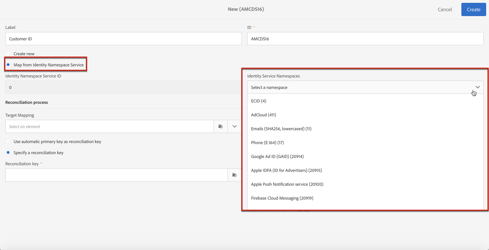

# 管理隐私请求 {#privacy-requests}

有关隐私管理的一般演示文稿，请参阅[此部分](../../start/using/privacy-management.md)。

此信息适用于 GDPR、CCPA、PDPA 和 LGPD。有关这些法规的更多信息，请参阅[此部分](../../start/using/privacy-management.md#privacy-management-regulations)。

[此部分](#sale-of-personal-information-ccpa)中说明了特定于 CCPA 的个人信息销售的选择退出。

>[!IMPORTANT]
>
>从 19.4 开始，将 Campaign API 和接口用于访问和删除请求的方法已被弃用。对于任何 GDPR、CCPA、PDPA 或 LGPD 访问和删除请求，您需要使用[隐私核心服务](#create-privacy-request)集成方法。

## 关于隐私请求 {#about-privacy-requests}

为了帮助您促进隐私就绪，Adobe Campaign 允许您处理访问和删除请求。**访问权**&#x200B;和&#x200B;**被遗忘权**（删除请求）在[此部分](../../start/using/privacy-management.md#right-access-forgotten)中进行了描述。

要执行这些请求，您必须使用&#x200B;**隐私核心服务**&#x200B;集成。从隐私核心服务推送到所有 Experience Cloud 解决方案的隐私请求由 Campaign 通过专用工作流自动处理。

### 先决条件{#prerequesites}

Adobe Campaign 为数据控制者提供用于创建和处理 Adobe Campaign 中存储的数据的隐私请求的工具。但是，数据控制者负责处理与数据主体（电子邮件、客户关怀或 Web 门户）的关系。

因此，作为数据控制者，您的职责是确认发出请求的数据主体的身份，并确认返回给请求者的数据与数据主体有关。

>[!NOTE]
>
>有关个人数据以及管理数据的不同实体（数据控制者、数据处理者和数据主体）的更多信息，请参阅[个人数据和角色](../../start/using/privacy.md#personal-data)。

### 命名空间 {#namesspaces}

在创建隐私请求之前，您需要定义将要使用的命名空间。命名空间是用于识别 Adobe Campaign 数据库中的数据主体的键。有两个命名空间现成可用：电子邮件和手机。如果您需要其他命名空间（例如，用户档案自定义字段），请按照以下步骤操作。

另请参阅本[教程](https://experienceleague.adobe.com/docs/campaign-standard-learn/tutorials/privacy/namespaces-for-privacy-requests.html?lang=zh-Hans#privacy)，了解如何创建命名空间。

>[!NOTE]
>
>如果您使用多个命名空间，则需要为每个命名空间创建一个隐私请求。

1. 单击左上角的 Adobe Campaign 徽标，然后选择 **[!UICONTROL Administration]** > **[!UICONTROL Namespaces]**。

   

1. 在命名空间列表中，单击 **[!UICONTROL Create]**。

   

1. 输入 **[!UICONTROL Label]**。

   

1. 如果要使用现有身份服务命名空间，请选择 **[!UICONTROL Map from Identity Namespace Service]**，然后从 **[!UICONTROL Identity Service Namespaces]** 列表中选择命名空间。

   

   如果要在 **[!UICONTROL Identity Service]** 中创建新命名空间并在 Campaign 中映射该命名空间，请选择 **[!UICONTROL Create new]**，然后在 **[!UICONTROL Identity namespace name]** 字段中输入名称。

   

   要详细了解身份命名空间，请参阅 [Experience Platform](https://experienceleague.adobe.com/docs/experience-platform/identity/namespaces.html?lang=zh-Hans) 文档。

1. 一个身份服务命名空间映射到 Campaign 中的一个命名空间。您需要指定将如何在 Campaign 中协调命名空间。

   选择目标映射（**[!UICONTROL Recipients]**、**[!UICONTROL Real-time event]** 或 **[!UICONTROL Subscriptions to an application]**）。如果要使用多个目标映射，则需要为每个目标映射创建一个命名空间。

   

1. 选择 **[!UICONTROL Reconciliation key]**。这是将用于识别 Adobe Campaign 数据库中的数据主体的字段。

   

1. 单击 **[!UICONTROL Create]**。现在，您可以根据新命名空间创建隐私请求。如果您使用多个命名空间，则需要为每个命名空间创建一个隐私请求。

### 创建隐私请求 {#create-privacy-request}

>[!IMPORTANT]
>
>**隐私核心服务**&#x200B;集成是您应当用于所有访问和删除请求的方法。
>
>从 19.4 开始，将 Campaign API 和接口用于访问和删除请求的方法已被弃用。对任何 GDPR、CCPA、PDPA 或 LGPD 访问和删除请求都使用核心隐私服务。

隐私核心服务集成允许您通过单个 JSON API 调用在多解决方案上下文中自动处理隐私请求。从隐私核心服务推送到所有 Experience Cloud 解决方案的隐私请求由 Campaign 通过专用工作流自动处理。

请参阅 [Experience Platform Privacy Service](https://experienceleague.adobe.com/docs/experience-platform/privacy/home.html?lang=zh-Hans) 文档，以了解如何从隐私核心服务创建隐私请求。

每个隐私核心服务作业根据使用的命名空间数在 Campaign 中分割为多个隐私请求（一个请求对应于一个命名空间）。此外，一个作业可以在多个实例上运行。因此，将为一个作业创建多个文件。例如，如果某个请求具有两个命名空间，并且在三个实例上运行，则总共发送六个文件。每个命名空间和实例一个文件。

文件名的模式为：`<InstanceName>-<NamespaceId>-<ReconciliationKey>.xml`

* **InstanceName**：Campaign 实例名称
* **NamespaceId**：已使用的命名空间的身份服务命名空间 ID
* **Reconciliation key**：编码的合并关键项

### 资源列表 {#list-of-resources}

执行删除或访问隐私请求时，Adobe Campaign 会根据所有具有指向用户档案资源（自有类型）链接的资源中的&#x200B;**对帐**&#x200B;值搜索所有数据主体数据。

以下是执行隐私请求时考虑的现成资源列表：

* 用户档案 (recipient)
* 用户档案投放日志 (broadLogRcp)
* 用户档案跟踪日志 (trackingLogRcp)
* 投放日志（应用程序订阅）(broadLogAppSubRcp)
* 跟踪日志（应用程序订阅） (trackingLogAppSubRcp)
* 应用程序订阅 (appSubscriptionRcp)
* 用户档案历史记录订阅 (subHistoRcp)
* 用户档案订阅 (subscriptionRcp)
* 访客 (visitor)

如果您创建的自定义资源具有指向用户档案资源（自有类型）的链接，则也会考虑这些资源。例如，如果您具有链接到用户档案资源的事务资源和链接到该事务资源的事务详细信息资源，则这两个资源都将被考虑在内。

另请参阅[本教程](https://experienceleague.adobe.com/docs/campaign-standard-learn/tutorials/privacy/custom-resources-for-privacy-requests.html?lang=zh-Hans#privacy)，了解如何修改自定义资源。

要使此功能正常工作，需要选择自定义资源中的 **[!UICONTROL Deleting the target record implies deleting records referenced by the link]** 选项：

1. 单击左上角的 Adobe Campaign 徽标，然后选择 **[!UICONTROL Administration]** > **[!UICONTROL Development]** > **[!UICONTROL Custom resources]**。

1. 选择具有指向用户档案资源（自有类型）的链接的自定义资源。

1. 单击 **[!UICONTROL Links]** 部分。

1. 对于每个链接，单击铅笔图标 (**[!UICONTROL Edit properties]**)。

1. 在 **[!UICONTROL Behavior if deleted/duplicated]** 部分中，选择 **[!UICONTROL Deleting the target record implies deleting records referenced by the link]** 选项。

   

### 隐私请求状态 {#privacy-request-statuses}

以下是隐私请求的不同状态：

* **[!UICONTROL New]** / **[!UICONTROL Retry pending]**：进行中，工作流尚未处理请求。
* **[!UICONTROL Processing]** / **[!UICONTROL Retry in progress]**：工作流正在处理请求。
* **[!UICONTROL Delete pending]**：工作流已识别要删除的所有收件人数据。
* **[!UICONTROL Delete in progress]**：工作流正在处理删除。
   <!--**[!UICONTROL Delete Confirmation Pending]** (Delete request in 2-steps process mode): the workflow has processed the Access request. Manual confirmation is requested to perform the deletion. The button is available for 15 days.-->
* **[!UICONTROL Complete]**：请求的处理已完成，并且没有错误。
* **[!UICONTROL Error]**：工作流遇到错误。原因显示在 **[!UICONTROL Request status]** 列的隐私请求列表中。例如，**[!UICONTROL Error data not found]** 表示在数据库中找不到与数据主体的 **[!UICONTROL Reconciliation value]** 匹配的收件人数据。

### 禁用两步流程 {#disabling-two-step-process}

核心隐私服务不支持两步流程。

>[!IMPORTANT]
>
>在使用核心隐私服务集成来管理隐私请求之前，您必须从 Campaign Standard 界面对删除请求禁用两步流程。

如果未禁用此选项，则通过隐私核心服务管理的所有删除请求都将保持挂起状态，并且将无法完成。

默认情况下，将激活两步流程。

要更改此模式，请单击 **[!UICONTROL Edit properties]**（位于 **[!UICONTROL Privacy Requests]** 屏幕的右上角），然后取消选中 **[!UICONTROL Activate the 2-step process]** 选项。

## 选择退出个人信息销售 (CCPA) {#sale-of-personal-information-ccpa}

**加州消费者隐私法案** (CCPA) 为加利福尼亚州居民提供了与其个人信息有关的新权利，并要求在加利福尼亚开展业务的特定实体承担数据保护责任。

访问和删除请求的配置和使用对于 GDPR 和 CCPA 均通用。此部分介绍特定于 CCPA 的个人数据销售的选择退出。

除了 Adobe Campaign 提供的[同意管理](../../start/using/privacy-management.md#consent-management)工具外，您还可以跟踪消费者是否已选择退出个人信息销售。

消费者通过您的系统决定不允许将其个人信息销售给第三方。在 Adobe Campaign 中，您将能够存储和跟踪此信息。

>[!NOTE]
>
>您可以通过 Campaign 界面和 API 来利用个人信息销售的选择退出。不能通过隐私核心服务使用该功能。

>[!IMPORTANT]
>
>作为数据控制者，您负责接收数据主体的请求并跟踪 CCPA 的请求日期。作为技术提供商，我们仅提供选择退出的方式。有关您作为数据控制者的角色的更多信息，请参阅[个人数据和角色](../../start/using/privacy.md#personal-data)。

### 自定义表的先决条件 {#ccpa-prerequisite}

从 19.4 开始，在 Campaign 接口和 API 中现成提供 **[!UICONTROL CCPA Opt-Out]** 字段。默认情况下，该字段可用于标准 **[!UICONTROL Profile]** 资源。

如果使用自定义用户档案资源，则需要扩展该资源并添加字段。我们建议您使用不同于现成字段的名称，例如：**[!UICONTROL Opt-Out for CCPA]** (optoutccpa)。创建新字段后，Campaign API 自动支持该字段。

有关如何扩展用户档案资源的更多详细信息，请参阅[此部分](../../developing/using/extending-the-profile-resource-with-a-new-field.md)。

>[!NOTE]
>
>修改资源是一项敏感操作，必须仅由专家用户执行。

1. 转到 **[!UICONTROL Administration]** > **[!UICONTROL Development]** > **[!UICONTROL Custom Resources]**。单击自定义用户档案资源。有关扩展资源的更多信息，请参阅[此部分](../../developing/using/creating-or-extending-the-resource.md)。

   

1. 单击 **[!UICONTROL Add field]** 或 **[!UICONTROL Create Element]**，添加标签、ID 并选择 **[!UICONTROL Boolean]** 类型。对于名称，使用 **Opt-Out for CCPA**。对于 ID，使用：**optOutCcpa**。

   

1. 在 **[!UICONTROL Screen definition]** 选项卡中的 **[!UICONTROL Detail screen configuration]** 下，添加字段并选择 **[!UICONTROL Input field]**。这将使该字段在用户档案列表和详细信息中可用。  有关配置屏幕定义的更多信息，请参阅[此部分](../../developing/using/configuring-the-screen-definition.md)。

   

1. 转到 **[!UICONTROL Administration]** > **[!UICONTROL Development]** > **[!UICONTROL Publishing]**，准备发布并发布修改。有关发布资源的更多信息，请参阅[此部分](../../developing/using/updating-the-database-structure.md)。

   

1. 验证字段在用户档案的详细信息中是否可用。有关更多信息，请参阅[此章节](#usage)。

### 使用情况 {#usage}

数据控制者负责填写字段值，并遵循关于数据销售的 CCPA 准则和规则。

要填写值，可以使用以下几种方法：

* 使用 Campaign 的界面通过编辑收件人的详细信息（请参阅下文）
* 使用 Campaign 隐私 API（请参阅 [API 文档](../../api/using/managing-ccpa-opt-out.md)）
* 通过数据导入工作流

然后，您应确保永远不要向已选择退出的任何第三方销售用户档案的个人信息。

1. 在 Campaign 的界面中，编辑用户档案以更改选择退出状态。

   

1. 当字段的值为 **[!UICONTROL True]** 时，该信息会显示在用户档案的详细信息中。

   

1. 您可以配置用户档案列表以显示选择退出列。要了解如何配置列表，请参阅[此部分](../../start/using/customizing-lists.md)。

   

1. 您可以单击该列，以根据选择退出信息对收件人进行排序。

   
