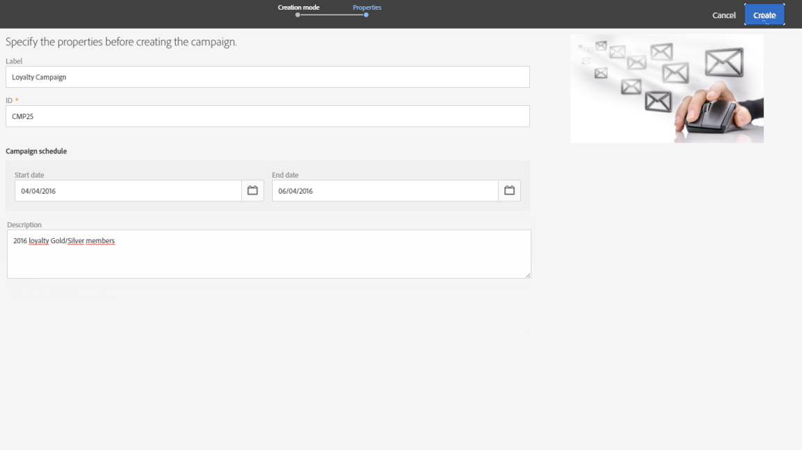

# 项目和营销策划{#programs-and-campaigns}

## 关于计划、项目和营销策划{#about-plans--programs-and-campaigns}

利用 Adobe Campaign 可计划市场营销策划活动，并在这些活动中创建和管理不同类型的：电子邮件、短信、推送通知、工作流、登陆页面。这些营销策划及其内容可以收集成到项目中。

利用项目和营销策划，可重组并查看与其关联的各种营销活动。

* **项目**&#x200B;可能包含其他项目以及营销策划、工作流和登陆页面。项目会显示在时间轴中，并帮助您组织营销活动：您可以按国家/地区、品牌、单位等进行划分。
* 通过&#x200B;**营销策划**，您可以将所选的全部营销活动收集整合到单一实体中。营销策划可能包含电子邮件、短信、推送通知、直邮、工作流和登陆页面。

为了更好地组织营销计划，Adobe 建议采用以下层次结构：项目 > 子项目 > 营销策划 > 工作流 > 投放。

利用项目和营销策划的相关报告，可分析其影响。例如，您可以在营销策划层级构建报表，以聚合该营销策划中所包含的全部投放数据。

**相关主题：**

* [时间线](../../start/using/timeline.md)
* [关于动态报告](../../reporting/using/about-dynamic-reports.md)

## 创建项目{#creating-a-program}

项目是组织结构中的第一层。它可以包含子项目、营销策划、工作流或登陆页面。

1. 从 Adobe Campaign 主页中，选择 **[!UICONTROL Programs & Campaigns]** 卡。
1. 单击 **[!UICONTROL Create]** 按钮。
1. 在 **[!UICONTROL Creation mode]** 屏幕中，选择项目类型。

   

   可用的项目类型，取决于在 **[!UICONTROL Resources]** > **[!UICONTROL Templates]** > **[!UICONTROL Program templates]** 部分中定义的模板。有关更多信息，请参阅[管理模板](../../start/using/marketing-activity-templates.md)一节。

1. 在 **[!UICONTROL Properties]** 屏幕中，输入项目的名称和 ID。

   

1. 选择项目的开始和结束日期。这些日期仅适用于该项目本身。

   您可以在父项目中创建项目。要实现此目的，请从现有项目中选择父项目。

1. 单击 **[!UICONTROL Create]** 以确认创建项目。

随即会创建并显示项目。使用 **[!UICONTROL Create]** 按钮可添加子项目、营销策划、工作流或登陆页面。

>[!NOTE]
>
>您还可从营销活动的列表创建项目。

## 创建营销策划{#creating-a-campaign}

在项目和子项目中，可以添加营销策划。营销策划可以包含营销活动，如电子邮件、短信、推送通知、工作流和登陆页面等。

1. 从 Adobe Campaign 主页中，选择 **[!UICONTROL Programs & Campaigns]** 卡并访问项目或子项目。
1. 单击 **[!UICONTROL Create]** 按钮并选择 **[!UICONTROL Campaign]**。
1. 在 **[!UICONTROL Creation mode]** 屏幕中，选择营销策划类型。

   

   可用的营销策划类型，取决在 **[!UICONTROL Resources]** > **[!UICONTROL Templates]** > **[!UICONTROL Campaign templates]** 中定义的模板。有关更多信息，请参阅[管理模板](../../start/using/marketing-activity-templates.md)一节。

1. 在 **[!UICONTROL Properties]** 屏幕中，输入营销策划的名称和 ID。
1. 选择营销策划的开始和结束日期。这些日期仅适用于该营销策划本身。

   

1. 单击 **[!UICONTROL Create]** 以确认创建营销策划。

随即会创建并显示营销策划。使用 **[!UICONTROL Create]** 按钮可向您的营销策划添加营销活动。

>[!NOTE]
>
>根据您的许可协议，您可能只能访问其中的部分活动。

您也可以从营销活动列表创建营销策划。您可以通过营销策划的属性窗口，将营销活动关联到父项目或子项目。

## 项目和营销策划的图标和状态{#programs-and-campaigns-icons-and-statuses}

列表的每个项目和每个营销策划都拥有一个可视符号和一个图标，图标的颜色可表示执行的状态。此状态取决于项目或营销策划的有效期。

* 灰色：项目/营销策划尚未开始 - **[!UICONTROL Editing]** 状态。
* 蓝色：项目/营销策划正在进行 - **[!UICONTROL In progress]** 状态。
* 绿色：项目/营销策划已完成 - **[!UICONTROL Finished]** 状态。默认情况下，会自动显示当前日期作为有效期的开始日期，并根据开始日期计算结束日期（**D+186 天**）。您可以在项目或营销策划属性中更改这些日期。

